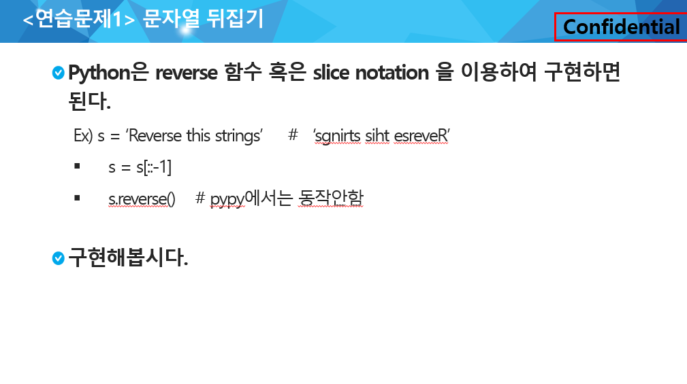
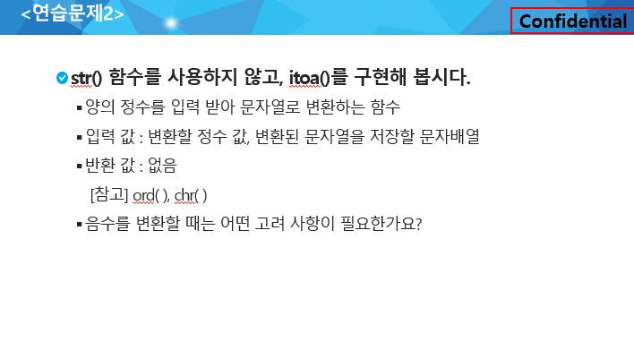

## String

> 0216

|        No        |           Title            | HW 여부 | 비고 |
| :--------------: | :------------------------: | :-----: | :--: |
|    연습문제 1    | 문자열 뒤집기(문자열 비교) |         | ppt  |
|    연습문제 2    |    정수를 문자열로 반환    |         | ppt  |
| 연습문제3 (1213) |           String           |         |      |
|       1221       |            GNS             |    O    |      |
|       6485       |     삼성시의 버스노선      |         | 추가 |
|       1859       |     백만장자 프로젝트      |         | 추가 |
|       4408       |    자기 방으로 돌아가기    |         | 추가 |
|       5356       |   의석이의 세로로 말해요   |         | 추가 |
|       1947       |        스도쿠 검증         |         | 추가 |
|       1961       |       숫자 배열 회전       |         | 추가 |


### 연습문제1 - 문자열 뒤집기(문자열 비교)

> - 문자열을 뒤집는 다양한 방법 정리해보기



input

```
4
algorithm
life is short
you need python
SSAFY
```

output

```
#1 mhtirogla
#2 trohs si efil
#3 nohtyp deen uoy
#4 YFASS
```


---


### 연습문제2 - 정수를 문자열로 반환

> - 아스키 코드가 아닌 **문자열 ‘0~9’ 까지의 index를 활용해서 푸는 방법을 권장**합니다.
>
> - 아스키 코드는 추후 제공되는 예시 답안을 확인해주시기 바랍니다.



input

```
5
3
1461
4671224
85761
-1
```

output

```
#1 5 <class 'str'>
#2 3 <class 'str'>
#3 1461 <class 'str'>
#4 4671224 <class 'str'>
#5 85761 <class 'str'>
#6 -1 <class 'str'>
```


---


### 연습문제3 - 1213_String

> - **보이어 무어로 풀이 하는 것을 권장하지 않습니다.**
> - 보이어 무어는 추후 필요한 순간에 다시 등장할 예정입니다.
> - brute_force, KMP 혹은 다른 풀이법을 활용해서 푸는 방법을 권장합니다.
>
> [주의]
>
> - `sys.stdin = open('input.txt', encoding='utf-8')` 를 사용해 데이터를 입력 받습니다.
