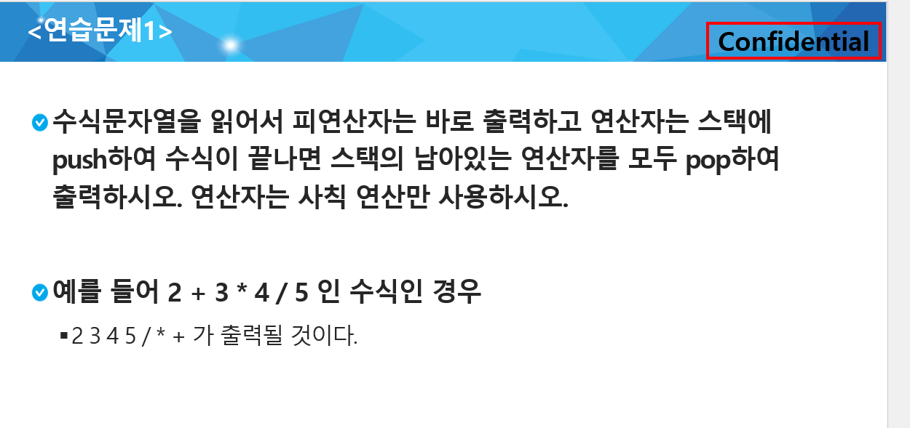

## Stack 2

|     No      |     Title     | HW 여부 | 비고 |
| :---------: | :-----------: | :-----: | :--: |
| 연습문제1-1 |  후위 표기법  |         |      |
| 연습문제1-2 |    계산기     |         |      |
|  연습문제2  | 부분집합의 합 |         |      |
|    1222     |   계산기 1    |         | 추가 |
|    1223     |   계산기 2    |    O    |      |

> 계산기 1 -> 2 순서로 풀이하기


## 연습문제 1-1 - 후위 표기법



input

```
3
2+3*4/5
(6+5*(2-8)/2)
3-2*5+4/2-2
```

output

```
#1 234*5/+
#2 6528-*2/+
#3 325*-42/+2-
```


---


## 연습문제 1-2 - 계산기


input

```
3
234*5/+
6528-2/*+
325*-42/+2-
```

output

```
#1 4.4
#2 -9.0
#3 -7.0
```


---


## 연습문제 2 - **부분집합의 합**


```python
# 1

def process_solution(a, k, my_sum):
    if my_sum != 10:
        return
    global cnt

    for i in range(1, k + 1):
        if a[i]:
            print(data[i], end=' ')
    print()
    cnt += 1


def construct_candidates(a, k, input_data, c):
    c[0] = True
    c[1] = False
    return 2


# a: 해당 원소를 사용 할 것(o) / 안할 것(x) 여부
# k: index
# input_data
def backtrack(a, k, input_data, my_sum):
    if my_sum > 10:
        return  # 가지치기

    global MAXCANDIDATES, total_cnt
    c = [0] * MAXCANDIDATES

    # 현재의 인덱스가
    if k == input_data:
        process_solution(a, k, my_sum)  # 답이면 원하는 작업을 한다.
    else:
        k += 1
        # ncandidates -> 후보군이 2개
        ncandidates = construct_candidates(a, k, input_data, c)
        # 반복 2번을 돌림
        for i in range(ncandidates):
            #
            a[k] = c[i]
            if a[k]:  # 가지치기
                backtrack(a, k, input_data, my_sum + data[k])
            else:
                backtrack(a, k, input_data, my_sum)
    total_cnt += 1


# 임의로 잡아 놓은 100 크기의 유망성 검사
MAXCANDIDATES = 100

# 임의로 잡아 놓은 100
NMAX = 100

data = [0, 1, 2, 3, 4, 5, 6, 7, 8, 9, 10]
a = [0] * NMAX
cnt = 0
total_cnt = 0

backtrack(a, 0, 10, 0)

print(f'count: {cnt}')
print(f'total_count {total_cnt}')
```

```python
# 2
"""
연습문제2. {1, 2, 3, 4, 5, 6, 7, 8, 9, 10}의 powerset 중
원소의 합이 10인 부분집합을 구하시오.
"""

# 1 ~ 10 데이터 준비
data = range(1, 11)
sel = [0] * len(data)
results = []

def powerset(idx):
    # 부분집합을 찾아보자
    if idx < len(data):
        sel[idx] = 1
        powerset(idx + 1)
        sel[idx] = 0
        powerset(idx + 1)
    else:
        total = 0
        for i in range(len(data)):
            # 1로 표시되어 있다면
            if sel[i]:
                # total에 그 값을 더하자
                total += data[i]
                
        # 반복이 다 끝나고 부분집합의 합이 10이 된다면
        if total == 10:
            # 부분집합의 합이 10인 경우 각 원소를 출력해보자
            for idx, num in enumerate(sel, start=1):
                if num == 1:
                    print(idx, end=' ')
            print()
        # 함수 종료
        return


powerset(0)
```

