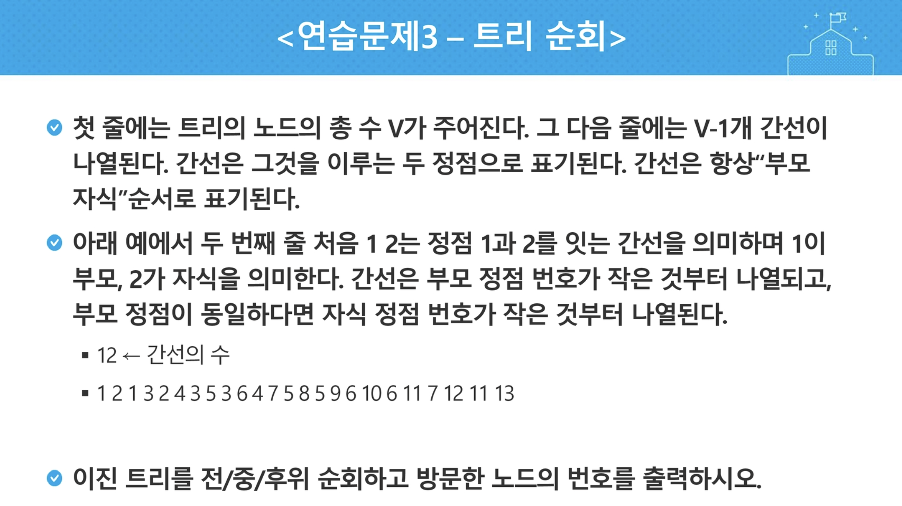

## 분할정복_백트래킹

|     No     |   Title   | HW 여부 | 비고 |
| :--------: | :-------: | :-----: | :--: |
| 연습문제 1 |  퀵정렬   |         | ppt  |
| 연습문제 2 | 부분집합  |         | ppt  |
| 연습문제 3 | 트리 순회 |         | ppt  |
|    5204    | 병합정렬  |    O    |      |

> `5204_병합정렬`
>
> - 추가 조건
>   - 병합 하는 과정에서 왼쪽 마지막 원소가 오른쪽 마지막 원소보다 큰 경우의 수를 세기
>
> `연습문제 3`
>
> - 전위, 중위, 후위 순회 구현


---


## 연습문제 1


```
# input

11, 45, 23, 81, 28, 34
11, 45, 22, 81, 23, 34, 99, 22, 17, 8
1, 1, 1, 1, 1, 0, 0, 0, 0, 0
```

```
# output

11, 23, 28, 34, 45, 81
8, 11, 17, 22, 22, 23, 34, 45, 81, 99
0, 0, 0, 0, 0, 1, 1, 1, 1, 1
```


## 연습문제 3



```
12
1 2 1 3 2 4 3 5 3 6 4 7 5 8 5 9 6 10 6 11 7 12 11 13
```

```
```

