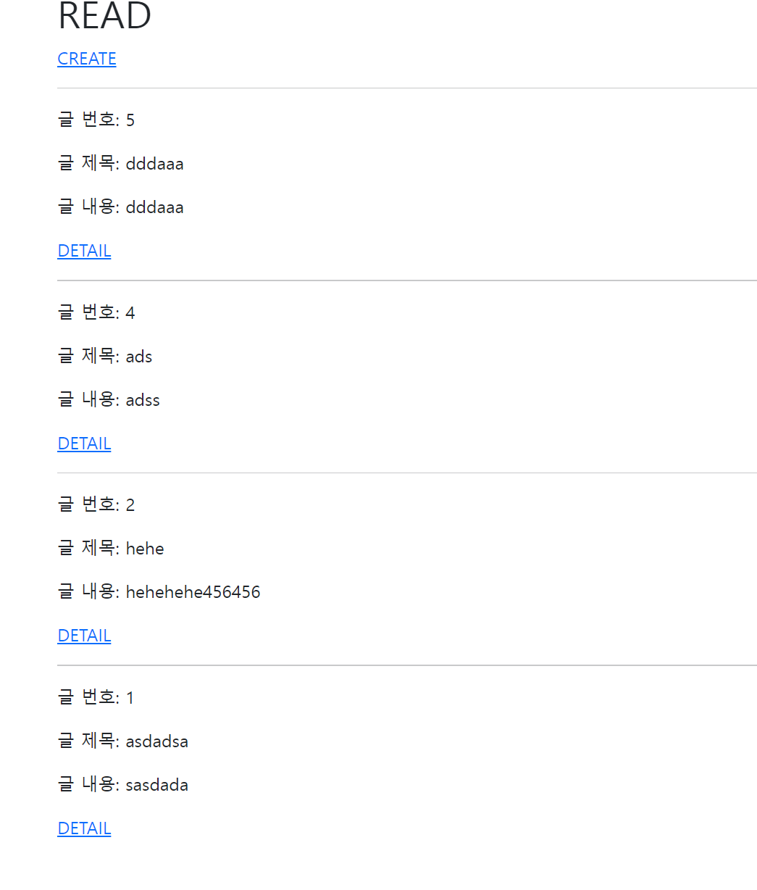
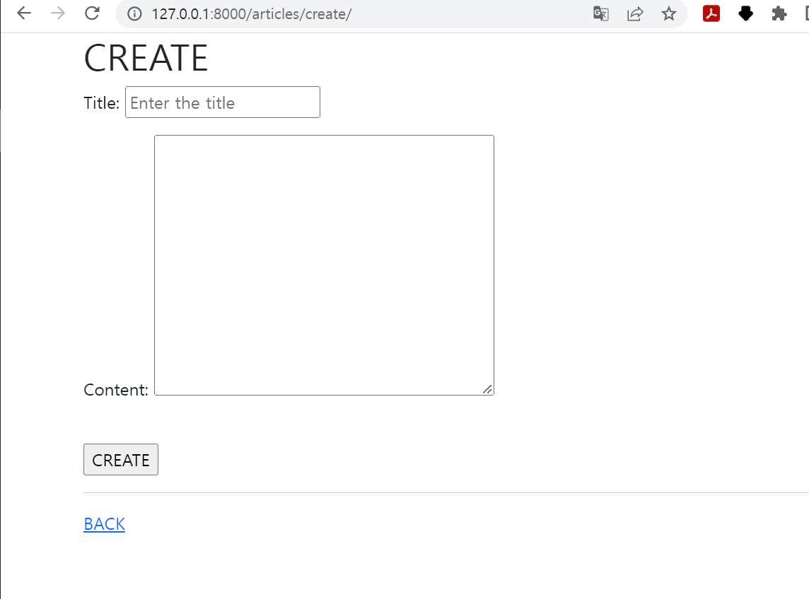
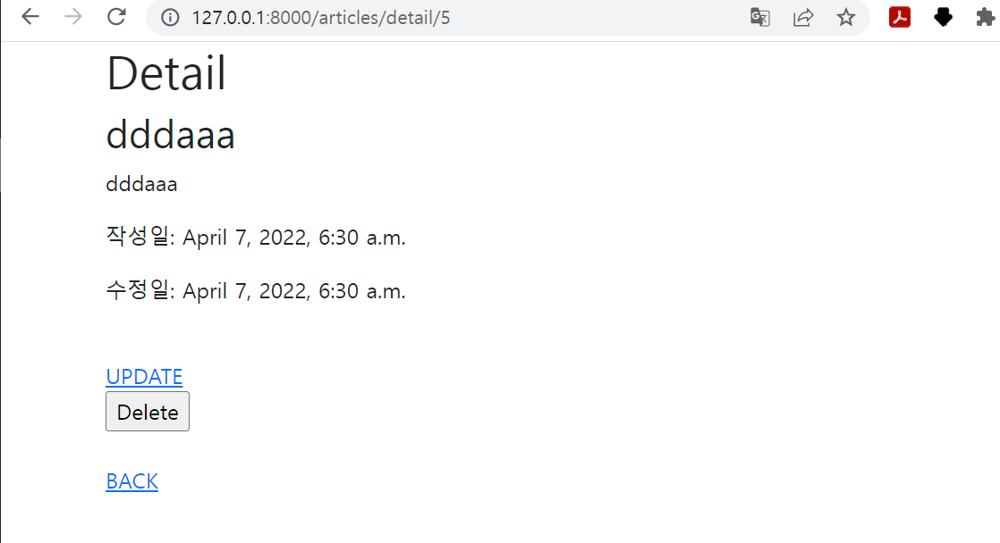
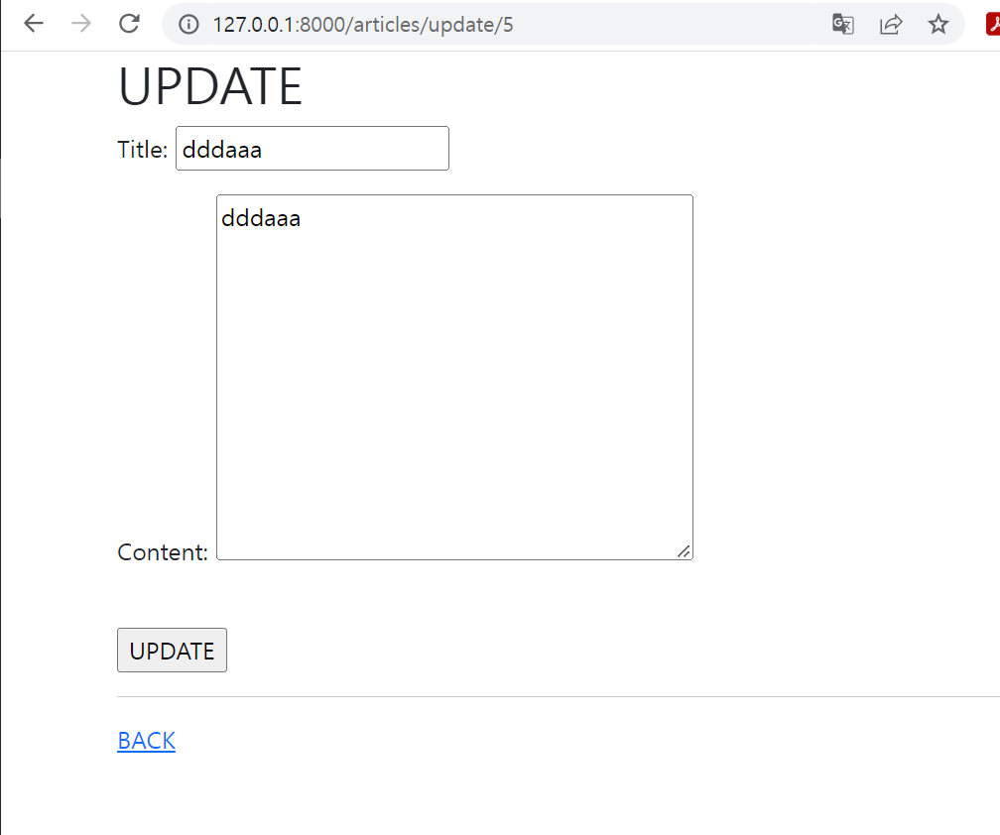

1. url

```python
from django.contrib import admin
from django.urls import path, include
from . import views


app_name = 'articles'
urlpatterns = [
    path('', views.index, name='index'),
    # path('new/', views.new, name='new'),
    path('create/', views.create, name='create'),
    path('detail/<int:pk>', views.detail, name='detail'),
    # path('edit/<int:pk>', views.edit, name='edit'),
    path('update/<int:pk>', views.update, name='update'),
    path('delete/<int:pk>', views.delete, name='delete')

]
```

2. views

```python
from django.shortcuts import redirect, render

from articles.forms import ArticleForm
from .models import Article

# Create your views here.
def index(request):
    articles = Article.objects.order_by('-pk')
    context = {
        'articles': articles
    }
    return render(request, 'articles/index.html', context)


# def new(request):
#     return render(request, 'articles/new.html')


def create(request):
    if request.method == 'POST':
        form = ArticleForm(request.POST)
        if form.is_valid():
            article = form.save()
            return redirect('articles:detail', article.pk)
    else:
        form = ArticleForm()
    context = {
        'form': form
    }
    return render(request, 'articles/create.html', context)
    article = Article()
    article.title = request.POST.get('title')
    article.content = request.POST.get('content')
    article.save()
    return redirect('articles:detail', article.pk)


def detail(request, pk):
    article = Article.objects.get(pk=pk)
    context = {
        'article': article
    }
    return render(request, 'articles/detail.html', context)


# def edit(request, pk):
#     article = Article.objects.get(pk=pk)
#     context = {
#         'article': article
#     }
#     return render(request, 'articles/edit.html', context)


def update(request, pk):
    if request.method == 'POST':
        article = Article.objects.get(pk=pk)
        form = ArticleForm(request.POST, instance=article)
        if form.is_valid():
            article = form.save()
            return redirect('articles:detail', article.pk)
    else:
        article = Article.objects.get(pk=pk)
        form = ArticleForm(instance=article)
    context = {
        'article' : article,
        'form': form
    }
    return render(request, 'articles/update.html', context)
    # article = Article.objects.get(pk=pk)
    # article.title = request.POST.get('title')
    # article.content = request.POST.get('content')
    # article.save()
    # return redirect('articles:detail', article.pk)


def delete(request, pk):
    article = Article.objects.get(pk=pk)
    article.delete()
    return redirect('articles:index')
```

3. templates

- index

```django



<h1>READ</h1>
<a href="">CREATE</a>

  <hr>
  <p>글 번호: {{article.pk}}</p>
  <p>글 제목: {{article.title}}</p>
  <p>글 내용: {{article.content}}</p>
  <a href="">DETAIL</a>


```

- create(new)

```django



<h1>CREATE</h1>
<form action="" method='POST'>
  
  {{form.as_p}}
   <label for="title">제목</label>
  <input type="text" name='title' id='title'><br>
  <label for="content">Content</label>
  <textarea name="content" id="content" cols="30" rows="10"></textarea> 
  <br><input type="submit" value='CREATE'>
</form>
<hr>
<a href="">BACK</a>

```

- detail

```django



<h1>Detail</h1>
<h2>{{article.title}}</h2>
<p>{{article.content}}</p>
<p>작성일: {{article.created_at}}</p>
<p>수정일: {{article.updated_at}}</p>
<br>
<a href="">UPDATE</a><br>
<form action="">
  <input type="submit" value="Delete">
</form><br>
<a href="">BACK</a>

```

- update

```django



<h1>UPDATE</h1>
<form action="" method='POST'>
  
  {{form.as_p}}
   <label for="title">제목</label>
  <input type="text" name='title' id='title'><br>
  <label for="content">Content</label>
  <textarea name="content" id="content" cols="30" rows="10"></textarea> 
  <br><input type="submit" value='UPDATE'>
</form>
<hr>
<a href="">BACK</a>

```


4. model

```python
from django.db import models

# Create your models here.
class Article(models.Model):
    title = models.CharField(max_length = 10)
    content = models.TextField()
    created_at = models.DateTimeField(auto_now_add=True)
    updated_at = models.DateTimeField(auto_now=True)

    def __str__(self):
        return self.title


from django import forms
from .models import Article

class ArticleForm(forms.ModelForm):
    title = forms.CharField(
        widget=forms.TextInput(
            attrs={
                'placeholder' : 'Enter the title'
            }
        )
    )
    class Meta:
        model = Article
        fields = '__all__'
```


5. 사진







