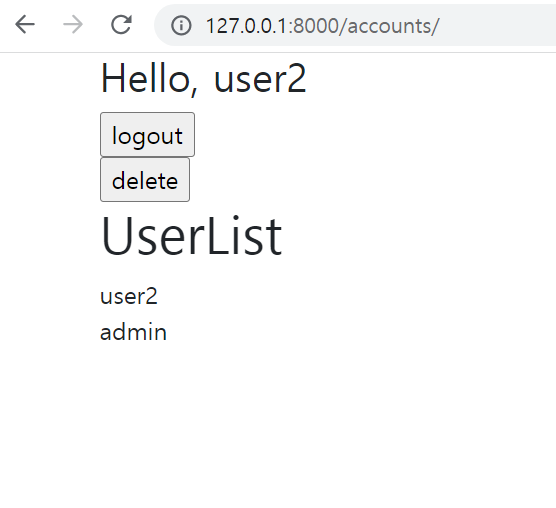
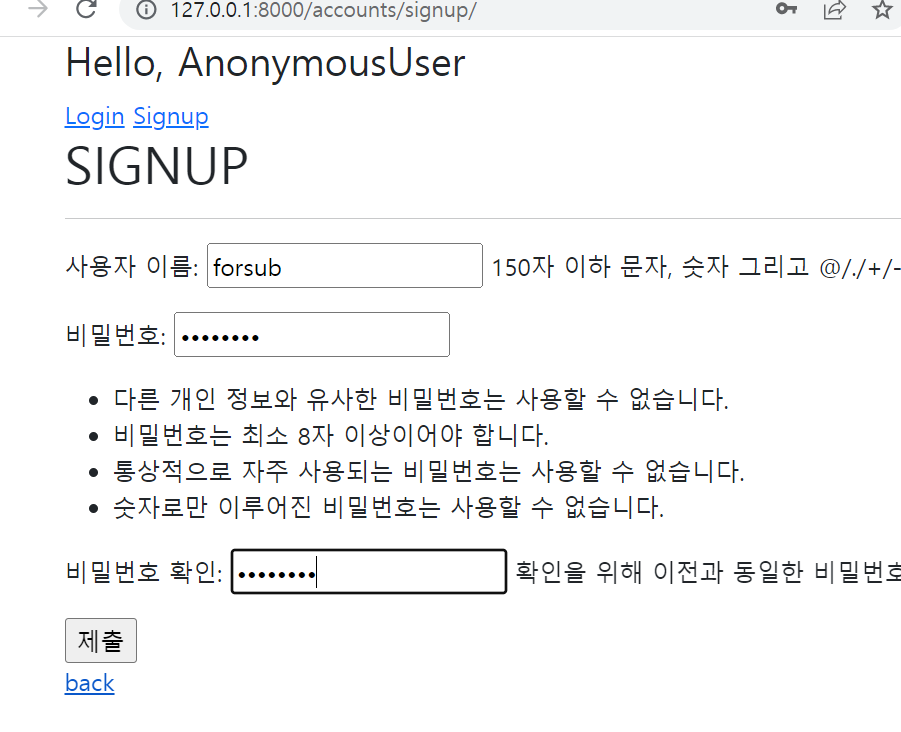
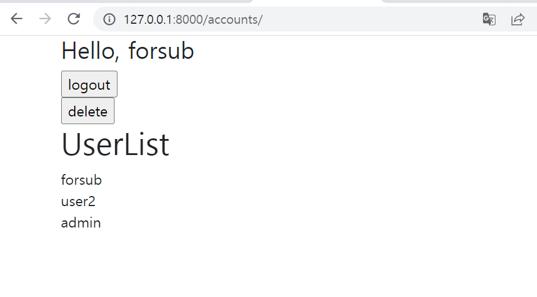

1. views.py

```python
from django.shortcuts import redirect, render
from django.contrib.auth.decorators import login_required
from django.contrib.auth import login as auth_login
from django.contrib.auth import logout as auth_logout
from django.contrib.auth.forms import (
    AuthenticationForm,
     UserCreationForm,
     )
from django.contrib.auth import get_user_model


# Create your views here.
def index(request):
    forms = get_user_model().objects.order_by('-pk')
    context = {
        'forms': forms
    }
    return render(request, 'accounts/index.html', context)


def login(request):
    if request.user.is_authenticated:
        return redirect('articles:index')

    if request.method == 'POST':
        form = AuthenticationForm(request, request.POST)
        if form.is_valid():
            auth_login(request, form.get_user())
            next_url = request.GET.get('next')
            return redirect(next_url or 'articles:index')
    else:
        form = AuthenticationForm()
    context = {
        'form': form,
    }
    return render(request, 'accounts/login.html', context)


def logout(request):
    if request.user.is_authenticated:
        auth_logout(request)  
    return redirect('articles:index')


def signup(request):
    if request.method == 'POST':
        form = UserCreationForm(request.POST)
        if form.is_valid():
            user = form.save()
            auth_login(request, user)
            return redirect('articles:index')
    else:
        form = UserCreationForm()
    context = {
        'form': form,
    }
    return render(request, 'accounts/signup.html', context)

```


2. 사진

- `accounts/` userlist 출력



- `accounts/signup/` 회원가입 페이지



- 회원가입 후 userlist에 추가된 모습

