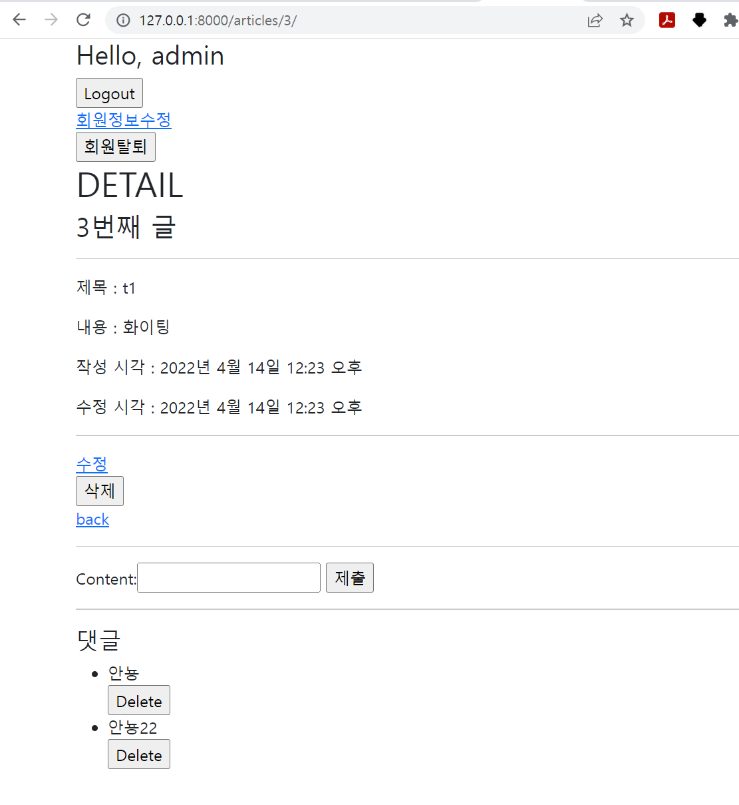

1. view

```python
from django.contrib.auth.decorators import login_required
from django.shortcuts import render, redirect, get_object_or_404
from django.views.decorators.http import require_http_methods, require_POST, require_safe
from .models import Article, Comment
from .forms import ArticleForm, CommentForm

# Create your views here.
@require_safe
def index(request):
    articles = Article.objects.order_by('-pk')
    context = {
        'articles': articles,
    }
    return render(request, 'articles/index.html', context)


@login_required
@require_http_methods(['GET', 'POST'])
def create(request):
    if request.method == 'POST':
        form = ArticleForm(request.POST)
        if form.is_valid():
            article = form.save(commit=False)
            article.user = request.user
            article.save()
            return redirect('articles:detail', article.pk)
    else:
        form = ArticleForm()
    context = {
        'form': form,
    }
    return render(request, 'articles/create.html', context)


@require_safe
def detail(request, pk):
    article = get_object_or_404(Article, pk=pk)
    comments = article.comment_set.all()
    comment_form = CommentForm
    context = {
        'article': article,
        'comments': comments,
        'comment_form': comment_form,
    }
    return render(request, 'articles/detail.html', context)


@login_required
# @require_POST
def delete(request, pk):
    if request.method == 'POST':
        article = get_object_or_404(Article, pk=pk)
        if request.user.is_authenticated:
            article.delete()
            return redirect('articles:index')
    return redirect('articles:detail', pk)


@login_required
@require_http_methods(['GET', 'POST'])
def update(request, pk):
    article = get_object_or_404(Article, pk=pk)
    if request.method == 'POST':
        form = ArticleForm(request.POST, instance=article)
        if form.is_valid():
            article = form.save()
            return redirect('articles:detail', article.pk)
    else:
        form = ArticleForm(instance=article)
    context = {
        'article': article,
        'form': form,
    }
    return render(request, 'articles/update.html', context)


def comments_create(request, pk):
    comment_form = CommentForm(request.POST)
    article = Article.objects.get(pk=pk)
    if comment_form.is_valid():
        comment = comment_form.save(commit=False)
        comment.article = article
        comment.save()
    return redirect('articles:detail', article.pk)


def comment_delete(request, article_pk, comment_pk):
    comment = Comment.objects.get(pk=comment_pk)
    comment.delete()
    return redirect('articles:detail', article_pk)
```

2. model

```python
from django.db import models
from django.conf import settings

# Create your models here.
class Article(models.Model):
    user = models.ForeignKey(settings.AUTH_USER_MODEL, on_delete=models.CASCADE)
    title = models.CharField(max_length=10)
    content = models.TextField()
    created_at = models.DateTimeField(auto_now_add=True)
    updated_at = models.DateTimeField(auto_now=True)

    def __str__(self):
        return self.title


class Comment(models.Model):
    article = models.ForeignKey(Article, on_delete=models.CASCADE)
    content = models.CharField(max_length=200)
    created_at = models.DateTimeField(auto_now_add=True)
    updated_at = models.DateTimeField(auto_now=True)


    def __str__(self):
        return self.content
```

3. html

```django



  <h1>DETAIL</h1>
  <h3>{{ article.pk }}번째 글</h3>
  <hr>
  <p>제목 : {{ article.title }}</p>
  <p>내용 : {{ article.content }}</p>
  <p>작성 시각 : {{ article.created_at }}</p>
  <p>수정 시각 : {{ article.updated_at }}</p>
  <hr>
  <a href="">수정</a>
  <form action="" method="POST">
    
    <input type="submit" value="삭제">
  </form>
  <a href="">back</a>
  <hr>
  <form action="" method='POST'>
    
    {{comment_form}}
    <input type="submit">
  </form>
  <hr>
  <h4>댓글</h4>
  <ul>
    
      <li>
        {{comment.content}}
        <form action="" method='POST'>
          
          <input type="submit" value='Delete'>
        </form>
      </li>
    
  </ul>


```

4. 사진

