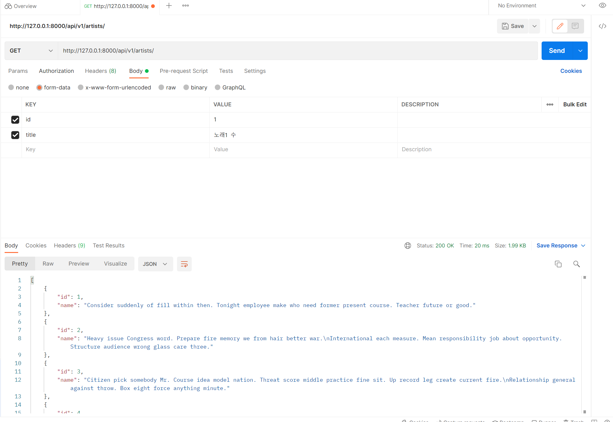
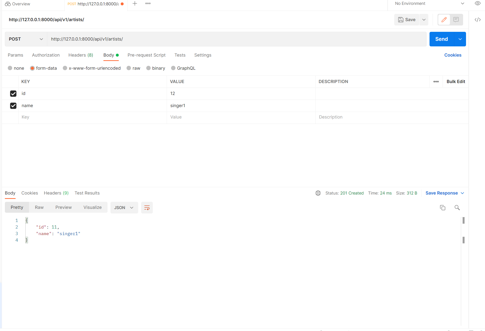
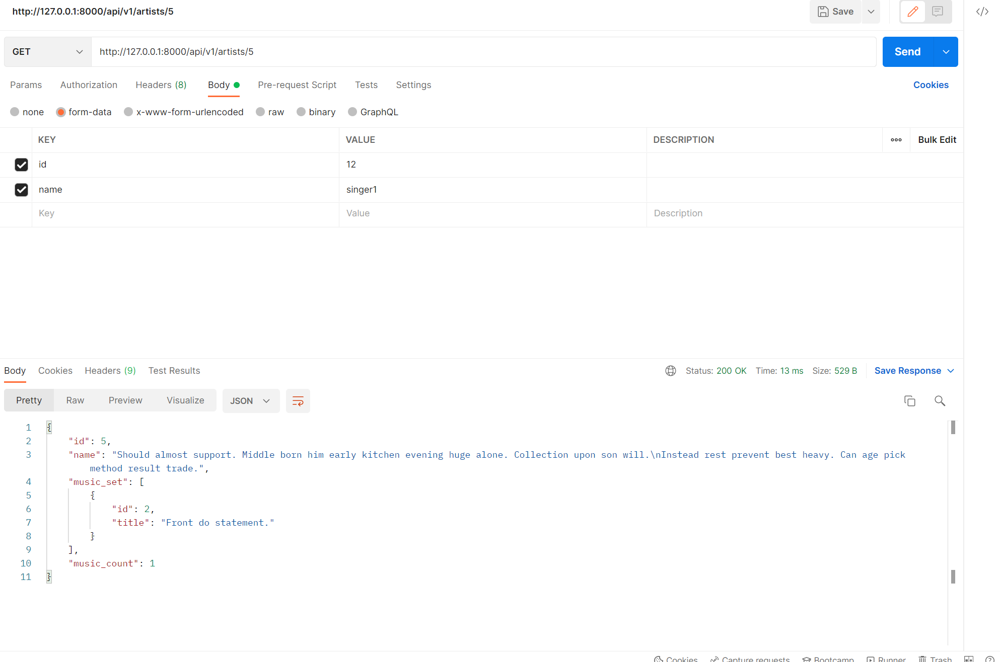
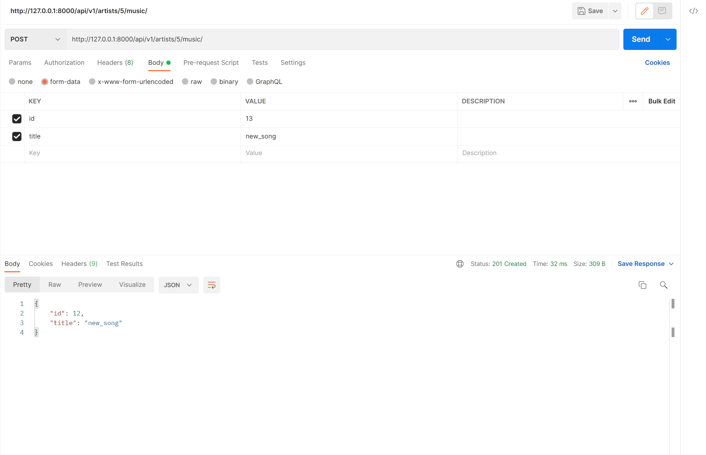
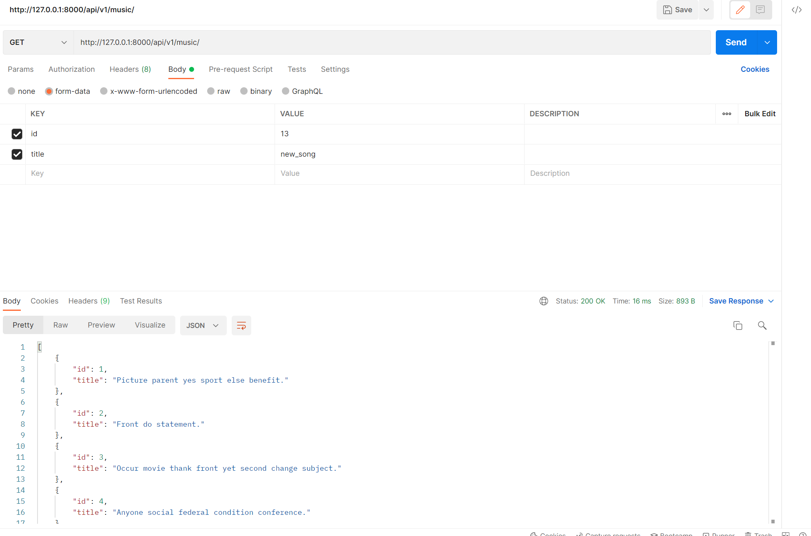
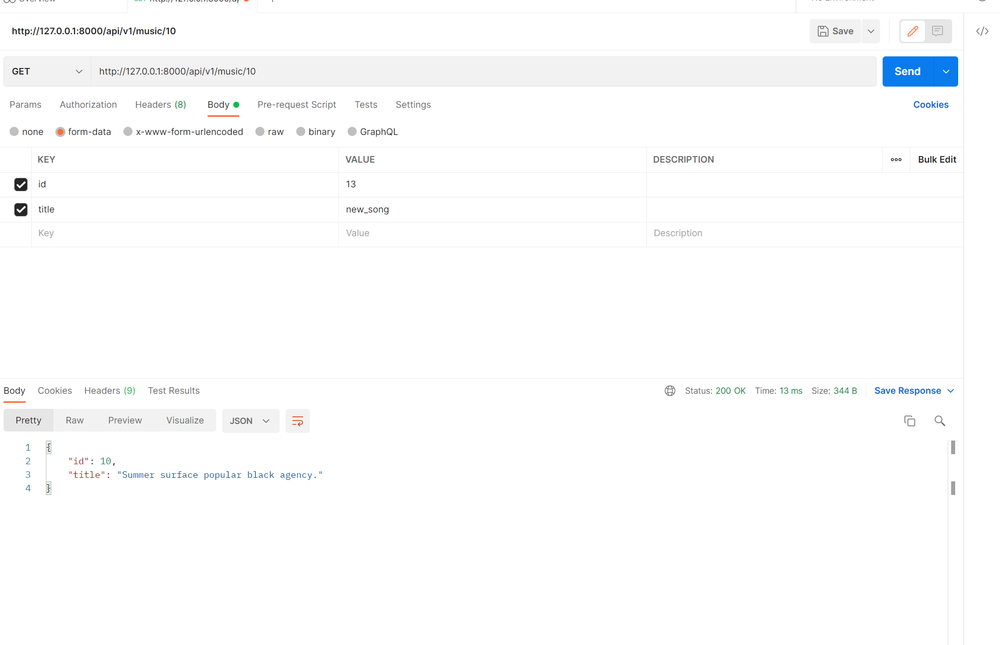
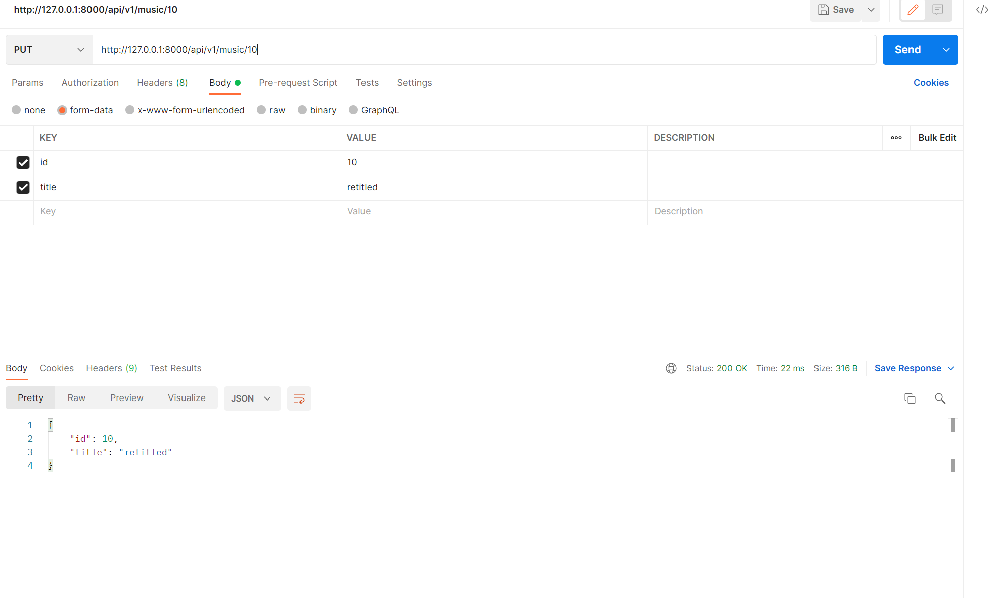
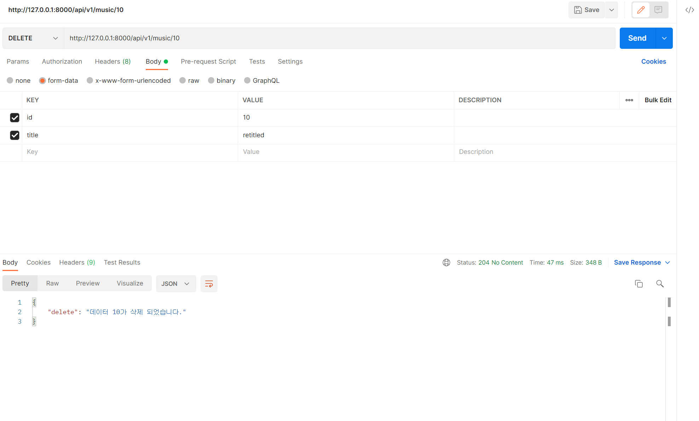

1. views.py

```python
from sunau import AUDIO_FILE_ENCODING_DOUBLE
from rest_framework import status
from rest_framework.response import Response
from rest_framework.decorators import api_view
from .serializers import ArtistListSerializer, ArtistSerializer, MusicListSerializer
from .models import Artist, Music
from django.shortcuts import get_list_or_404, get_object_or_404

from music import serializers

# Create your views here.
@api_view(['GET', 'POST'])
def artist_list(request):
    if request.method == "GET":
        artists = get_list_or_404(Artist)
        serializers = ArtistListSerializer(artists, many=True)
        return Response(serializers.data)
    if request.method == 'POST':
        serializer = ArtistListSerializer(data=request.data)
        if serializer.is_valid(raise_exception=True):
            serializer.save()
            return Response(serializer.data, status=status.HTTP_201_CREATED)


@api_view(['GET'])
def artist_detail(request, artist_pk):
    if request.method == "GET":
        artist = get_object_or_404(Artist, pk=artist_pk)
        serializer = ArtistSerializer(artist)
        return Response(serializer.data)


@api_view(['POST'])
def artist_music(request, artist_pk):
    artist = get_object_or_404(Artist, pk=artist_pk)
    serializer = MusicListSerializer(data=request.data)
    if serializer.is_valid(raise_exception=True):
        serializer.save(artist=artist)
        return Response(serializer.data, status=status.HTTP_201_CREATED)


@api_view(['GET'])
def music_list(request):
    if request.method == 'GET':
        musics = get_list_or_404(Music)
        serializers = MusicListSerializer(musics, many=True)
        return Response(serializers.data)


@api_view(['GET', 'PUT', 'DELETE'])
def music_detail(request, music_pk):
    music = get_object_or_404(Music, pk=music_pk)
    if request.method == 'GET':
        serializer = MusicListSerializer(music)
        return Response(serializer.data)
    elif request.method == 'PUT':
        serializer = MusicListSerializer(music, data=request.data)
        if serializer.is_valid(raise_exception=True):
            serializer.save()
            return Response(serializer.data)
    elif request.method == 'DELETE':
        music.delete()
        data = {
            'delete': f'데이터 {music_pk}가 삭제 되었습니다.'
        }
        return Response(data, status=status.HTTP_204_NO_CONTENT)
```


2. serializers.py

```python
from dataclasses import field
from .models import Artist, Music
from rest_framework import serializers

class ArtistListSerializer(serializers.ModelSerializer):

    class Meta:
        model = Artist
        fields = ('id', 'name')


class MusicListSerializer(serializers.ModelSerializer):

    class Meta:
        model = Music
        fields = ('id', 'title')


class ArtistSerializer(serializers.ModelSerializer):

    music_set = MusicListSerializer(many=True, read_only=True)
    music_count = serializers.IntegerField(source='music_set.count', read_only=True)
    class Meta:
        model = Artist
        fields = ('id', 'name', 'music_set', 'music_count')


class MusicSerializer(serializers.ModelSerializer):

    class Meta:
        model = Music
        fields = ('id', 'title', 'artist')
```


3. 사진

- GET & POST api/v1/artists





- GET api/v1/artists/<artist_pk>/



- POST api/v1/artists/<artist_pk>/music/



- GET api/v1/music/



- GET & PUT & DELETE api/v1/music/<music_pk>/






