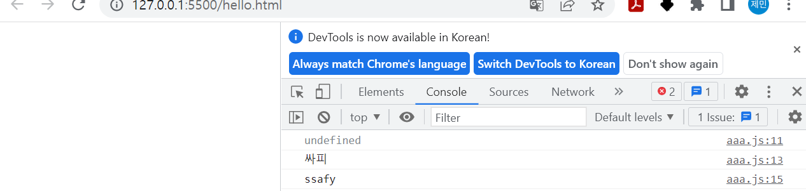
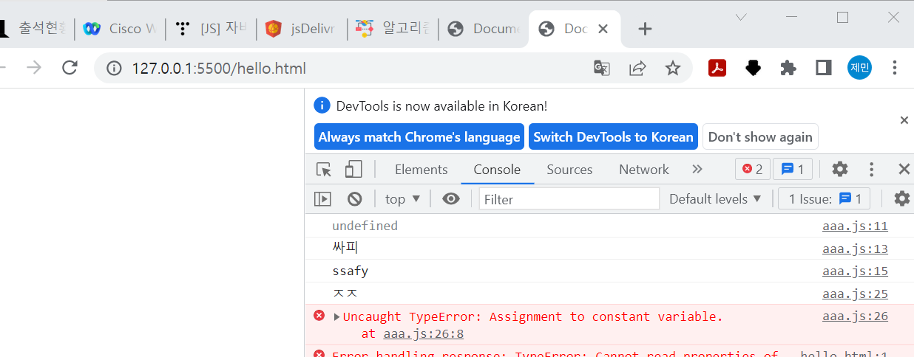
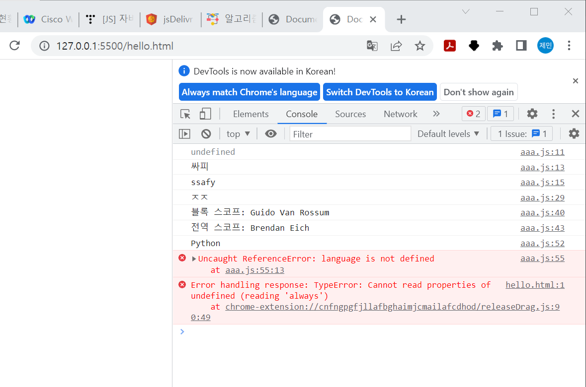

```js

# 1
let firstName
console.log(firstName)
firstName = '싸피 '
console.log(firstName)
firstName = 'ssafy'
console.log(firstName)


# 2
const myName = 'ㅈㅈ'
console.log(myName)
myName = '싸피 '
console.log(myName)
myName = 'ssafy'
console.log(myName)
```


#1




#2



#3  오류 없이,,


