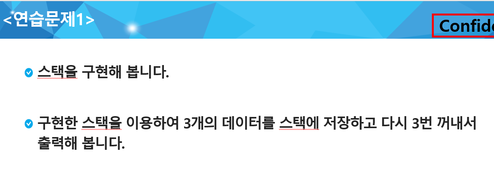
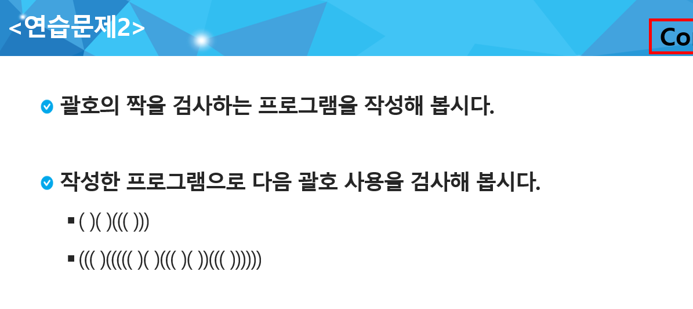
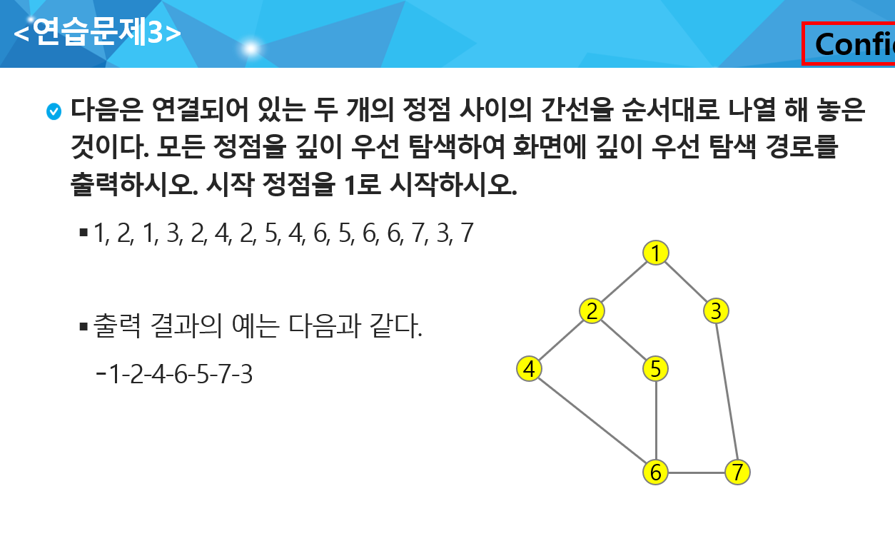

## Stack 1

|     No     |      Title      | HW 여부 | 비고 |
| :--------: | :-------------: | :-----: | :--: |
| 연습문제 1 |    스택 구현    |         | ppt  |
| 연습문제 2 |    괄호 검사    |         | ppt  |
| 연습문제3  |    DFS 구현     |         | ppt  |
|    2005    | 파스칼의 삼각형 |    O    |      |


### 연습문제1 - 스택 구현




---


### 연습문제2 - 괄호 검사



input

```
()()((()))
((()((((()()((()())((())))))
```

output

```
True
False
```


---


### 연습문제3 - DFS 구현



input 

> 7 - 정점 개수
>
> 8 - 간선 개수

```
7 8
1 2 1 3 2 4 2 5 4 6 5 6 6 7 3 7
```


output

```
1 2 4 6 5 7 3
```

