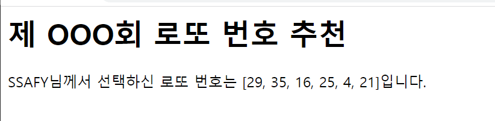

1. intro/urls.py

```python
from django.contrib import admin
from django.urls import path
from pages import views


urlpatterns = [
    path('admin/', admin.site.urls),
    path('lotto/', views.lotto),

]
```


2. pages/views.py

```python
def lotto(request):
    nums = range(1, 51)
    pick = random.sample(nums, 6)
    context = {
        'pick' : pick,
    }
    return render(request, 'lotto.html', context)
```


3. templates/lotto.html

```django

<h1>제 OOO회 로또 번호 추천</h1>
<p>SSAFY님께서 선택하신 로또 번호는 {{pick}}입니다.</p>

```

