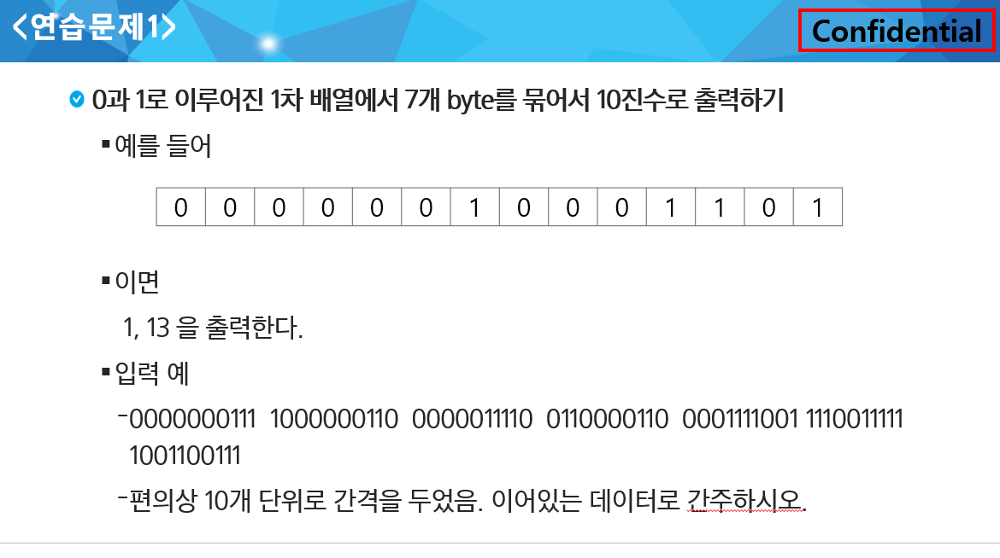
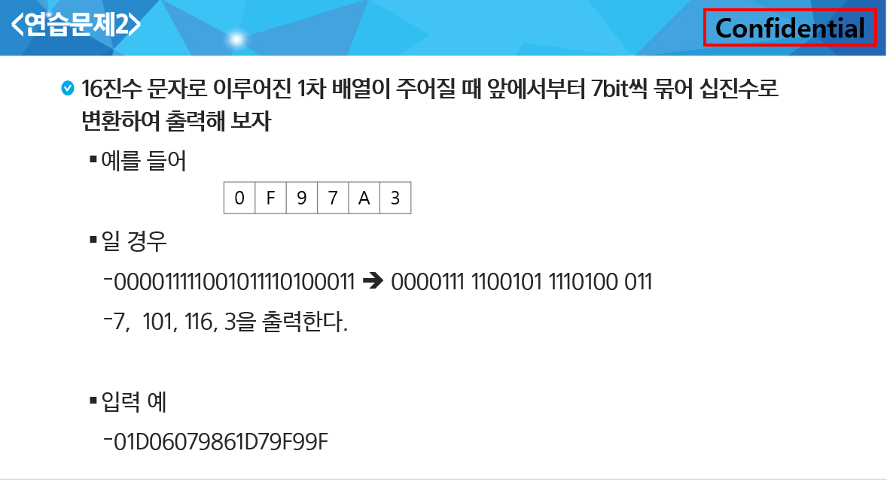
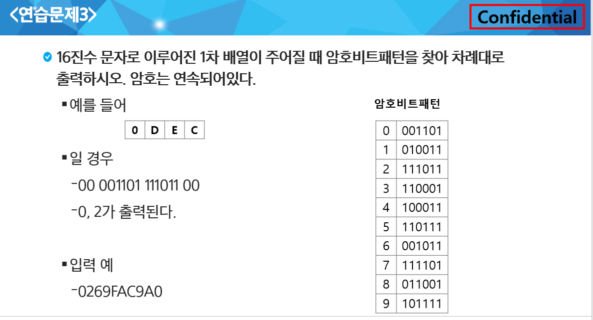

## Start

|     No     |      Title       | HW 여부 |               비고               |
| :--------: | :--------------: | :-----: | :------------------------------: |
| 연습문제 1 |                  |         |               ppt                |
| 연습문제 1 |                  |         |               ppt                |
| 연습문제2  |                  |         |               ppt                |
|    1240    | 단순2진 암호코드 |    O    | 총 소요시간은 신경쓰지 않아도 됨 |
|    2117    |  홈 방범 서비스  |         |        모의 SW 역량테스트        |
|    2382    |   미생물 격리    |         |        모의 SW 역량테스트        |


---


## 연습문제 1

> 7개의 byte -> 7개의 bit
> 2진수를 10진수로 만드는 방법



```sh
# input
2
00000010001101
0000000111100000011000000111100110000110000111100111100111111001100111
```

```sh
# output
1 13
0 120 12 7 76 24 60 121 124 103
```


### 연습문제 2



```sh
# input
2
0F97A3
01D06079861D79F99F
```

```sh
# output
7 101 116 3
0 116 12 7 76 24 58 121 124 103 3
```


## 연습문제3

> 16진수를 10진수로, 10진수를 2진수로 만드는 방법



```sh
# input
2
0DEC
0269FAC9A0
```

```sh
# output
0 2
1 1 7 8 0
```