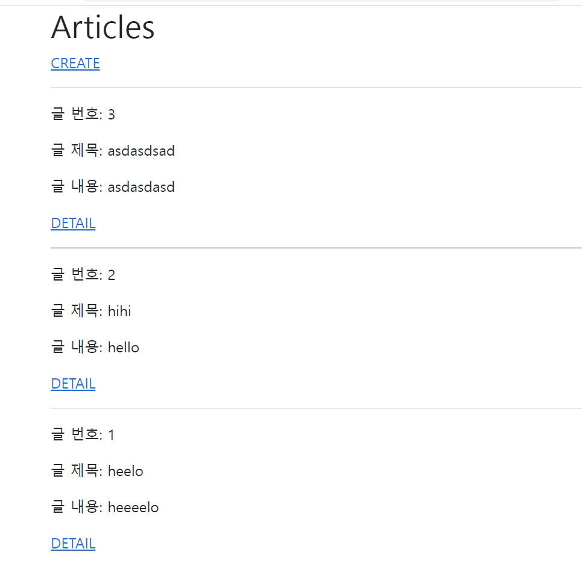
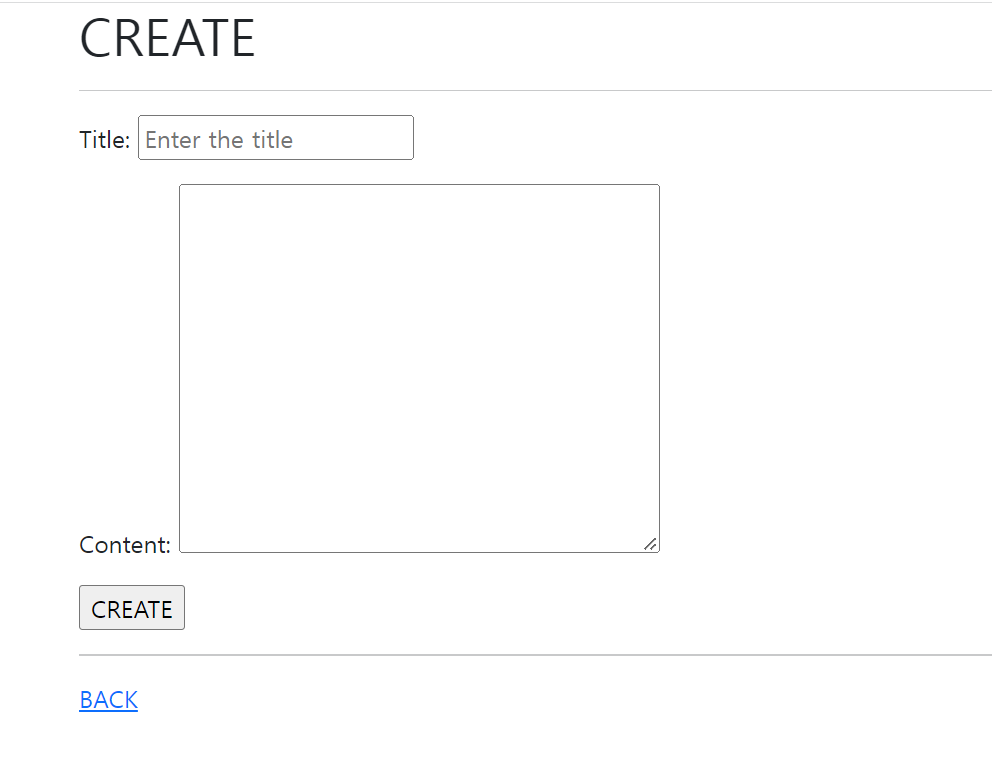
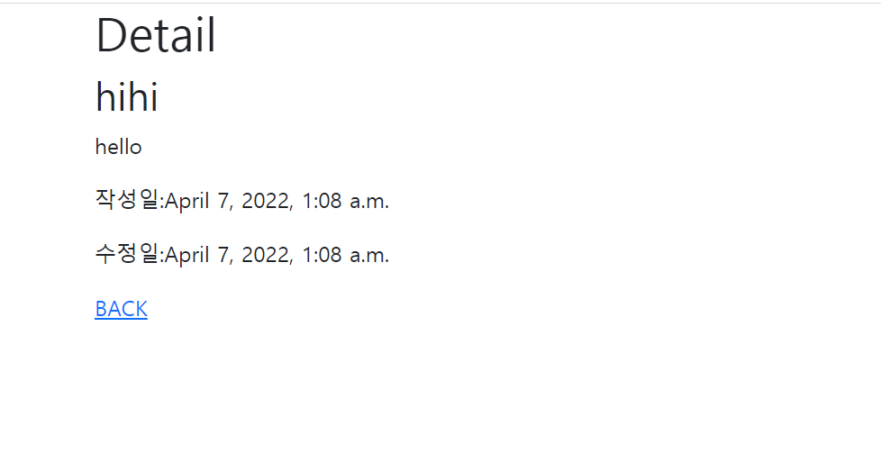

1. url

```python
from django.contrib import admin
from django.urls import path
from . import views

app_name = 'articles'
urlpatterns = [
    path('', views.index, name='index'),
    # path('create/', views.create, name='create'),
    path('creating/', views.creating, name='creating'),
    path('detail/<int:pk>/', views.detail, name='detail'),


]
```

2. views

```python
from django.shortcuts import redirect, render
from .models import Article
from .forms import ArticleForm

# Create your views here.

def index(request):
    articles = Article.objects.order_by('-pk')
    context = {
        'articles': articles,
    }
    return render(request, 'articles/index.html', context)


# def create(request):
#     form = ArticleForm()
#     context = {
#         'form': form
#     }
#     return render(request, 'articles/create.html',context)


def creating(request):
    if request.method == 'POST':
        form = ArticleForm(request.POST)
        article = form.save()
        return redirect('articles:detail', article.pk)
    else:
        form = ArticleForm()
    context = {
        'form': form
    }
    return render(request, 'articles/create.html',context)

    # article = Article()
    # article.title = request.POST.get('title')
    # article.content = request.POST.get('content')
    # article.save()
    # return redirect('articles:index')


def detail(request, pk):
    article = Article.objects.get(pk=pk)
    context = {
        'article': article,

    }
    return render(request, 'articles/detail.html', context)

```

3. templates

- index

```django



<h1>Articles</h1>
<a href="">CREATE</a>

  <hr>
  <p>글 번호: {{article.pk}}</p>
  <p>글 제목: {{article.title}}</p>
  <p>글 내용: {{article.content}}</p>
  <a href="">DETAIL</a>




```

- create(new)

```django



<h1>CREATE</h1>
<hr>
<form action="" method="POST">
  
  {{form.as_p}}
   <label for="title">Title: </label>
  <input type="text" id='title' name='title' value='Enter the title'><br>
  <label for="content">Content: </label>
  <textarea name="content" id="content" cols="30" rows="10"></textarea>
  <br> 
  <input type="submit" value="CREATE">
</form>
<hr>
<a href="">BACK</a>

```

- detail

```django



<h1>Detail</h1>
<h2>{{article.title}}</h2>
<p>{{article.content}}</p>
<p>작성일:{{article.created_at}}</p>
<p>수정일:{{article.updated_at}}</p>

<a href="">BACK</a>

```


4. model

```python
from pyexpat import model
from django.db import models

class Article(models.Model):
    title = models.CharField(max_length=10)
    content = models.TextField()
    created_at = models.DateTimeField(auto_now_add=True)
    updated_at = models.DateTimeField(auto_now=True)

    def __str__(self):
        return self.title

# form

from django import forms
from .models import Article

class ArticleForm(forms.ModelForm):
    title = forms.CharField(
        widget=forms.TextInput(
            attrs={
                'placeholder': 'Enter the title'
            }
        )
    )
    class Meta:
        model = Article
        fields = '__all__'
```


5. 사진





