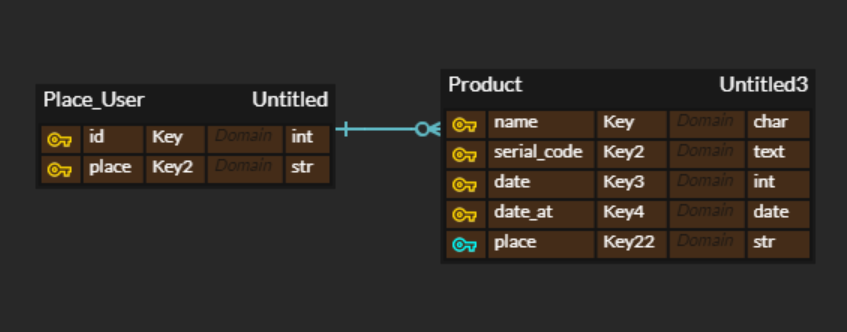

1. model.py

```python
from django.db import models

# Create your models here.
class Product(models.Model):
    name = models.CharField(max_length=10)  # 제품 이름
    serial_code = models.TextField()  # 제품 코드
    date = models.IntegerField()  # 유통기한
    place = models.CharField(max_length=10)  # 어느 지점 인지,, 
    # balance = models.IntegerField()  # 남은 갯수의 경우 의미 없다.
    date_at = models.DateTimeField(auto_now_add=True)  # 언제 입고 되었는지

    def __str__(self):
        return self.name
    
```

하나하나의 상품을 입력 받고, 정렬하기 편하도록 제품 이름과 지점 column을 만들어 두었다.

이 외에는 각자의 특성을 갖는 값들을 받도록 한다.

- Place_User는 각 지점에서 서비스를 사용하는 사람들, account와 비슷하다고 보면 됩니다.
- Product가 제품을 분류할 수 있도록 여러 field를 갖추었다.



