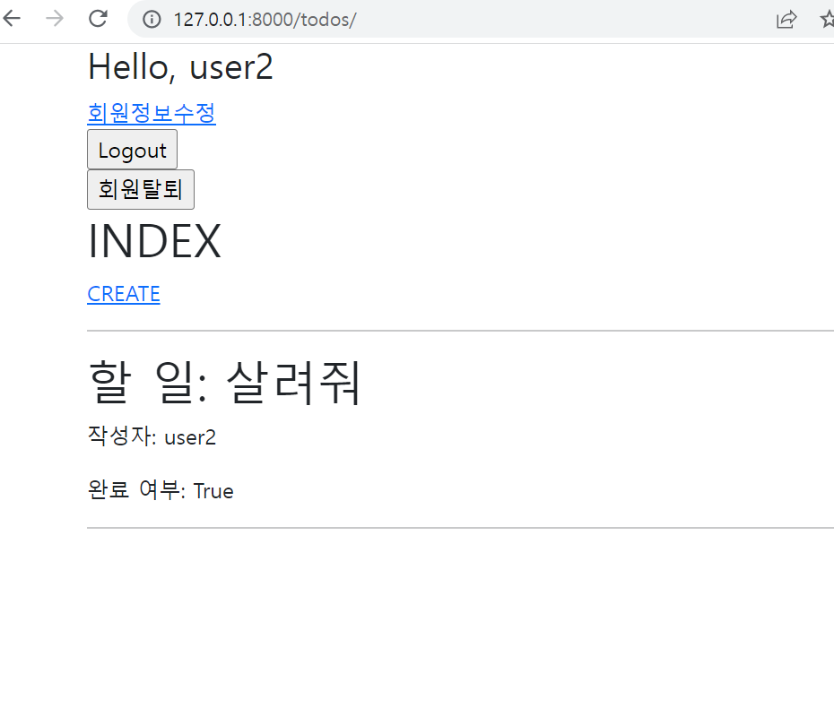
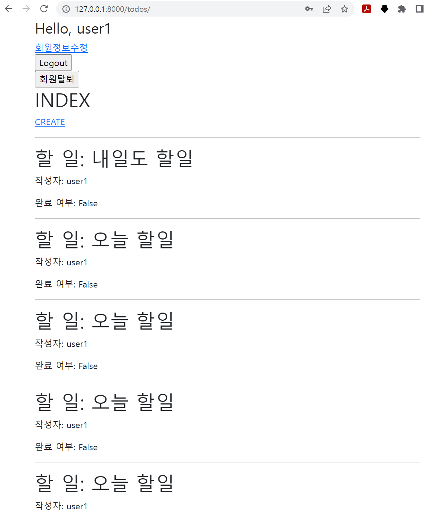
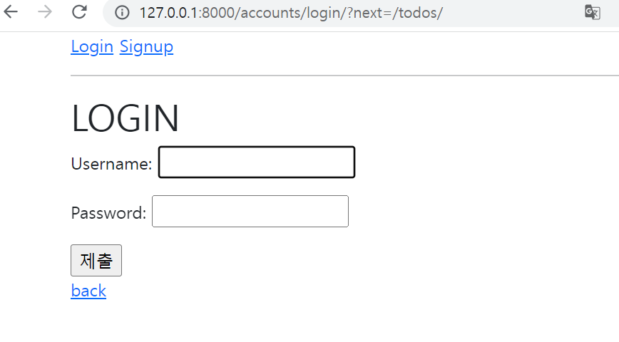

1. accounts

model.py

```python
from django.db import models
from django.contrib.auth.models import AbstractUser

# Create your models here.
class User(AbstractUser):
    pass
```

forms.py

```python
from django.contrib.auth.forms import UserChangeForm, UserCreationForm
from django.contrib.auth import get_user_model

from accounts.models import User


class CustomUserChangeForm(UserChangeForm):

    # password = None

    class Meta:
        model = get_user_model() # User
        fields = ('first_name', 'last_name',)
        

class CustomUserCreationForm(UserCreationForm):

    class Meta(UserCreationForm.Meta):
        model = get_user_model()
        fields = UserCreationForm.Meta.fields
```

views. py

```python
from django.contrib.auth import login as auth_login
from django.contrib.auth import logout as auth_logout
from django.contrib.auth import update_session_auth_hash
from django.contrib.auth.decorators import login_required
from django.contrib.auth.forms import (
    AuthenticationForm, 
    UserCreationForm, 
    PasswordChangeForm,
)
from django.views.decorators.http import require_http_methods, require_POST
from django.shortcuts import render, redirect
from .forms import CustomUserChangeForm, CustomUserCreationForm

# Create your views here.
@require_http_methods(['GET', 'POST'])
def login(request):
    if request.user.is_authenticated:
        return redirect('todos:index')

    if request.method == 'POST':
        form = AuthenticationForm(request, request.POST)
        if form.is_valid():
            # 로그인
            auth_login(request, form.get_user())
            return redirect(request.GET.get('next') or 'todos:index')
    else:
        form = AuthenticationForm()
    context = {
        'form': form,
    }
    return render(request, 'accounts/login.html', context)


@require_POST
def logout(request):
    if request.user.is_authenticated:
        auth_logout(request)
    return redirect('todos:index')


@require_http_methods(['GET', 'POST'])
def signup(request):
    if request.user.is_authenticated:
        return redirect('todos:index')

    if request.method == 'POST':
        form = CustomUserCreationForm(request.POST)
        if form.is_valid():
            user = form.save()
            auth_login(request, user)
            return redirect('todos:index')
    else:
        form = CustomUserCreationForm()
    context = {
        'form': form,
    }
    return render(request, 'accounts/signup.html', context)


@require_POST
def delete(request):
    if request.user.is_authenticated:
        # 반드시 회원탈퇴 후 로그아웃 함수 호출
        request.user.delete()
        auth_logout(request)
    return redirect('todos:index')


@login_required
@require_http_methods(['GET', 'POST'])
def update(request):
    if request.method == 'POST':
        form = CustomUserChangeForm(request.POST, instance=request.user)
        if form.is_valid():
            form.save()
            return redirect('todos:index')
    else:
        form = CustomUserChangeForm(instance=request.user)
    context = {
        'form': form,
    }
    return render(request, 'accounts/update.html', context)


@login_required
@require_http_methods(['GET', 'POST'])
def change_password(request):
    if request.method == 'POST':
        form = PasswordChangeForm(request.user, request.POST)
        if form.is_valid():
            # user = form.save()
            # update_session_auth_hash(request, user)
            form.save()
            update_session_auth_hash(request, form.user)
            return redirect('todos:index')
    else:
        form = PasswordChangeForm(request.user)
    context = {
        'form': form,
    }
    return render(request, 'accounts/change_password.html', context)

```


2. todos

model.py

```python
from django.db import models
from django.conf import settings

# Create your models here.
class Todo(models.Model):
    author = models.ForeignKey(settings.AUTH_USER_MODEL, on_delete=models.CASCADE)
    title = models.CharField(max_length=20)
    completed = models.BooleanField()

    def __str__(self):
        return self.title
```

forms.py

```python
from django import forms
from .models import Todo


class TodoForm(forms.ModelForm):

    class Meta:
        model = Todo
        # fields = '__all__'
        exclude = ('author',)
```

views. py

```python
from django.shortcuts import render, redirect
from todos.models import Todo
from todos.forms import TodoForm
from django.contrib.auth.decorators import login_required


# Create your views here.
@login_required
def index(request):
    todos = Todo.objects.order_by('-pk')
    context = {
        'todos': todos
    }
    return render(request, 'todos/index.html', context)


@login_required
def create(request):
    if request.method == 'POST':
        form = TodoForm(request.POST)
        if form.is_valid():
            todo = form.save(commit=False)
            todo.author = request.user
            todo.save()
            return redirect('todos:index')
    else:
        form = TodoForm()
    context = {
        'form': form,
    }
    return render(request, 'todos/create.html', context)

```


3. html

base.html

```django
<!DOCTYPE html>
<html lang="en">
<head>
  <meta charset="UTF-8">
  <meta http-equiv="X-UA-Compatible" content="IE=edge">
  <meta name="viewport" content="width=device-width, initial-scale=1.0">
  <link href="https://cdn.jsdelivr.net/npm/bootstrap@5.1.3/dist/css/bootstrap.min.css" rel="stylesheet" integrity="sha384-1BmE4kWBq78iYhFldvKuhfTAU6auU8tT94WrHftjDbrCEXSU1oBoqyl2QvZ6jIW3" crossorigin="anonymous">
  <title>Document</title>
</head>
<body>
  <div class="container">
    
      <h3>Hello, {{ user }}</h3>
      <a href="">회원정보수정</a>
      <form action="" method="POST">
        
        <input type="submit" value="Logout">
      </form>
      <form action="" method="POST">
        
        <input type="submit" value="회원탈퇴">
      </form>
    
      <a href="">Login</a>
      <a href="">Signup</a>
      <hr>
    
    
    
  </div>
  <script src="https://cdn.jsdelivr.net/npm/bootstrap@5.1.3/dist/js/bootstrap.bundle.min.js" integrity="sha384-ka7Sk0Gln4gmtz2MlQnikT1wXgYsOg+OMhuP+IlRH9sENBO0LRn5q+8nbTov4+1p" crossorigin="anonymous"></script>
</body>
</html>
```


index.html

```django



  <h1>INDEX</h1>
  
    <a href="">CREATE</a>
    <hr>
    
      
      <h1>할 일: {{todo.title}}</h1>
      <p>작성자: {{user}}</p>   
      <p>완료 여부: {{todo.completed}}</p>
      <hr>   
      
      
    
  
    
  


```


4. 사진


- user 2의 화면



- user1의 화면에는 user1의 글만 보임,,




- 로그인 해야 사용 가능,, (redirect)

