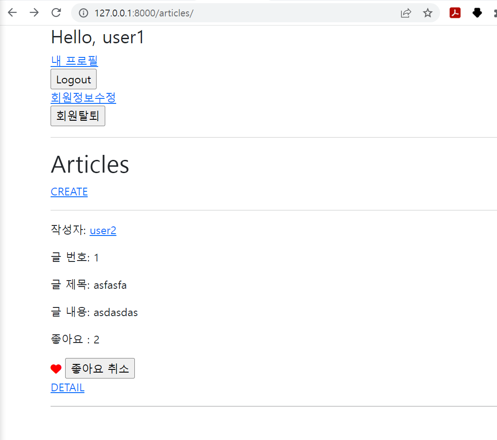
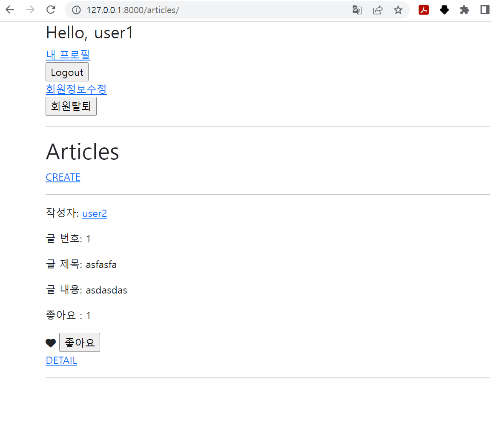

1. Model

```python
from django.db import models
from django.conf import settings

# Create your models here.
class Article(models.Model):
    user = models.ForeignKey(settings.AUTH_USER_MODEL, on_delete=models.CASCADE)
    like_users = models.ManyToManyField(settings.AUTH_USER_MODEL, related_name='like_articles')  # 좋아요 처리를 위함
    title = models.CharField(max_length=10)
    content = models.TextField()
    created_at = models.DateTimeField(auto_now_add=True)
    updated_at = models.DateTimeField(auto_now=True)

    def __str__(self):
        return self.title


class Comment(models.Model):
    article = models.ForeignKey(Article, on_delete=models.CASCADE)
    user = models.ForeignKey(settings.AUTH_USER_MODEL, on_delete=models.CASCADE)
    content = models.CharField(max_length=200)
    created_at = models.DateTimeField(auto_now_add=True)
    updated_at = models.DateTimeField(auto_now=True)

    def __str__(self):
        return self.content

```


2. url

```python
from django.urls import path
from . import views


app_name = 'articles'
urlpatterns = [
    path('', views.index, name='index'),
    path('create/', views.create, name='create'),
    path('<int:pk>/', views.detail, name='detail'),
    path('<int:pk>/delete/', views.delete, name='delete'),
    path('<int:pk>/update/', views.update, name='update'),
    path('<int:pk>/comments/', views.comment_create, name='comment_create'),
    path('<int:article_pk>/comments/<int:comment_pk>/delete/', views.comment_delete, name='comment_delete'),
    path('<int:article_pk>/likes/', views.likes, name='likes'),  # 좋아요 처리
]
```


3. view

```python
from django.contrib.auth.decorators import login_required
from django.shortcuts import render, redirect, get_object_or_404
from django.views.decorators.http import require_http_methods, require_POST, require_safe
from .models import Article, Comment
from .forms import ArticleForm, CommentForm

# Create your views here.
@require_safe
def index(request):
    articles = Article.objects.order_by('-pk')
    context = {
        'articles': articles,
    }
    return render(request, 'articles/index.html', context)


@login_required
@require_http_methods(['GET', 'POST'])
def create(request):
    if request.method == 'POST':
        form = ArticleForm(request.POST)
        if form.is_valid():
            article = form.save(commit=False)
            article.user = request.user
            article.save()
            return redirect('articles:detail', article.pk)
    else:
        form = ArticleForm()
    context = {
        'form': form,
    }
    return render(request, 'articles/create.html', context)


@require_safe
def detail(request, pk):
    article = get_object_or_404(Article, pk=pk)
    comment_form = CommentForm()
    # 조회한 article의 모든 댓글을 조회(역참조)
    comments = article.comment_set.all()
    context = {
        'article': article,
        'comment_form': comment_form,
        'comments': comments,
    }
    return render(request, 'articles/detail.html', context)


@require_POST
def delete(request, pk):
    article = get_object_or_404(Article, pk=pk)
    if request.user.is_authenticated:
        if request.user == article.user:
            article.delete()
    return redirect('articles:index')


@login_required
@require_http_methods(['GET', 'POST'])
def update(request, pk):
    article = get_object_or_404(Article, pk=pk)
    if request.user == article.user:
        if request.method == 'POST':
            form = ArticleForm(request.POST, instance=article)
            if form.is_valid():
                article = form.save()
                return redirect('articles:detail', article.pk)
        else:
            form = ArticleForm(instance=article)
    else:
        return redirect('articles:index')
    context = {
        'article': article,
        'form': form,
    }
    return render(request, 'articles/update.html', context)


@require_POST
def comment_create(request, pk):
    if request.user.is_authenticated:
        article = get_object_or_404(Article, pk=pk)
        comment_form = CommentForm(request.POST)
        if comment_form.is_valid():
            comment = comment_form.save(commit=False)
            comment.article = article
            comment.user = request.user
            comment.save()
        return redirect('articles:detail', article.pk)
    return redirect('accounts:login')


@require_POST
def comment_delete(request, article_pk ,comment_pk):
    if request.user.is_authenticated:
        comment = get_object_or_404(Comment, pk=comment_pk)
        if request.user == comment.user:
            comment.delete()
    return redirect('articles:detail', article_pk)


@require_POST
def likes(request, article_pk):
    if request.user.is_authenticated:  # 로그인한 유저의 요청만 처리
        article = get_object_or_404(Article, pk=article_pk)

        # 이 게시글에 좋아요를 누른 유저 목록에 현재 요청하는 유저가 있다면.. 좋아요 취소
        # if request.user in article.like_users.all(): 
        if article.like_users.filter(pk=request.user.pk).exists():  # 두번 누름 취소
            article.like_users.remove(request.user)
        else:  # 한번 이면 좋아요
            article.like_users.add(request.user)
        return redirect('articles:index')
    return redirect('accounts:login')


```


4. Templates

- base.html

```django
<!DOCTYPE html>
<html lang="en">
<head>
  <meta charset="UTF-8">
  <meta http-equiv="X-UA-Compatible" content="IE=edge">
  <meta name="viewport" content="width=device-width, initial-scale=1.0">
  <link href="https://cdn.jsdelivr.net/npm/bootstrap@5.1.3/dist/css/bootstrap.min.css" rel="stylesheet" integrity="sha384-1BmE4kWBq78iYhFldvKuhfTAU6auU8tT94WrHftjDbrCEXSU1oBoqyl2QvZ6jIW3" crossorigin="anonymous">
  <title>Document</title>
</head>
<body>
  <div class="container">
    
      <h3>Hello, {{ user }}</h3>
      <a href="">내 프로필</a>
      <form action="" method="POST">
        
        <input type="submit" value="Logout">
      </form>
      <a href="">회원정보수정</a>
      <form action="" method="POST">
        
        <input type="submit" value="회원탈퇴">
      </form>
    
      <a href="">Login</a>
      <a href="">Signup</a>
    

    <hr>

    
    
  </div>
  <script src="https://kit.fontawesome.com/cfc6f760f1.js" crossorigin="anonymous"></script>  # 하트 로고 추가를 위한 script
  <script src="https://cdn.jsdelivr.net/npm/bootstrap@5.1.3/dist/js/bootstrap.bundle.min.js" integrity="sha384-ka7Sk0Gln4gmtz2MlQnikT1wXgYsOg+OMhuP+IlRH9sENBO0LRn5q+8nbTov4+1p" crossorigin="anonymous"></script>
</body>
</html>

```

- index.html

```django



  <h1>Articles</h1>
  
    <a href="">CREATE</a>
  
    <a href="">[새 글을 작성하려면 로그인 하세요]</a>
  
  <hr>
  
    <p>작성자:  <a href="">{{ article.user }}</a></p>
    <p>글 번호: {{ article.pk }}</p>  
    <p>글 제목: {{ article.title }}</p>
    <p>글 내용: {{ article.content }}</p>
    <p>좋아요 : {{article.like_users.all.count}}</p>
    <div>
      <form action="" method="POST">  
        
        
          <i class="fa-solid fa-heart" style="color: red;"></i>
          <input type="submit" value="좋아요 취소">
        
          <i class="fa-solid fa-heart"></i>
          <input type="submit" value="좋아요">
        
      </form>
    </div>
    <a href="">DETAIL</a>
    <hr>
  


```


사진

- 좋아요 2명



- 좋아요 취소 시

