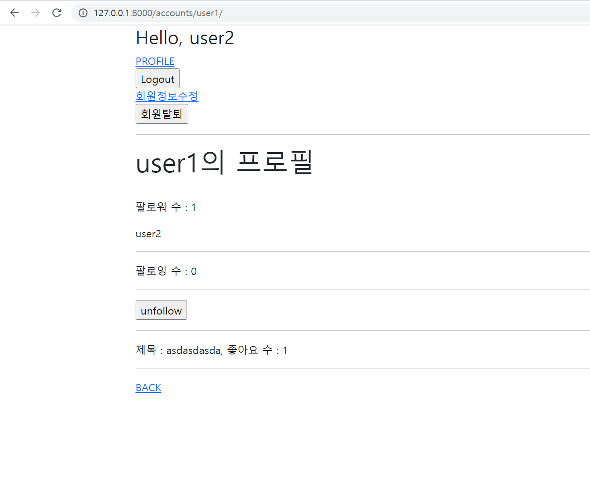
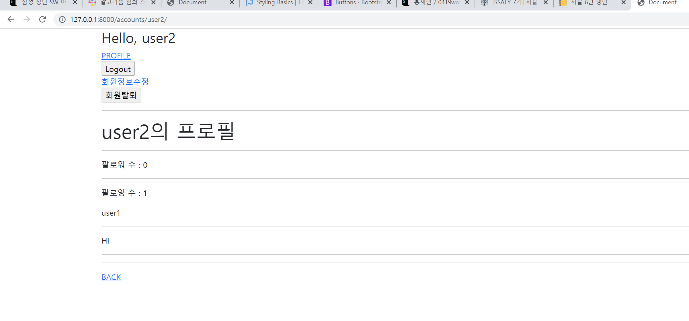

1. accounts/views.py

```python
from django.contrib.auth import login as auth_login
from django.contrib.auth import logout as auth_logout
from django.contrib.auth import update_session_auth_hash, get_user_model
from django.contrib.auth.decorators import login_required
from django.contrib.auth.forms import (
    AuthenticationForm, 
    UserCreationForm, 
    PasswordChangeForm,
)
from django.views.decorators.http import require_http_methods, require_POST
from django.shortcuts import get_object_or_404, render, redirect
from .forms import CustomUserChangeForm, CustomUserCreationForm

# Create your views here.
@require_http_methods(['GET', 'POST'])
def login(request):
    if request.user.is_authenticated:
        return redirect('articles:index')

    if request.method == 'POST':
        form = AuthenticationForm(request, request.POST)
        if form.is_valid():
            # 로그인
            auth_login(request, form.get_user())
            return redirect(request.GET.get('next') or 'articles:index')
    else:
        form = AuthenticationForm()
    context = {
        'form': form,
    }
    return render(request, 'accounts/login.html', context)


@require_POST
def logout(request):
    if request.user.is_authenticated:
        auth_logout(request)
    return redirect('articles:index')


@require_http_methods(['GET', 'POST'])
def signup(request):
    if request.user.is_authenticated:
        return redirect('articles:index')

    if request.method == 'POST':
        form = CustomUserCreationForm(request.POST)
        if form.is_valid():
            user = form.save()
            auth_login(request, user)
            return redirect('articles:index')
    else:
        form = CustomUserCreationForm()
    context = {
        'form': form,
    }
    return render(request, 'accounts/signup.html', context)


@require_POST
def delete(request):
    if request.user.is_authenticated:
        # 반드시 회원탈퇴 후 로그아웃 함수 호출
        request.user.delete()
        auth_logout(request)
    return redirect('articles:index')


@login_required
@require_http_methods(['GET', 'POST'])
def update(request):
    if request.method == 'POST':
        form = CustomUserChangeForm(request.POST, instance=request.user)
        if form.is_valid():
            form.save()
            return redirect('articles:index')
    else:
        form = CustomUserChangeForm(instance=request.user)
    context = {
        'form': form,
    }
    return render(request, 'accounts/update.html', context)


@login_required
@require_http_methods(['GET', 'POST'])
def change_password(request):
    if request.method == 'POST':
        form = PasswordChangeForm(request.user, request.POST)
        if form.is_valid():
            # user = form.save()
            # update_session_auth_hash(request, user)
            form.save()
            update_session_auth_hash(request, form.user)
            return redirect('articles:index')
    else:
        form = PasswordChangeForm(request.user)
    context = {
        'form': form,
    }
    return render(request, 'accounts/change_password.html', context)

def profile(request, username):
    me = get_object_or_404(get_user_model(), username=username)
    context = {
        'me': me
    }
    return render(request, 'accounts/profile.html', context)


def follow(request, user_pk):
    me = request.user
    you = get_object_or_404(get_user_model(), pk=user_pk)

    if me != you:
        if you.followers.filter(pk=me.pk).exists():
            you.followers.remove(me)
        else:
            you.followers.add(me)
        return redirect('accounts:profile', you.username)
        

```


2. accounts.model.py

```python
from django.db import models
from django.contrib.auth.models import AbstractUser

# Create your models here.
class User(AbstractUser):
    followings = models.ManyToManyField('self', symmetrical=False, related_name='followers')

```


3. profile.html

```django




<h1>{{ me }}의 프로필</h1>

<hr>

<p>팔로워 수 : {{ me.followers.all|length }}</p>

  {{ follower.username }}

<hr>
<p>팔로잉 수 : {{ me.followings.all|length }}</p>

  {{ follow.username }}

<hr>

  <p>HI</p>

  <form action="" method="POST">
    
    
      <input type="submit" value="unfollow">
    
      <input type="submit" value="follow">
    
  </form>

<hr>

<p>제목 : {{article}}, 좋아요 수 : {{article.like_users.all|length}}</p>

<hr>
<a href="">BACK</a>

```


사진



