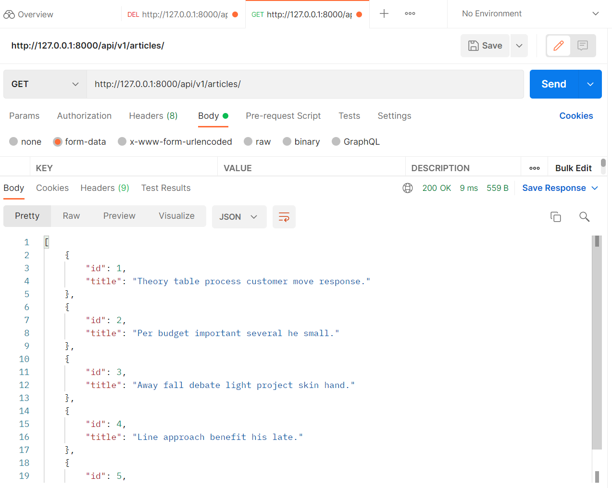
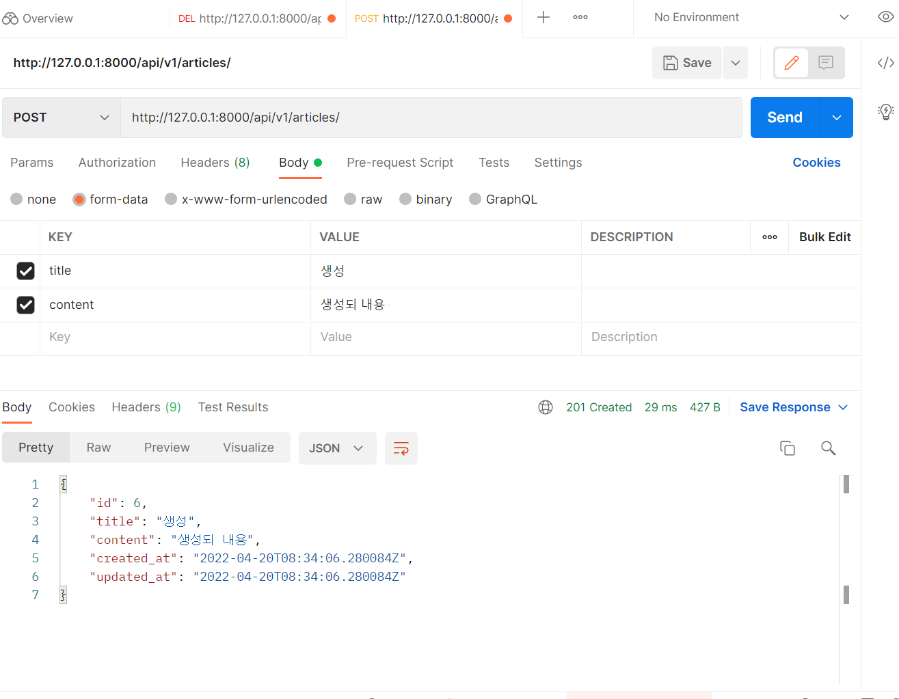
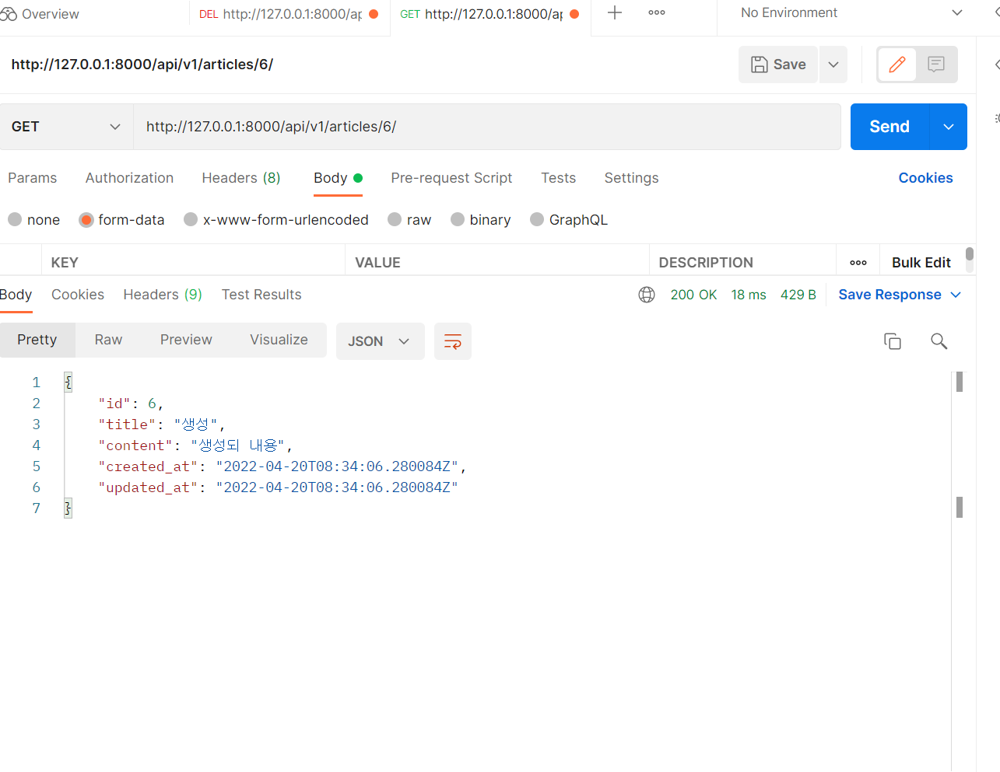
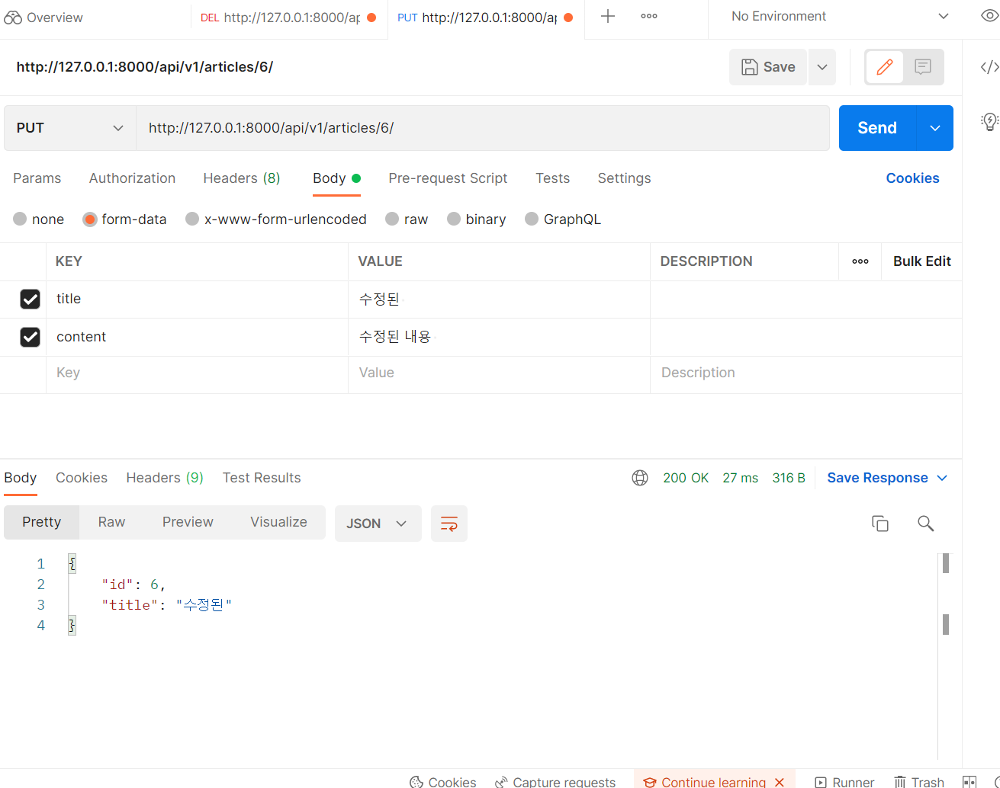
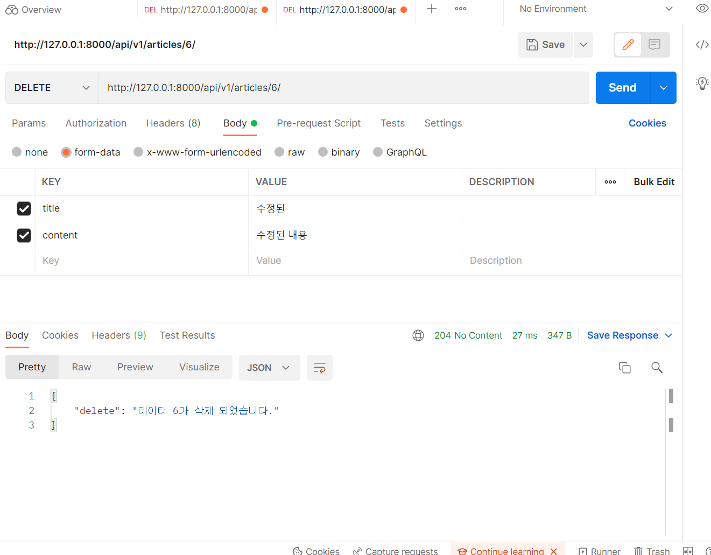

1. views.py

```python
from cgitb import reset
from urllib import response
from rest_framework import status
from rest_framework.response import Response
from rest_framework.decorators import api_view
from django.shortcuts import get_list_or_404, get_object_or_404
from django.shortcuts import render
from .models import Article
from. serializers import ArticleListSerializer, ArticleSerializer
from articles import serializers
# Create your views here.

@api_view(['GET', 'POST'])
def article_list(request):
    if request.method == 'GET':
        # article = Article.objects.all()
        article = get_list_or_404(Article)
        serializers = ArticleListSerializer(article, many=True)
        return Response(serializers.data)
    elif request.method == 'POST':
        serializers = ArticleSerializer(data=request.data)
        if serializers.is_valid(raise_exception=True):
            serializers.save()
            return Response(serializers.data, status=status.HTTP_201_CREATED)
    # return Response(serializers.errors, status=status.HTTP_500_INTERNAL_SERVER_ERROR)


@api_view(['GET', 'DELETE', 'PUT'])
def article_detail(request, article_pk):
    article = get_object_or_404(Article, pk=article_pk)
    if request.method == 'GET':
        serializers = ArticleSerializer(article)
        return Response(serializers.data)

    elif request.method == 'DELETE':
        article.delete()
        data = {
            'delete': f'데이터 {article_pk}가 삭제 되었습니다.'
        }
        return Response(data, status=status.HTTP_204_NO_CONTENT)

    elif request.method == 'PUT':
        serializers = ArticleListSerializer(article, request.data)
        if serializers.is_valid(raise_exception=True):
            serializers.save()
            return Response(serializers.data)
   
    
```


2. serializers.py

```python
from dataclasses import field
from rest_framework import serializers
from .models import Article


class ArticleListSerializer(serializers.ModelSerializer):

    class Meta:
        model = Article
        fields = ('id', 'title', )


class ArticleSerializer(serializers.ModelSerializer):
    class Meta:
        model = Article
        fields = '__all__'


```


3. 사진

- GET




- POST




- GET




- PUT




- DELETE


