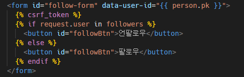
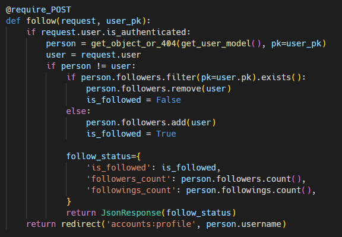
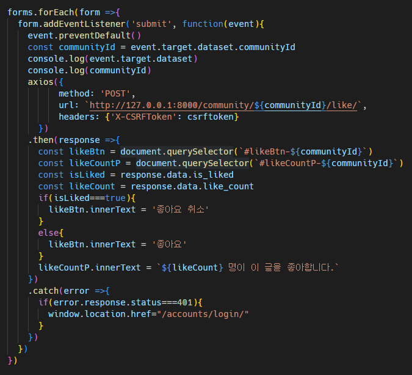
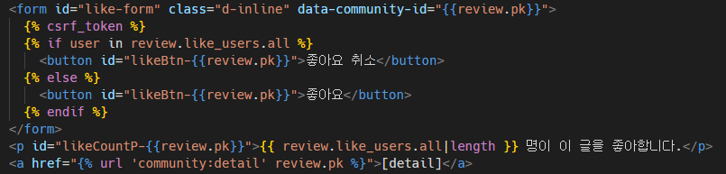
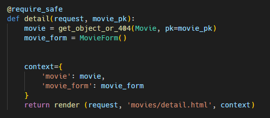

# 관통pjt09. Vue 기초

제출일 : 2022-05-06

작성자 : 손보희, 홍제민

- 목표
  - 데이터를 생성, 조회, 수정, 삭제할 수 있는 Web Application 제작
  - AJAX 통신과 JSON 구조에 대한 이해
  - Database 1:N, M:N 관계의 이해와 데이터 관계 설정
  - 영화 추천 알고리즘 설계
- 요구사항
  - 커뮤니티 서비스의 상세 기능 개발을 위한 단계로, 비동기 통신(AJAX)을 활용하여 사용자의 UI/UX를 개선합니다.


### 1. 유저 팔로우 기능

- 팔로우 버튼을 클릭하는 경우, AJAX통신을 이용하여 서버에서 JSON데이터를  받아와 상황에 맞게 HTML화면을 구성하였습니다.

  1. `/profile.html` 에서 form에서 action과 method 삭제 (axios로 대체)

  2. user id를 HTML의 data 속성(data-*)으로 받아옴 (URL 작성) - data mdn 확인하기

     

     - ```vue
       <script>
         const form = document.querySelector('#follow-form')
       
         form.addEventListener('submit', function(event){
           event.preventDefault()
           const userId = event.target.dataset.userId
       
           axios(
             {
                 method: 'POST',
                 url: `http://127.0.0.1:8000/accounts/${userId}/follow/`,
             })
       </script>
       ```

     - data속성의 명칭은 자바스크립트로 오면 카멜케이스로 자동 변환되어서 위에와 같은 경우에는 `data-user-id`가 `userId`로 변환 된다.

  3. axios로 CSRF 토큰을 함께 보냄 (403 에러 해결, DB 반영 문제 없음) - django [공식문서](https://docs.djangoproject.com/en/4.0/ref/csrf/) 확인하기

     - ```Vue
       <script>
         const form = document.querySelector('#follow-form')
         const csrftoken = document.querySelector('[name=csrfmiddlewaretoken]').value;
       
         form.addEventListener('submit', function(event){
           event.preventDefault()
           const userId = event.target.dataset.userId
       
           axios(
             {
                 method: 'POST',
                 url: `http://127.0.0.1:8000/accounts/${userId}/follow/`,
                 headers: {'X-CSRFToken': csrftoken}
             })
       </script>
       ```

  4. 새로고침을 해야 결과가 반영되었다. (팔로우 버튼이랑 팔로워 수에 해당하는 부분, 여전히 장고는 문서를 응답하고 있기 때문)

  5. 장고에서 문서가 아닌 JSON을 응답 (view함수 조정, 그 데이터 가져와서 적용하기)

     

  6. 자바스크립트가 JSON 데이터를 받아서 DOM을 조작

     - ```javascript
           .then(response => {
             const followBtn = document.querySelector('#followBtn')
             const followCount = document.querySelector('#follow-count')
             // console.log(response.data)
             const isFollowed = response.data.is_followed
             const followersCount = response.data.followers_count
             const followingsCount = response.data.followings_count
             if(isFollowed===true){
               followBtn.innerText = `언팔로우`
             }
             else{
               followBtn.innerText = `팔로우`
             }
             followCount.innerText = `팔로잉 : ${ followingsCount } / 팔로워 : ${ followersCount }`
       
           })
       ```

     - 중간중간 진행하면서 `console.log()`를 통해 데이터와 데이터명들을 확인했다.


### 2. 리뷰 좋아요 기능

- 위의 팔로우 기능 구현과 거의 유사한 코드로 작성하였다.

- 좋아요 기능은 for 문 안에 존재하기 때문에 forEach를 사용했다.

  

  - `.catch`의 역할을 정확히 모르겠어서 구글에 검색을 해보았다. (교재 활용)
    - `.then`이 하나라도 실패하면(거부 되면) 동작된다. (동기식의 'try - except' 구문과 유사)

- 어떤 리뷰 글의 좋아요 버튼인지 구분을 하기 위해서 button 태그 안의 id를 아래와 같이 작성하였다.

  

- 로그인하지 않은 상태에서 좋아요 버튼을 누르면 undefined가 출력된다.

  


### 3. movies app

- 너무 오랜만에 하는 django로 인해 많은 오류와 고민이 발생했다.
- `python manage.py loaddata movies.json`
  - `movies/fixtures/movies.json`의 데이터 파일을 받아온다.

#### 3.1 전체 영화 목록 페이지 조회

- 사용자의 인증 여부와 관계없이 전체 영화 목록 조회 페이지를 조회한다.

  - 처음에 movie의 목록은 한 페이지에 전부 조회하는 페이지를 만들었다.

  - serializer를 활용해서 rest_framework를 통해 JSON형태의 데이터를 출력하였으나, 명세에서 원하는 결과가 아니었다.

  - `get_list_or_404` 를 활용해서 html로 전체 목록을 조회하는 페이지를 만들었다.

    ```python
    @require_safe
    def index(request):
        movies = get_list_or_404(Movie)
        paginator  = Paginator(movies, 10)
        page_number = request.GET.get('page')
        page_obj = paginator.get_page(page_number)
        context = {
            'movies': page_obj,
            # 'page_obj': page_obj
    
        }
        return render(request, 'movies/index.html', context)
    ```

    

  - 데이터가 한 페이지에 너무 많이 로드되기 때문에 paginator를  사용했다.

    - django의 paginator를 이용해서 한 페이지에 10개의 목록만 조회되도록 변경하였다.
    - 편의성을 위해 bootstrap5를 활용해서 하단에 paginator를 구현하였다.

    

#### 3.2 단일 영화 상세 조회 페이지

- index 뷰 함수와 유사한 코드라서 간단히 작성하였다.

  

- 결과 페이지


### 4. 영화 추천 기능

- 사용자가 인증되어 있다면, 적절한 알고리즘을 활용하여 10개의 영화를 추천하여 제공합니다.

- 가장 기본적인 방법을 사용해서 추천 기능을 활성화했다.

  - 평점을 내림차순으로 정렬해서 상위 10개의 영화를 추천하는 알고리즘을 선택했습니다.

  

- 순위를 나타내는 숫자를 표현하는데 `{{ forloop.counter }}`를 사용해야 했다.

- 오류발생 ❌❌❌

  ```python
  @require_safe
  def recommended(request):
      movie2 = Movie.objects.order_by('-vote_average')[:10]
      # movies = get_list_or_404(Movie).order_by('-vote_averge')[:10]
      context = {
          'movies': movie2,
      }
      return render (request, 'movies/recommended.html', context)
  ```

  - 처음에 movies를 `get_list_or_404`로 데이터를 받아서 정렬하니까 아래와 같은 오류페이지가 나왔다.

    

  - `Movie.objects.order_by()`로 작성해야 제대로된 페이지가 출력되었다.


#### 4.1 다른 추천 기능 도전

- 평점 순으로 하는 추천보다 조금 더 여러가지 정보를 합산한 결과를 가지고 추천을 하는 방법을 도전해 보았다.

  ```python
  @require_safe
  def recommended(request):
      movies = Movie.objects.filter(vote_count__gte=10000, popularity__gte=50).order_by('-vote_average')[:10]
      # movies = get_list_or_404(Movie).order_by('-vote_averge')[:10]
      context = {
          'movies': movies,
      }
      return render (request, 'movies/recommended.html', context)
  ```

  - `filter(vote_count__gte=10000, popularity__gte=50)` 를 통해 vote_count는 10000 이상이고, popularity가 50이상인 영화만 추천되도록 필터를 적용했다.

  - 그 결과 중에서 평점을 내림차순해서 상위 10개의 영화만 나타내도록 했다.
    

- 사용자가 보고 싶은 연도의 영화목록을 추천하기 위해 사용자의 입력으로 연도를 받았다.

  - method를 GET과 POST로 구분해서 기존의 GET방식으로는 모든 연도의 인기영화를 추천받고, POST의 경우에는 해당 연도의 인기영화만 추천되는 방식으로 알고리즘을 설계하였다.
  - 해당 연도의 인기 영화만 출력한다.

  ```python
  def recommended(request):
      if request.method=="GET":
          movies = Movie.objects.filter(vote_count__gte=10000, popularity__gte=50).order_by('-vote_average')[:10]
      elif request.method == "POST":
          movie_year = request.POST.get('movie_year')
          # movie_year = request.GET['movie_year']
          movies = Movie.objects.filter(release_date__year=int(movie_year), vote_count__gte=10000, popularity__gte=50).order_by('-vote_average')[:10]
      context = {
          'movies': movies,
      }
      return render (request, 'movies/recommended.html', context)
  ```

  

  

  - 2001년을 입력한 후의 페이지


### 5. 느낀점

- 손보희 : 오랜만에 하는 장고라서 여러부분들을 검색을 통해 다시 들여다 봐야했습니다. 자주 사용하던 문법도 헷갈리는 부분들이 많아서 추가적으로 공부할 부분이 많다고 깨달았습니다. 추천 방법을 여러가지 방법을 사용하려고 시도했지만 주어진 시간안에 API까지 접근하기에는 힘들었습니다. 최종 프로젝트에서는 여러 방법과 아이디어를 실현가능하도록 노력해봐야할 것 같습니다.

- 홍제민 : 스켈레톤 코드가 주어졌지만, requirement.txt에서 필요한 것들이 모두 주어지지 않아 원하는 기능을 구현함에 있어 공식문서를 찾아보고 설치하는 과정이 필요했다. 최근 까지 수업자료에서 주어지거나 따라한 것이 전부였기에 직접해보는 것은 시간이 좀 더 걸렸지만, 자신감도 생기고 복습하는 좋은 기회가 되었다. 이외에도 다양한 코드를 구현 함에 있어 이해한 것이 아닌 암기하여 사용한 것들에서 적용하는데 문제가 발생하였는데, 이를 고쳐나가는 것도 고생이었다.