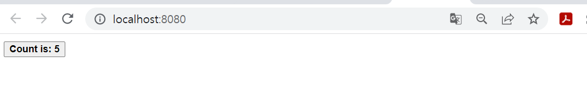

# VUE3

#### 시작

1. `npm create <app>`

- 이 때 `create . <app>`으로 하면 해당 경로에 바로 설치


#### 구조

##### 기본

```vue
<script>
export default {
  data() {
    return {
      count: 0
    }
  }
}
</script>

<template>
  <button @click="count++">Count is: {{ count }}</button>
</template>

<style scoped>
button {
  font-weight: bold;
}
</style>
```



위와 같은 페이지가 출력


#### API

##### Option API

기존에 사용하던 방법으로 익숙하다.

```vue
<script>
export default {
  // Properties returned from data() become reactive state
  // and will be exposed on `this`.
  data() {
    return {
      count: 0
    }
  },

  // Methods are functions that mutate state and trigger updates.
  // They can be bound as event listeners in templates.
  methods: {
    increment() {
      this.count++
    }
  },

  // Lifecycle hooks are called at different stages
  // of a component's lifecycle.
  // This function will be called when the component is mounted.
  mounted() {
    console.log(`The initial count is ${this.count}.`)
  }
}
</script>

<template>
  <button @click="increment">Count is: {{ count }}</button>
</template>
```


##### Composition

react에서 사용하는 class로 만들어 하나의 기능 단위를 만드는 듯 함

```vue
<script setup>
import { ref, onMounted } from 'vue'

// reactive state
const count = ref(0)

// functions that mutate state and trigger updates
function increment() {
  count.value++
}

// lifecycle hooks
onMounted(() => {
  console.log(`The initial count is ${count.value}.`)
})
</script>

<template>
  <button @click="increment">Count is: {{ count }}</button>
</template>
```


##### 차이점

- Composition을 쓰면 나중에 프로젝트가 복잡해져도 찾기 어렵지 않을 듯 하다. 이거에 익숙해 지도록 합시다. react랑 비슷하다는 말이 무슨 뜻인지 알았다.


#### ref

template에서 사용한 변수를 script에서 쓰기 쉽게 해주는 듯

##### ex)

```vue
<template>
  <div>
    <input type="text" placeholder="Start typing..." ref="abcd" />
  </div>
</template>

<script setup>
import { ref, onMounted } from 'vue'

let abcd = ref(null)

onMounted(() => {
  abcd.value.focus()
})
</script>

```


##### ex2)

```vue
<template>
  <ul>
    <li
      v-for="(name, i) in names"
      :key="name"
      :ref="(el) => (elements[2*i] = el)"
    >
      {{ name }}
    </li>
  </ul>
</template>

<script setup>
import { ref, onMounted } from 'vue'

const names = ref(['Matt', 'John', 'Jane'])
const elements = ref([])
onMounted(() => {
  console.log(elements.value)
})
</script>
```

