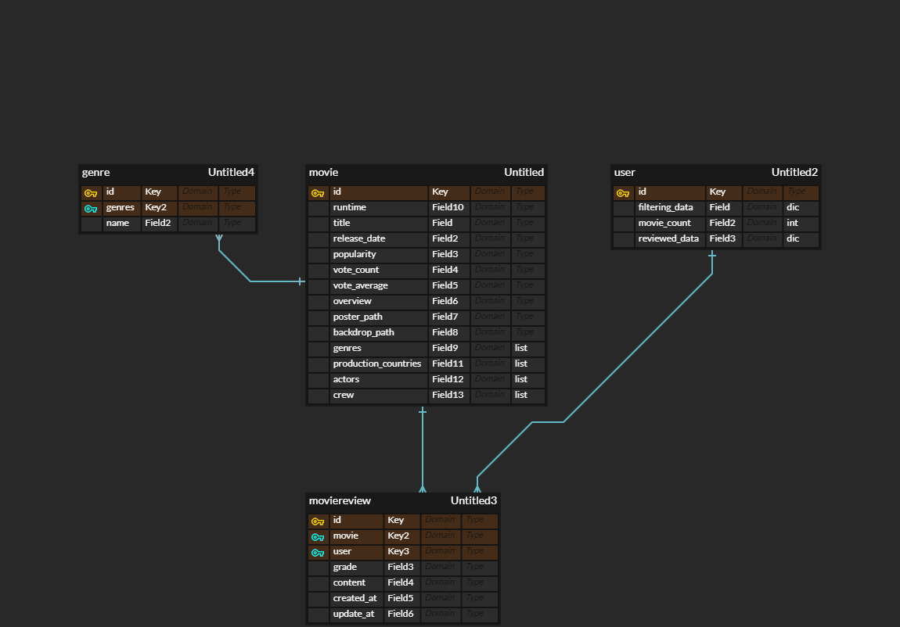
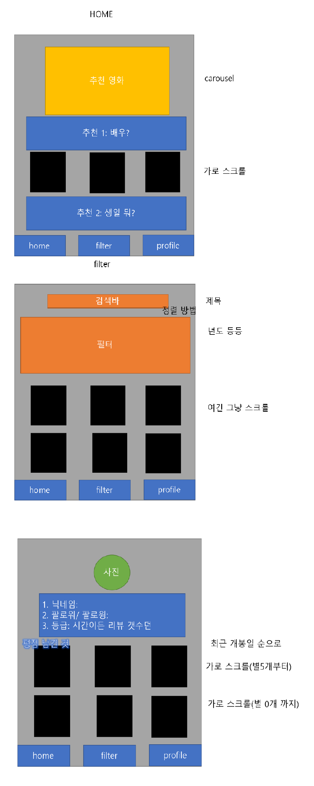
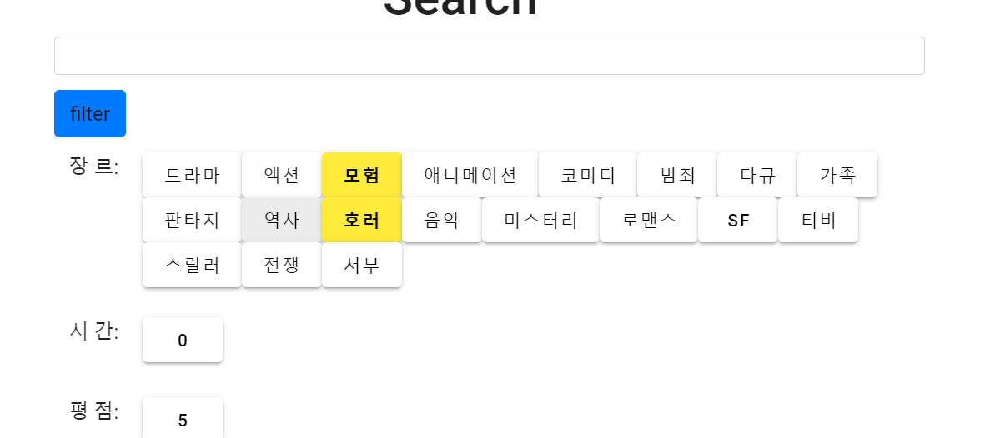
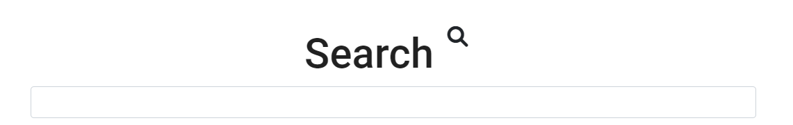
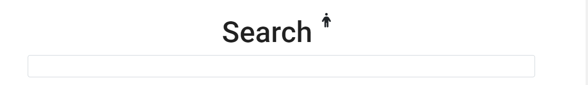
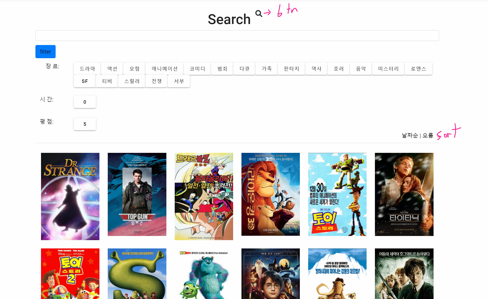

# Final PJT

# 제목: 영화 추천 알고리즘 프로젝트

- ##### 여행가기 좋은 나라의 영화 추천 서비스

- SSAFY 7기 홍제민, 유경훈

  - 역할
    - 유경훈 : main page 기획 및 구현
    - 홍제민 : filter(search) page 기획 및 구현, profile page 기획 및 구현


## 모델 및 앱 화면





## 구성

## main page

1. 기능 : 사용자에게 다양한 알고리즘을 통해 영화를 추천하여 편의성을 도모하고 흥미를 유발함.
   - Main Algorithm

     - Covid-19 API 를 활용하여 각 국가의 현지 상황을 파악함.

     - 현지 상황이 좋지 않아 여행가기 어려운 나라를 제외하여, 여행이 가능한 나라들을 구성함.

     - 여행이 가능한 나라 중 환율 API 와 날씨 API 를 통해, 현실적으로 여행가기  좋은 나라를 찾음.

     - 여행가기 좋은 나라의 영화를 추천하여, 여행에 대한 기대감을 높이고, 해당 국가의 분위기를 선제적으로 간접체험할 수 있는 기회를 제공함.
   - Sub Algorithms
     - 각 국가들을 적절히 조합하여 재미있는 여행 테마를 만듦.
     - 여행 테마에 따라 다양한 국가의 영화를 추천함.
     - 사용자 개인 특성에 따라 인기 장르의 영화를 추천함으로써, 사용자 편의성을 높이고, 효율적인 영화추천을 제공함.

2. 구현

   - (Main Algorithm) Covid-19 API 를 활용하여 각 국가의 현지 상황 파악 후, 여행 가능 국가 선정

     
     
     ```javascript
     // (Front) scr > views > Mainview.vue
     
     methods:{
         getCovid: function() {
           // const covidPassCountries = []
           countries.forEach((country, index) => {
             const options = {
               method: 'GET',
               url: 'https://covid-193.p.rapidapi.com/statistics',
               params: {country: country},
               headers: {
                 'X-RapidAPI-Host': 'covid-193.p.rapidapi.com',
                 'X-RapidAPI-Key': '20e0fd6a32msh9c342b484a50c8dp141c9ejsnacc814584485'
               }
             };
             axios.request(options)
               .then(response => {
                 const active = response.data.response[0].cases.active
                 const today = response.data.response[0].cases.new
                 if (today === 'null') {
                   today === 0
                 } else {
                   today === Number(today)
                 }
                 console.log('인구', response.data.response[0].population)
                 const population = response.data.response[0].population
                 const key = (active + today * 10) *100 / population
                 if (key <= 1) {
                   storetmp.dispatch('getCovidPassCountryData', country)
                   console.log({[country]: index})
                 }
               })
                 .catch(error => {
                   console.error(error);
                 });
             })
           },
     }
     ```
     
     ```python
     # (Back) movies / views.py
     
     @api_view(['GET', 'POST'])
     def finalmovie(request):
         # print('요청들어옴')
         # print(request.data)  # {'country': 'Japan'}
         country = request.data['country']  # Japan
         if country == 'Australia':
             production_country = 'AU'  # 1 / 8
         elif country == 'Canada':
             production_country = 'CA'  # 3 / 18
         elif country == 'China':
             production_country = 'CN'  # 2 / 11
         elif country == 'France':
             production_country = 'FR'  # 6 / 15
         elif country == 'Germany':
             production_country = 'DE'  # 1 / 11
         elif country == 'Japan':
             production_country = 'JP'  # 27 / 36
         elif country == 'Mexico':
             production_country = 'MX'  # 5 / 10
         elif country == 'Spain':
             production_country = 'ES'  # 6 / 7
         elif country == 'Uk':
             production_country = 'GB'  # 7 / 43
         elif country == 'USA':
             production_country = 'US'  # 190 / 272
     
         # production_country = "DE"
         print(production_country, type(production_country))
         movies = Movie.objects.filter(production_countries__icontains=production_country)
         movies = list(movies)
         print(len(movies))
         random_six_movies = random.sample(movies, 6)
         print(len(random_six_movies), random_six_movies)
         
         serializer = MovieListSerializer(random_six_movies, many=True)
         return Response(serializer.data)
     
     ```
     
     
   
   
      - (Main Algorithm) 여행이 가능한 나라 중 환율 API 와 날씨 API 를 통해, 현실적으로 여행가기  좋은 나라를 찾음.
   
        ```javascript
        // (Front) scr > views > Mainview.vue
        
        Methods:{
        	getYearRate: function() {
              const ago = moment().subtract(1, 'year').format('YYYY-MM-DD')
              const options = {
                method: 'GET',
                url: 'https://currencyscoop.p.rapidapi.com/historical',
                params: {date: ago},
                headers: {
                  'X-RapidAPI-Host': 'currencyscoop.p.rapidapi.com',
                  'X-RapidAPI-Key': '20e0fd6a32msh9c342b484a50c8dp141c9ejsnacc814584485'
                }
              };
              axios.request(options)
                .then(response => {
                  const rates = response.data.response.rates
                  for(let i = 0; i < 10; i++) {
                    storetmp.dispatch('getYearRateData', rates[currencies[i]])
                  }
                })
                .catch(error => {
                  console.error(error);
                });
            },
        
            getTodayRate: function() {
                const options = {
                  method: 'GET',
                  url: 'https://currencyscoop.p.rapidapi.com/latest',
                  headers: {
                    'X-RapidAPI-Host': 'currencyscoop.p.rapidapi.com',
                    'X-RapidAPI-Key': '20e0fd6a32msh9c342b484a50c8dp141c9ejsnacc814584485'
                  }
                };
        
                axios.request(options)
                  .then(response => {
                    const rates = response.data.response.rates
                    for(let i = 0; i < 10; i++) {
                      storetmp.dispatch('getTodayRateData', rates[currencies[i]])
                    }
                  })
                  .catch(function (error) {
                    console.error(error);
                  });
            },
        
            getWeather: function() {
              for(let i = 0; i < 10; i++) {
                let capital = capitals[i]
                axios({
                  method: 'GET',
                  url: 'http://api.openweathermap.org/data/2.5/forecast',
                  params: {
                    q: capital ,
                    appid: '14f4ed7520a452dfe8d674c740f251fa'
                  }
                })
                  .then(response => {
                    const index = capitals.indexOf(capital)
                    const country = countries[index]
                    const humidity = response.data.list[39].main.humidity // 습도
                    const kelvin = response.data.list[39].main.temp       // 온도(켈빈)
                    const degree = kelvin - 273.15                          // 온도(섭씨)
                    const discomfort = degree*9/5 - 0.55*(1-humidity/100)*(degree*9/5-26) + 32
                    const weatherStatus = response.data.list[39].weather[0].id
                    let weatherIndex = 0 // 불쾌지수에 날씨를 보완한, 날씨지수
                    switch(weatherStatus) {
                      case 500:
                        weatherIndex = discomfort + 10
                        break;
                      case 501:
                        weatherIndex = discomfort + 20
                        break;
                      case 502:
                        weatherIndex = discomfort + 30
                        break;
                      case 600:
                        weatherIndex = discomfort + 20
                        break;
                      case 804:
                        weatherIndex = discomfort + 5
                        break;
                      default:
                        weatherIndex = discomfort
                    }
                    storetmp.dispatch('getWeatherIndexData', weatherIndex)
                  })
                  .catch(function (error) {
                    console.error(error)
                    console.error('실패');
                  });
              }
            },
        }
        ```
   
        
   
   
      - (Sub Algorithm) 동아시아 국가 여행 테마를 만들어, 해당 국가 제작의 영화를 추천
   
        
        
        ```javascript
        // (Front) scr > store > modules > main.js > actions
        
        getEastAsia({ commit }) {
        
          axios({
            url: drf.movies.eastAsia(),
            method: 'post',
          })
            .then(res => {
              console.log(res.data),
              commit('GET_EAST_ASIA', res.data)
            })
        },
        ```
        
        ```python
        # (Back) movies / views.py
        
        @api_view(['GET', 'POST'])
        def eastasia(request):
            movies1 = Movie.objects.filter(production_countries__icontains="KR") # KR 이 들어간 영화
            movies2 = Movie.objects.filter(production_countries__icontains="JP") # JP 이 들어간 영화
            movies3 = Movie.objects.filter(production_countries__icontains="CN") # CN 이 들어간 영화
            movies = movies1.union(movies2, all=False)  # KR + JP 중복불가
            movies = movies.union(movies3, all=False)  # KR + JP + CN 중복불가
            # print(len(movie))
        
            # 랜덤개수만큼 랜덤을 돌림으로써, 순서무작위로 들어가도록 함
            movies = list(movies)
            if len(movies) >= 20:
                cnt = 20
            else:
                cnt = len(movies)
            movies = random.sample(movies, cnt)   
            serializer = MovieListSerializer(movies, many=True)
            return Response(serializer.data)
        
        
        ```
        
        
   
   
      - (Sub Algorithm) 개인적 많이 본 장르를 바탕으로 테마를 만들어, 해당 국가 장르의 인기 영화를 추천
   
        
        
        ```javascript
        // (Front) src > components > ManyGenre.vue
        
        methods: {
            getManyGenre: function() {
              // const profile = this.$store.state.accounts.profile
              const currentUser = this.$store.state.accounts.currentUser
              // const profile = return this.$store.state.movies.profile
              storetmp.dispatch("getManyGenre", currentUser)
              console.log('dispatch 로 넘길:', currentUser)
            },
        
        
        // (Front) scr > store > modules > main.js > actions
        
        getManyGenre({ commit }, currentUser) {//, getters }) {
          console.log('main.js :', currentUser)
          axios({
            url: drf.movies.manyGenre(),
            method: 'post',
            data: {
              'data': currentUser
            }
          })
            .then(res => {
              commit('GET_MANY_GENRE', res.data)
            })
        },
            
        ```
        
        ```python
        # (Back) movies / views.py
        
        @api_view(['GET', 'POST'])
        def manygenre(request):
            pk = request.data['data']['pk']  # 사용자 번호
            me = User.objects.get(pk=pk)  # 사용자 object
            serializer = UserNameSerializer(me)
            my_dict = serializer.data['reviewed_data']
            sorted_dict1 = sorted(my_dict.items(), key= lambda x : x[1][1], reverse=True)
            sorted_list1 = sorted_dict1[0:2]  # [('28', [12, 49, '액션']), ('12', [11, 46, '모험'])]
            genre_first = sorted_list1[0][0]  # 28
        
            movies = Movie.objects.filter(genres=genre_first, popularity__gt=7, vote_average__gt=7)  
            
            # 랜덤개수만큼 랜덤을 돌림으로써, 순서무작위로 들어가도록 함
            movies = list(movies)
            if len(movies) >= 20:
                cnt = 20
            else:
                cnt = len(movies)
            movies = random.sample(movies, cnt)  
            serializer = MovieListSerializer(movies, many=True)
            return Response(serializer.data)
        ```
        
        
   

### filter(search) page

1. 기능 :  사용자과 영화를 보다 편리하게 찾거나, 원하는 장르의 영화를 찾아 보기 쉽도록 한다.

3. 구현

   - 각 장르별로 필터링 되도록 함수를 구성한다.

   ```vue
   //front(vue's View) 다음과 같은 버튼들을 구현,, fitering data 연결
   <v-btn
               class="white black--text"
               v-if="filteringWords['drama_check'] === 'to-on'"
               @click="updateGenrefilter(data='drama_check'), fetchMovies()"
             >드라마 </v-btn>
             <v-btn
               class="yellow black--text"
               v-else
               @click="updateGenrefilter(data='drama_check'), fetchMovies()"
               style="font-weight: bold"
             >드라마 </v-btn>
   ```

   ```python
   # front(vue's action) filtering word를 data로 하여 필터링 되도록 장고에 요청
   	fetchMovies({ commit, getters }) {
         
         const filteringWords = this.state.movies.filteringWords
         // console.log(filteringWords)
         axios({
           url: drf.movies.movies(),
           method: 'post',
           headers: getters.authHeader,
           data: filteringWords
   
         })
           .then(res => commit('GET_MOIVES', res.data))
           .then(commit('MAKE_NULL'))
           .catch(err => console.error(err.response))
       },
       
   # filtering word
   filteringWords: {
         checking: 'to-recently',
         sort_level: 'to-up',
         drama_check: 'to-on',
         action_check: 'to-on',
         adventure_check: 'to-on',
         animation_check: 'to-on',
         comedy_check: 'to-on',
         crime_check: 'to-on',
         documentary_check: 'to-on',
         family_check: 'to-on',
         fantasy_check: 'to-on',
         hitory_check: 'to-on',
         horror_check: 'to-on',
         music_check: 'to-on',
         mystery_check: 'to-on',
         romance_check: 'to-on',
         sf_check: 'to-on',
         tv_check: 'to-on',
         thriller_check: 'to-on',
         war_check: 'to-on',
         western_check: 'to-on',
         runtime: 1,
         vote_num: 5,
         moviequery: '',
         actorquery:'',
   
       },
   ```

   ```python
   #back(django) 받은 fitering data를 통해 filter함수 통과
   
   if drama_check == 'to-off':  # 드라마 18
       movies=movies.filter(genres=18)
   elif drama_check == 'to-on':
       pass
   
   if action_check == 'to-off':  # 액션 28
       movies=movies.filter(genres=28)
   elif action_check == 'to-on':
       pass
   ```

   

   

   - 검색어, 영화 title 및 actor에서 query를 찾을 수 있도록 한다.

   ```vue
   
   # 배우를 검색 혹은 영화 제목을 검색할지 정하는 부분
   <div v-if="!this.search_m" class="d-flex justify-content-center">
         <h1>Search</h1><i @click="converSearchActor()" class="fa-solid btn fa-magnifying-glass fa-lg"></i>
       </div>
       <div v-if="this.search_m" class="d-flex justify-content-center">
         <h1>Search</h1><i @click="converSearchTitle()" class="fa-solid btn fa-person fa-lg"></i>
       </div>
   
   # 검색창, moviequery에 연결
       <!-- <div>{{filteringWords }}</div> -->
       <div v-if="!this.search_m" class="input-group input-group-sm mb-3">
         <input type="text"
           class="form-control" aria-label="Sizing example input" aria-describedby="inputGroup-sizing-sm"
           style="ime-mode:active"
           v-model="moviequery"
           @keyup.enter="searchMovie(moviequery), fetchMovies()"
         >
       </div>
       <div v-if="this.search_m" class="input-group input-group-sm mb-3">
         <input type="text"
           class="form-control" aria-label="Sizing example input" aria-describedby="inputGroup-sizing-sm"
           style="ime-mode:active"
           v-model="actorquery"
           @keyup.enter="searchActor(actorquery), fetchMovies()"
         >
       </div>
   ```

   ```python
   #back(django's function) query를 통해 fitering
   
   movies = Movie.objects.filter(title__icontains=movie_query) # 검색어
   movies = movies.filter(actors__icontains=actor_query)
   ```

   

   

   

   - sorting 종류를 3가지, 오름차순과 내림차순으로 구현하여 6가지 sorting방법이 있다.

   ```python
   
   # fitering data에서 부터 다음과 같이 정렬 방법을 구성
   		filtering_word = ''  # 내림차순, 오름차순 구현
           if sort_level == 'to-up':
               me.fitering_data['sort_level'] = 'up'
           elif sort_level == 'to-down':
               me.fitering_data['sort_level'] = 'down'
           if me.fitering_data['sort_level'] == 'down':
               filtering_word+='-'
   
           if vote_checked == 'to-vote':  # 날자순, 대중성순, 점수순
               me.fitering_data['vote_checked'] = 'vote_average'
           elif vote_checked == 'to-popu':
               me.fitering_data['vote_checked'] = 'popularity'
           elif vote_checked == 'to-recently':
               me.fitering_data['vote_checked'] = 'release_date'
   
           vote_checked = me.fitering_data['vote_checked']
           sort_level = me.fitering_data['sort_level']
   
   # 이후 정렬
           movies = movies.order_by(filtering_word+vote_checked)
   





### profile page

1. 기능 : 유저 본인의 상태를 확인하는 페이지

3. 구현

   - 유저의 정보를 받아와 기본적인 정보를 표현

   ```vue
   <!-- <p>{{profile}}</p> -->
       <div class="card mb-3" style="width:75%">
         <div class="row no-gutters">
           <div class="col-md-4">
             
           </div>
           <div class="col-md-8">
             <div class="card-body">
               <h5 class="card-title">{{ profile.username }}</h5>
               <p class="card-text">리뷰 수 : {{ profile.movie_count }}</p>
               <p v-if="profile.movie_count>1">많이 본 장르 :
               <span
                 v-for="genre in profile.user_many_genre"
                 :key=genre.id
               >{{genre[1][2]}}  </span>
                </p>
                <p v-else>
                  많이 본 장르 : 정보 없음
                </p>
               <p v-if="profile.movie_count>1">좋게 본 장르 :
               <span
                 v-for="genre in profile.user_vote_genre"
                 :key=genre.id
               >{{genre[1][2]}}  </span>
                </p>
                <p v-else>
                  좋게 본 장르 : 정보 없음
                </p>
                <v-btn :to="{ name: 'logout' }">Logout</v-btn>
             </div>
           </div>
         </div>
       </div>
   
   ```

   ```python
   # user model에 정의되어 있는 정보와, 필요한 데이터를 가공하여 tmp_data로 전송
   
   @api_view(['GET'])
   def profile(request, username):
       person = get_object_or_404(get_user_model(), username=username)
       serializer = UserNameSerializer(person)
       tmp_data = serializer.data
       my_dict = serializer.data['reviewed_data']
       # print(serializer.data['reviewed_data'])
       sorted_dict1 = sorted(my_dict.items(), key= lambda x : x[1][1], reverse=True)  # 많이 본 영화 장르
       sorted_dict2 = sorted(my_dict.items(), key= lambda x : x[1][1]/x[1][0] if(x[1][0]) else x[1][1], reverse=True)  # 평균 평점이 높은 영화 장르
       # print((sorted_dict1[0:2]))
       # print(sorted_dict2[0:2])
       tmp_data.update({"user_many_genre":sorted_dict1[0:2], "user_vote_genre":sorted_dict2[0:2]})
       return Response(tmp_data)
   ```

   

   

   - 리뷰를 남긴 영화 평점 순 정렬

     ```vue
     # 평점 순으로 정렬
     
     <v-rating
             color="yellow darken-3"
             background-color="grey darken-1"
             empty-icon="$ratingFull"
             size="20"
             readonly
             value=5
           ></v-rating>
           <div class="swiper" style="display:flex; white-space:nowrap; overflow-x:scroll;">
             <div
               v-for="moviereview in profile.moviereview_set"
               :key="moviereview.id"
               v-show="moviereview.grade===5"
             >
               
             </div>
           </div>
         </div>
     ```

   

### Movie Detail Page and Review

1. 기능 : 영화의 상세 정보 확인 및 영화에 대한 리뷰를 작성하는 공간

2. 구현

   - 영화의 포스터를 클릭할 경우 상세 정보를 갖는 모달 페이지가 나오도록 구현
   - 모달 페이지 내부에서 리뷰를 작성하도록 함

   ```vue
       <!-- Modal -->
       <div class="modal fade" id="movieListModal" tabindex="-1"  aria-labelledby="movieListModalLabel" aria-hidden="true">
         <div class="modal-dialog modal-dialog-centered modal-xl" >
           <div class="modal-content">
             <div class="modal-body row" style="height:100%">
               <div :style="{backgroundImage: 'linear-gradient(to left, rgba(232, 232, 232, 0.3), white),url(' + movie.backdrop_path + ')', overflow: 'hidden', backgroundSize: 'cover', backgroundRepeat: 'no-repeat', backgroundPostion:'center', width:'100%'}"  class="col-12">
                 <div class="row">
                   <div class="col-6 col-md-12">
                     <h5 class="card-title">{{movie.title}}</h5>
                     <p>release_date: {{movie.release_date}}</p>
                     <p>vote_average: {{movie.vote_average}}</p>
                     <p>popularity: {{movie.popularity}}</p>
                     <p>runtime: {{movie.runtime}}</p>
                     <p>grade: {{movie.moviereview_grade}}</p>
                     <p>reviews: {{movie.moviereview_num}}</p>
                     <div>genres:
                       <span
                         v-for="genre in movie.genres"
                         :key=genre.id
                       >{{genre.name}} </span>
                     </div>
                   </div>
                   <div class="d-none d-sm-none d-md-block  col-md-12 col-lg-8">
                     <p>{{movie.overview}}</p>
                   </div>
                 </div>
               </div>
               <div class="col-12">
                 <div class="row">
                   <div class="swiper" style="display:flex; white-space:nowrap; overflow-x:scroll;">
                     <div v-for="actor in movie.actors" v-show="actor.profile_path" :key="actor.id" class="col-3 col-md-2 col-lg-1">
                         <div>
                           
                         </div>
                         <div style="white-space:wrap;">
                           <p>{{actor.name.slice(0, 10)}}</p>
                         </div>
                     </div>
                   </div>
                 </div>
               </div>
               <div class="col-6">
                 <div>
                   <form @submit.prevent="onSubmit">
                     <!-- <label for="grade">grade: </label> -->
                     <v-rating
                       v-model="rating"
                       color="yellow darken-3"
                       background-color="grey darken-1"
                       empty-icon="$ratingFull"
                       hover
                       size="20"
                     ></v-rating>
                     <input type="text" v-model="content" required class="form-control">
   
                   </form>
                 </div>
                 <hr>
                 <div style="height:8rem">
                   <div
                     v-for="review in movie.moviereview_set"
                     :key=review.pk
                     v-show="review.user.id === $store.state.accounts.currentUser.pk"
                   >
                     <v-rating
                         :value=review.grade 
                         color="yellow darken-3"
                         background-color="grey darken-1"
                         empty-icon="$ratingFull"
                         size="20"
                         readonly
                     ></v-rating>
                     <div class="d-flex">
                       <p id="b"> 내  용 : {{ review.content }}</p>
                     </div>
                     <p>{{ review.updated_at| yyyyMMdd }}</p>
                     <button @click="deleteReview({'movie_pk': movie.id, 'review_pk': review.id})"> 삭제 </button>
                   </div>
                 </div>
               </div>
   
               <div class="col-6">
                 <div class="swiper" style="overflow-y:scroll; height: 100%">
                   <div
                     v-for="review in movie.moviereview_set"
                     :key=review.pk
                     v-show="review.user.id !== $store.state.accounts.currentUser.pk"
                   >
                     <v-rating
                       :value=review.grade 
                       color="yellow darken-3"
                       background-color="grey darken-1"
                       empty-icon="$ratingFull"
                       size="20"
                       readonly
                     ></v-rating>
                     <span>작성자 : 
                       <router-link :to="{ name: 'profile', params: { username: review.user.username } }" data-dismiss="modal" >
                         <span class="text-decoration-none color-black">
                           {{ review.user.username }}
                         </span>
                       </router-link>
                     </span>
                     <div class="d-flex">
                       <p id="b"> 내  용 : {{ review.content }}</p>
                     </div>
                     <p>{{ review.updated_at| yyyyMMdd }}</p>
                   </div>
                 </div>
               </div>
             </div>
             <div class="modal-footer">
               <button type="button" class="btn btn-secondary" data-dismiss="modal">Close</button>
             </div>
           </div>
         </div>
       </div>
   ```

   

   - 리뷰의 경우 하나의 영화에 한 명당 하나의 글만 작성 가능, 2개 이상 작성시 자동 삭제 및 갱신
   - 동시에 유저 모델에 리뷰한 데이터를 저장하여, 영화 추천에 사용하도록 함

   ```python
   @api_view(['POST', 'DELETE'])
   def moviereview_create(request, movie_pk):
       if request.method == 'POST':
           movie = get_object_or_404(Movie, pk=movie_pk)
           me = User.objects.get(pk=request.user.pk)
           before_write = movie.moviereview_set.filter(user=request.user).first()
       
           # content = request.data.get('content')
           # grade = request.data.get('grade')
           if before_write:
               before_grade=before_write.grade
               moviereviewform = MovieReviewForm(request.data, instance=before_write)
               if moviereviewform.is_valid():
                   tmp = movie.genres.all()
                   # print(before_write.grade)
                   for p in range(len(tmp)):
                       me.reviewed_data[str(tmp[p].id)][1] -= before_grade
                   review = moviereviewform.save()
                   for p in range(len(tmp)):
                       me.reviewed_data[str(tmp[p].id)][1] += int(review.grade)
                   me.save()
                   return redirect('movies:detail', movie_pk)
           else:
               moviereviewform = MovieReviewForm(request.data)
               if moviereviewform.is_valid():
                   review = moviereviewform.save(commit=False)
                   review.movie = movie
                   review.user = request.user
                   review.save()
                   me.movie_count += 1
                   tmp = movie.genres.all()
                   for p in range(len(tmp)):
                       me.reviewed_data[str(tmp[p].id)][0] += 1
                   for p in range(len(tmp)):
                       me.reviewed_data[str(tmp[p].id)][1] += int(review.grade)
                   me.save()
               return redirect('movies:detail', movie_pk)
       else:
           # print(request.data)
           movie = get_object_or_404(Movie, pk=movie_pk)
           me = User.objects.get(pk=request.user.pk)
           review = get_object_or_404(MovieReview,pk=request.data['review_pk'])
           tmp = movie.genres.all()
           # print("why not delete")
           me.movie_count -= 1
           for p in range(len(tmp)):
               me.reviewed_data[str(tmp[p].id)][0] -= 1
           for p in range(len(tmp)):
               me.reviewed_data[str(tmp[p].id)][1] -= int(review.grade)
           me.save()
           review.delete()
           return redirect('movies:detail', movie_pk)
   ```

   


## 고찰

- 프로젝트 계획과 실행의 괴리 발생

  - 시간 계획

    - 계획 일정대로 흘러가지 않아, 유휴시간(idle time)을 반드시 설정해야 한다고 깨달음.

    - 유휴시간을 통해 미비한 계획을 실행하고, 다음 단계를 미리 살펴볼 수 있는 여유를 가질 수 있음.

  - 내용 계획

    - 프로젝트를 진행하다보면, 기획한대로 온전히 수행할 수 없음.
    - 이를 인지하여, 기획단계에서 fix 했던 것에 매몰되지 않고, 어느 정도는 기획이 수정될 수 있다는 유연성을 가지고 업무를 수행해야함.
    - 물론, 수정 뿐만이 아니라 준비한 기획에서 여러 기능을 포기해야 할 수도 있고, 새롭게 추가해야 할 수도 있음을 인지해야함.
- 협업의 중요성

  - 잘한 점
    - 상호간에 아이디어 제시와 의견 개진이 자유로워, 더욱 창의적인 방법이 제시되었음.
    - 본인이 맡은 부분 외에도, 전체적인 프로젝트의 완성도를 지속적으로 Monitoring 하고 의견을 교환함으로써, 일정이 크게 어긋나지 않을 수 있었음.
  - 아쉬운 점
    - Git Branch 가 능숙하게 사용하지 못해, 두 명이서 Master Branch 로만 작업하는 기간이 길었음.
    - 내가 작성한 코드가 아니라 다른 사람(팀원)이 작성한 코드를 이해하기란 쉬운 일이 아니었음. 실제로 이해하고 있다고 생각하였으나, 디버깅을 도우면서 작성한 팀원의 설명을 들어야 했음. 
  - 지향해야할 부분
    - SSAFY 관통프로젝트는 끝났지만, 2학기 프로젝트와 향후 취업하고 나서 있을 Co-work 할 일이 많아질 것으로 예상.
    - 이에 팀원과 양적으로, 질적으로 좋은 의사소통을 하여 아쉬운 점을 해결해야 한다는 생각이 들었음.
    - 각자가 맡은 바를 유기적으로 연결하는 것이 높은 퀄리티의 결과물을 도출해 낼 수 있을 것이라고 생각함. 
- 프로젝트 수행 중 어려웠던 점

  - API 사용
    - 호출 형식이 상세하게 지정되지 않은 경우, 제대로 호출을 보낼 때까지 시행착오가 많았음.
    - TMDB 말고도 많은 OPEN API 가 존재한다는 것을 깨달았고, 이를 적절하게 활용하면 새로운 서비스를 제공하여 가치를 창출할 수 있는 가능성이 무궁무진하다고 생각함.

  - Front - Back 결합
    - 시작을 Front(Vue) 로 시작했는데, 어느 부분까지 Vue 에서 담당하고, 어느 부분부터 Django 에서 담당해야 하는지 잘 몰랐음. 그러다보니 많은 연산을 Vue 에서 수행하는 시행착오가 발생함.
    - 이에 Django 에서 했으면 쉬웠을 비동기처리를 Vue 에서 하느랴 시간을 많이 소모함. 충분한 연습이 필요함.
