------

## 준비사항

### Django project

- 완성된 프로젝트
- 의존성 저장 - `pip freeze > requirements.txt`
- 원격저장소 업로드

### AWS (https://aws.amazon.com/ko/)

- AWS 계정 생성
- 기본정보입력
- 카드정보입력 (해외결제가 가능한 체크카드 or 신용카드)
- 휴대폰인증
- 완료후 로그인

### 참고

- vim 명령어
  - `i` 버튼으로 수정모드로 전환
  - 방향키를 이용하여 이동
  - 수정
  - `esc` 로 수정모드 빠져나오기
  - `:wq` 명령어로 저장 후 종료

------

## Deploy

### cloud9

- AWS Management Console 에서 Cloud9 검색 후 Create environment 클릭

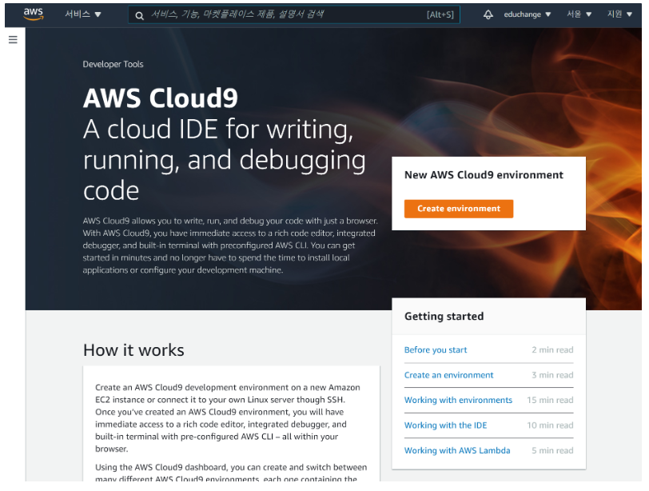

- 이름입력 후 Next step

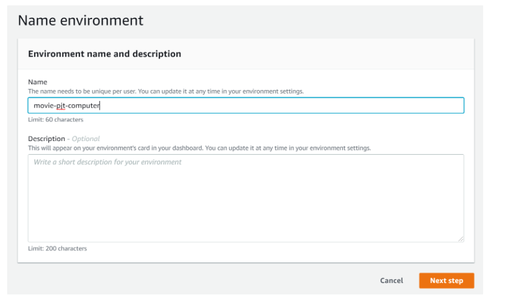

- 설정
  - Platform
    - Ubuntu Server 18.04 LTS
  - Cost-saving setting
    - 일정시간 후 꺼지도록 설정가능 (Never 설정시 과금주의)

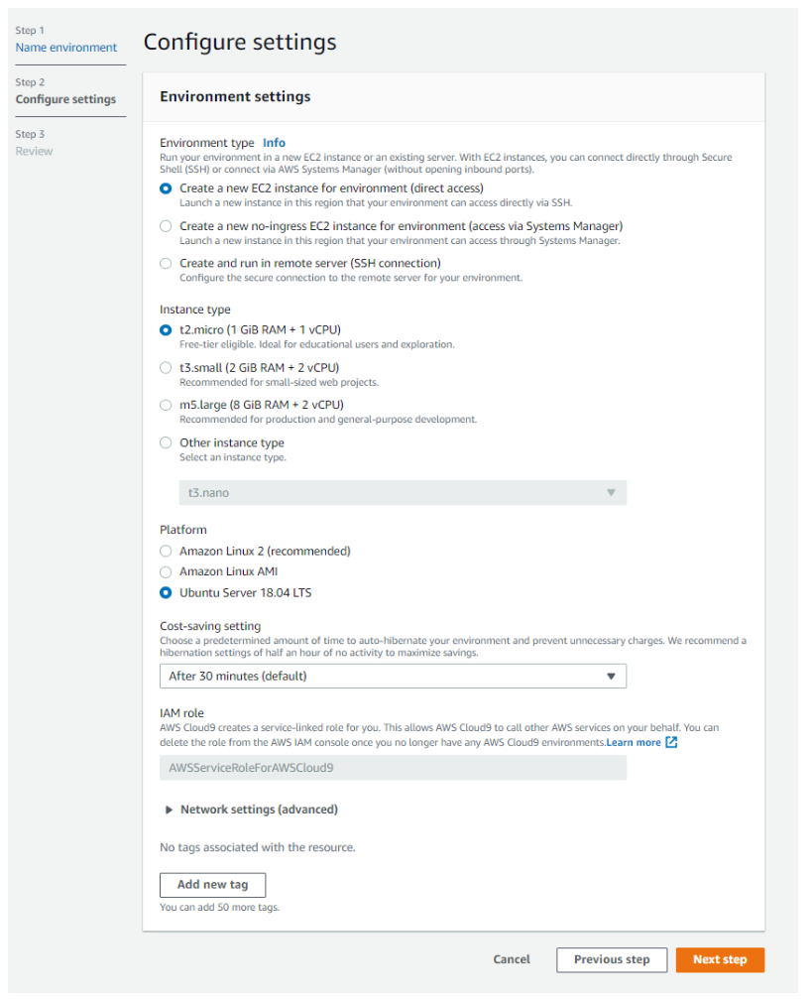

- 생성 완료 후 cloud9 화면 확인

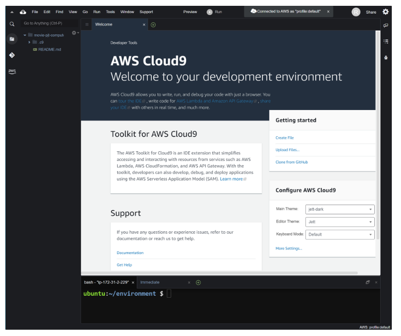

- 파일트리 설정 (home directory기준으로 진행)
  - `Show Environment Root` 체크해제
  - `Show Home in Favorites` 체크

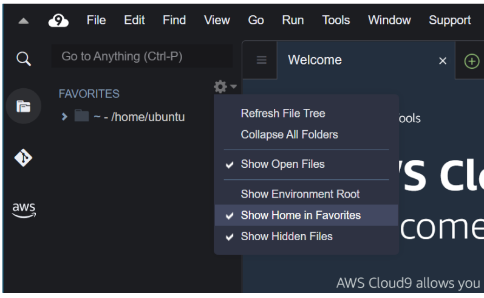

### EC2

<aside> 💡 브라우저 새 탭에서 진행 EC2는 cloud9 생성시 자동생성

</aside>

- 서비스 검색

  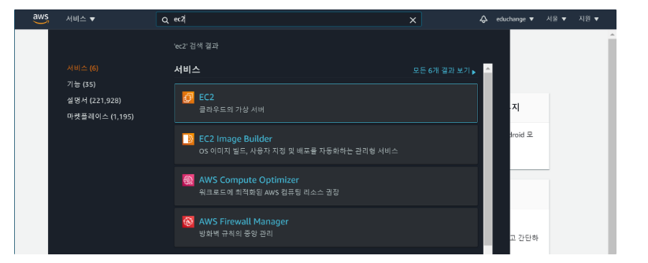

- 보안그룹 탭 이동 후 생성된 보안 그룹 ID 클릭

  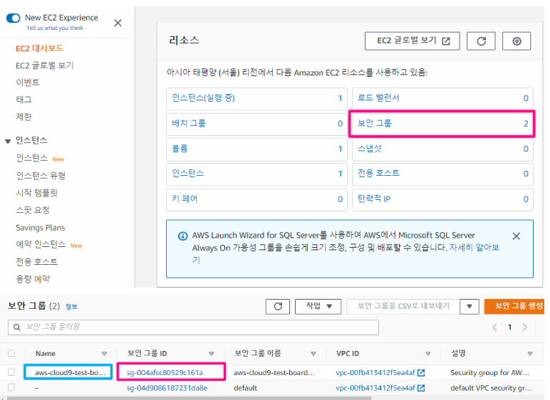

- 하단 화면의 인바운드 규칙 편집

  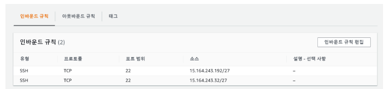

- 규칙 추가 후 저장

  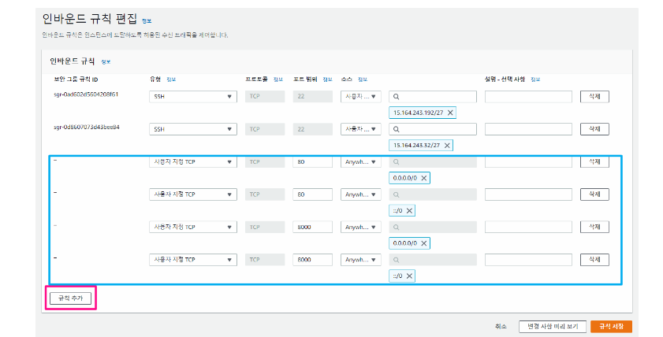

- 포트 범위 - 80, 8000(테스트용)

- 소스 - `0.0.0.0/0` , `::/0`

### 서버 설정

<aside> 💡 이후 내용은 cloud9 터미널에서 진행합니다.

</aside>

- pyenv 설치 후 터미널 재시작
  - https://github.com/pyenv/pyenv

```bash
git clone <https://github.com/pyenv/pyenv.git> ~/.pyenv
sed -Ei -e '/^([^#]|$)/ {a \\
export PYENV_ROOT="$HOME/.pyenv"
a \\
export PATH="$PYENV_ROOT/bin:$PATH"
a \\
' -e ':a' -e '$!{n;ba};}' ~/.profile
echo 'eval "$(pyenv init --path)"' >> ~/.profile

echo 'eval "$(pyenv init -)"' >> ~/.bashrc

source ~/.profile
source ~/.bashrc
```

- pyenv 설치 확인

```bash
pyenv -v

# 출력 확인 => pyenv VERSION_INFO
```

- python 설치 (프로젝트에서 사용한 버전설치)
  - global 설정 후 버전확인

```bash
pyenv install 3.9.X
pyenv global 3.9.X
python -V
#=> Python 3.9.X
```

### project clone

<aside> 💡 프로젝트 폴더와 마스터 앱, 두 이름에 주의하며 진행해주세요. 두 폴더의 이름을 통일하면 조금 더 편하게 설정할 수 있습니다.

</aside>

- clone
  - home을 기준으로 진행

```bash
cd ~
git clone {project_remote_url}
```

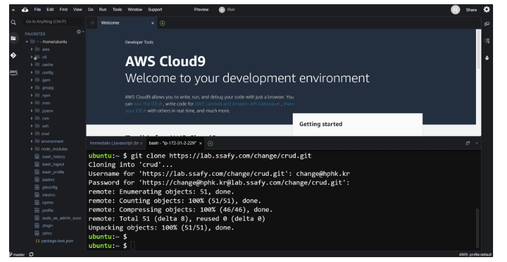

- 폴더구조
  - 프로젝트 이름은 변수처럼 사용예정 이름을 기억해주세요!

```bash
home/
	ubuntu/
		{프로젝트 폴더}
			{마스터 앱}
				settings.py
				...
			{앱1}
			{앱2}
			...
			manage.py
			requirements.txt
```

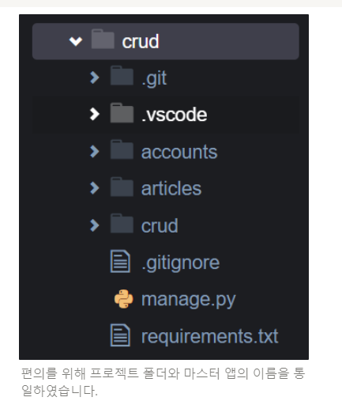

편의를 위해 프로젝트 폴더와 마스터 앱의 이름을 통일하였습니다.

- 프로젝트 폴더로 이동

```bash
cd ~/{프로젝트 폴더}
```

- 가상환경생성 (가상환경이름 기억)

```bash
python -m venv venv
```

- 가상환경 activate (window와 명령어가 다름)

```bash
source venv/bin/activate
```


- 라이브러리 설치

```bash
pip install -r requirements.txt
```

- 마이그레이션

```bash
python manage.py migrate
```

- createsuperuser

```bash
python manage.py createsuperuser
```

- loaddata (fixture가 있는경우)

```bash
python manage.py loaddata {데이터 dump 파일}
```

- collectstatic

  - `settings.py` 수정

    ```python
    # settings.py
    
    STATIC_ROOT = BASE_DIR / 'staticfiles'
    ```

  - collectstatic

    ```bash
    python manage.py collectstatic
    ```

### gunicorn

- 설치
  - https://docs.gunicorn.org/en/stable/install.html

```bash
pip install gunicorn
```

- 서버실행

```bash
gunicorn --bind 0.0.0.0:8000 {마스터 앱}.wsgi:application
```

- django 페이지 확인

  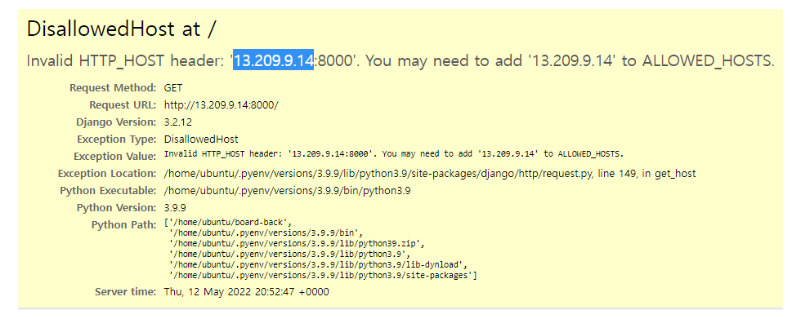

- `settings.py` 수정 후 서버 재시작

```python
# settings.py

ALLOWED_HOSTS = [
    # 할당된 EC2 인스턴스의 IP주소 입력. 현재 예시의 경우 아래와 같이 입력
		'13.209.9.14',
]
```

- 아래의 코드를 각자 프로젝트 이름에 맞게 수정 후 메모장에 입력(복사)

```
[Unit]
Description=gunicorn daemon
After=network.target

[Service]
User=ubuntu
Group=www-data
WorkingDirectory=/home/ubuntu/{프로젝트 폴더}
ExecStart=/home/ubuntu/{프로젝트 폴더}/venv/bin/gunicorn \\
        --workers 3 \\
        --bind 127.0.0.1:8000 \\
        {마스터 앱}.wsgi:application

[Install]
WantedBy=multi-user.target
```

- 위에 작성한 내용으로 아래와 같이 파일수정

```bash
sudo vi /etc/systemd/system/gunicorn.service
```

- 시스템 데몬 재시작

```bash
sudo systemctl daemon-reload
```

- 서비스 실행 및 등록

```bash
sudo systemctl start gunicorn
sudo systemctl enable gunicorn 
sudo systemctl status gunicorn.service 

# 중지
# sudo systemctl stop gunicorn
# 재시작
# sudo systemctl restart gunicorn
```

### nginx

<aside> 💡 vim을 사용하여 터미널에서 파일을 수정합니다. 사용법을 숙지하고 진행해주세요.

</aside>

- 설치

```bash
sudo apt-get update
sudo apt-get install -y nginx
```

- 복사할 코드 작성
  - 아래의 코드에서 각자의 프로젝트이름에 맞게 수정 후 메모장에 입력
  - `staticfiles`의 경우 다른 폴더를 썼다면 이름수정

```
server {
        listen 80;
        server_name {서버IP주소};

        location /static/ {
                root /home/ubuntu/{프로젝트 폴더}/**staticfiles**/;
        }

        location / {
                include proxy_params;
                proxy_pass <http://127.0.0.1:8000>;
        }
}
```

- 파일수정

```bash
sudo vi /etc/nginx/sites-available/django_test
```

- 사이트 추가

```bash
sudo ln -s /etc/nginx/sites-available/django_test /etc/nginx/sites-enabled
```

- 80번 포트의 프로세서 종료

```bash
sudo lsof -t -i tcp:80 -s tcp:listen | sudo xargs kill
```

- nginx  restart ⇒ status 확인

```bash
sudo systemctl restart nginx
systemctl status nginx.service
```

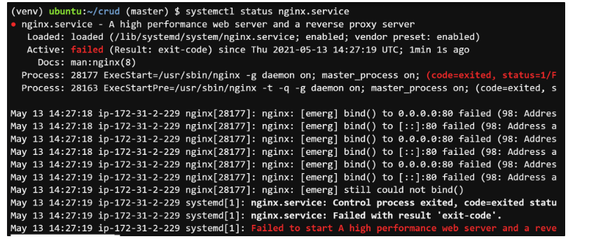

### 배포확인

- EC2 대시보드에서 퍼블릭 IP로 접속

------

## DNS

<aside> 💡 도메인 결제 후 진행합니다.

</aside>

### Route53

- 호스팅 영역 ⇒ 도메인 선택 ⇒ 레코드 생성
  - 레코드 유형 - A
  - 값 - `{ 서버 IP 주소 }`

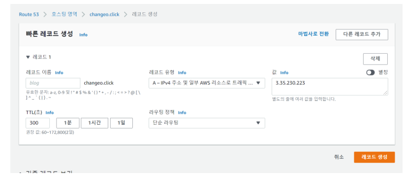

- nginx 설정 수정

```bash
sudo vi /etc/nginx/sites-available/django_test
server {
        listen 80;
        server_name {서버IP주소} **{도메인주소}**;

        location /static/ {
                root /home/ubuntu/{프로젝트 폴더}/staticfiles/;
        }

        location / {
                include proxy_params;
                proxy_pass <http://127.0.0.1:8000>;
        }
}
```

- `settings.py` 수정

```bash
ALLOWED_HOSTS = [
    '{서버IP주소}',
    '{도메인주소}'
]
```

- 수정 후 `gunicorn`,  `nginx` 재시작

```bash
sudo systemctl restart gunicorn
sudo systemctl restart nginx
```

------

## HTTPS

Domain 연결이 안되어 있을 경우, HTTPS 적용 불가

<aside> 📌 https://howhttps.works/ko/

</aside>

### Let's Encrypt

<aside> 💡 https://letsencrypt.org/ko/getting-started/ certbot 사용을 권장

</aside>

### certbot

https://certbot.eff.org/

- Software(nginx), System(Ubuntu) 선택 후 가이드진행


- core 설치 (EC2에 설치되어있음)

```bash
sudo snap install core; sudo snap refresh core
```

- certbot 설치

```bash
sudo snap install --classic certbot
```

- 심볼릭 링크

```bash
sudo ln -s /snap/bin/certbot /usr/bin/certbot
```

- 자동 설정

```bash
sudo certbot --nginx
```

- 이메일 입력

- 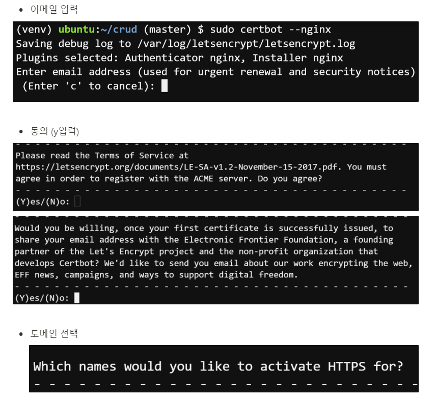
- EC2 보안그룹 탭 이동 후 생성된 보안 그룹 ID 클릭

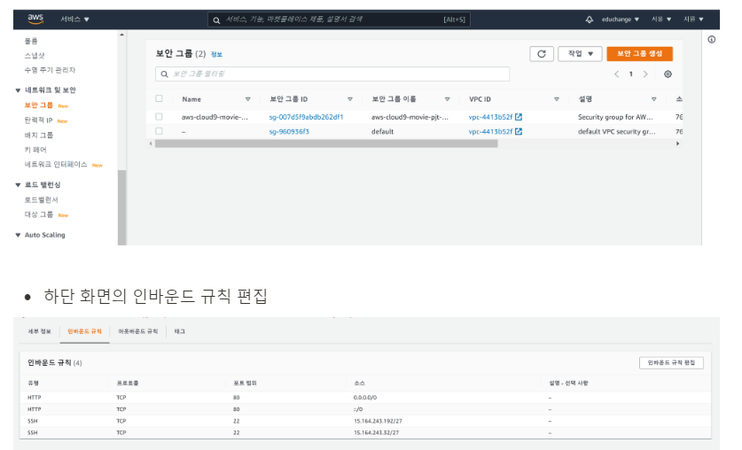

- 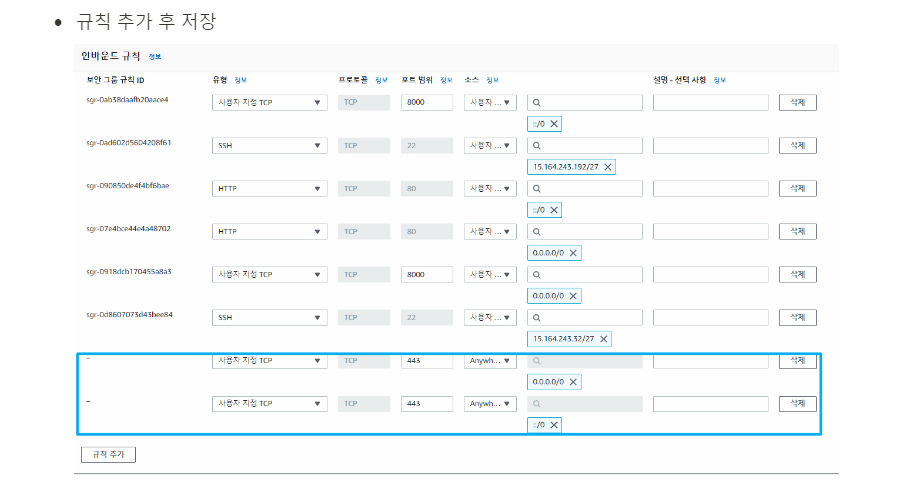
  - 포트 범위 - 443
  - 소스 - `0.0.0.0/0` , `::/0`
- `https://` 주소로 요청 후 확인