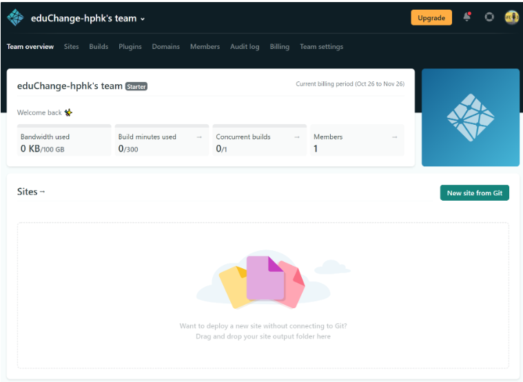
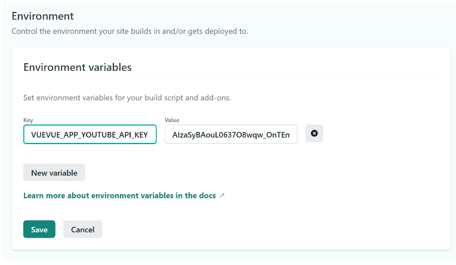
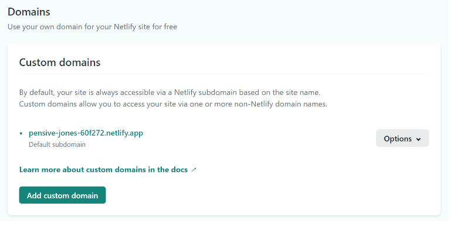
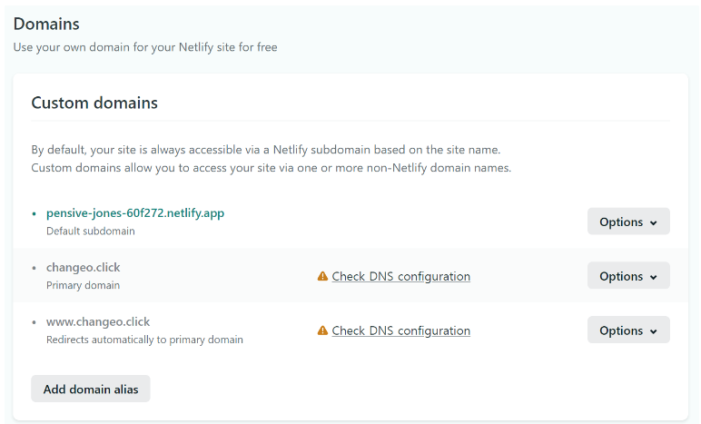
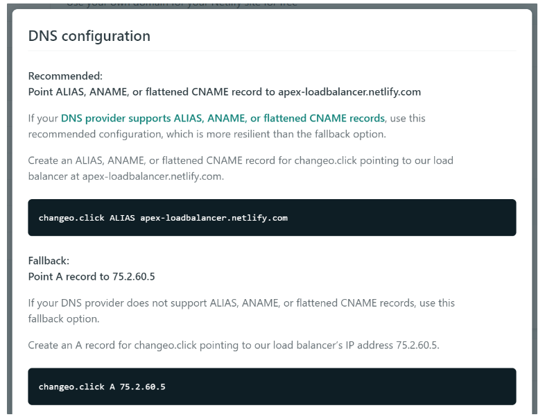
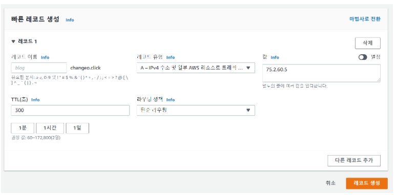
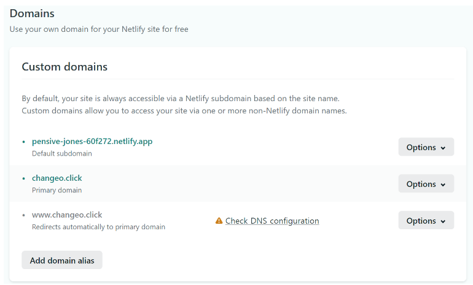
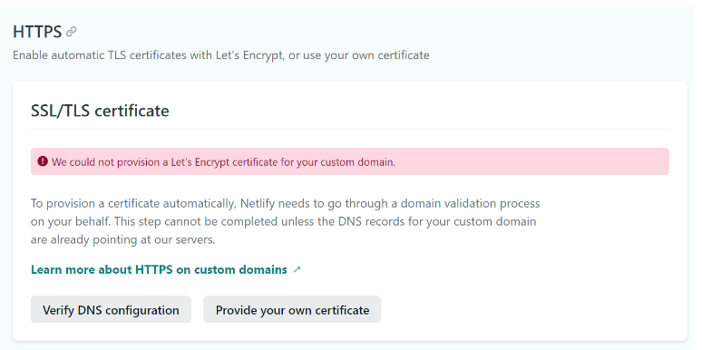

------

## 준비사항

### Vue project

- 완성된 프로젝트

## Deploy

### netlify

- 사이트 로그인

  

- build

```bash
npm run build
```

- dist 폴더 생성 확인
- dist폴더 업로드

### env

<aside> 📌 환경변수 설정시 사용합니다.

</aside>

- `Site settings` > `Build & deploy` > `Environment`

  

## 도메인 연결

- Site settings > Domain management > Domains >Add custom domain

  !

- check DNS configuration

  

- IP 주소 확인

  

- route53 설정

  

- 새로고침 후 check 확인

  

- SSL > Verify DNS configuration

  

- 일정시간 후 인증 완료

  