# OSI 7계층

## 개요

OSI 7계층이란, 네트워크 통신이 일어나는 과정을 7단계로 나눈 국제 표준화 기구(ISO)에서 정의한 네트워크 표준 모델이다.

(1)복잡한 시스템에 대처하고 (2)모듈화를 통한 유지보수의 편리를 위하여 명확한 구조를 제시하였다.

|      |    Layer     |                           Content                            |
| :--: | :----------: | :----------------------------------------------------------: |
|  7   | application  |             응용 서비스 ex) FTP, SMTP, HTTP             |
|  6   | presentation | 응용 서비스가 데이터의 해석하게끔 지원 ex) encryption, compression, machine-specific conventions |
|  5   |   session    |                 동기화, 데이터 회복 ex)                 |
|  4   |  transport   |           프로세스간 데이터 이동 ex) TCP, UDP           |
|  3   |   network    |   목적지까지의 데이터 이동 ex) IP, routing protocols    |
|  2   |     link     | 이웃한 네트워크 간 데이터 이동 ex)Ethernet, 802.III, PPP |
|  1   |   physical   |                      bits "on the wire"                      |

## 본문

### 7계층 - 응용 계층(Application Layer)

- 응용 프로세스와 직접 관계하여 일반적인 응용 서비스를 수행
  - explore, chrome
- HTTP, FTP, SMTP, POP3, IMAP, Telnet, DNS 등과 같은 프로토콜이 있다.

#### Application Architectures

1. Client-Server

   |                     Server                      |                            Client                            |
   | :---------------------------------------------: | :----------------------------------------------------------: |
   |       always on host 상시 통신 가능        | Communicate with server(intermittently) 서버와 통신(간헐적으로) |
   |   Permanent IP address 영구적인 IP 주소    |            Dynamic IP address 동적 주소 가능            |
   | Data center for scaling 데이터 베이스 필요 | Do not Communicate directly each other 클라이언트 간 직접 통신 불가 |

   

2. Peer-to-Peer

   - 서버가 항상 켜져 있을 필요 없음
   - 말단 끼리 직접 통신
   - 동적으로 IP 주소 할당 가능

#### Process Communicating

- 프로세스(process) : 호스트 내부에서 동작하는 프로그램
- 같은 호스트 내부에서 두 개의 다른 프로세스끼리 통신하기 위해서는 inter-process comminicatoin(defined by OS)를 통해 이루어진다.
- 다른 호스트간의 프로세스의 경우 message를 교환하여 이루어진다.

###### Sockets

- 프로세스 간 메세지를 주고받는 방법

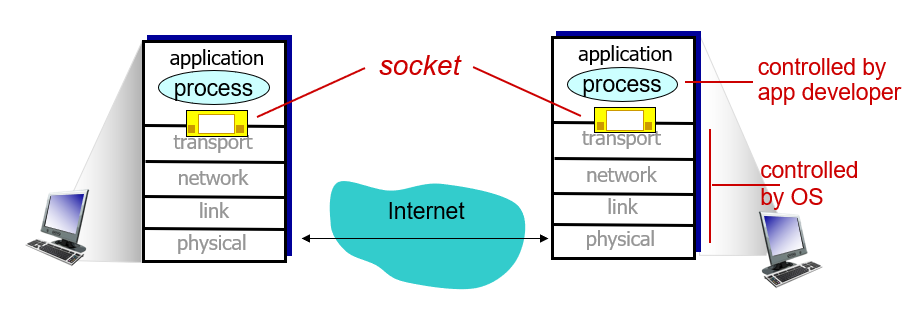

###### Addressing processes

- 메시지를 받기 위한 인식자(identifier (1) IP, (2) 포트)가 필요

- host device의 경우 32-bit의 unique IP address를 갖고 있다.

###### App layer Protocol defines...

- 메시지의 타입(request, response)
- 메시지의 필드, 의미
- Open : HTTP, SMTP
- Proprietary : Skype

###### 응용 프로그램이 요구하는 전송 조건

1. 데이터 무결성(data intefrity) : 데이터에 따라 손실을 감안할 수 있거나, 없는 경우
2. 시간(timing) : 통화와 같이 지연속도가 요구 되는 경우
3. 처리량(throughput) : 효율적으로 동작할 수 있도록 최소한의 처리량을 요구
4. 보안(security) : 보안

###### Internet Transport Protocols Service

|                            | TCP service | UDP service |
| -------------------------- | :---------: | :---------: |
| **Reliable Transport**     |      o      |      x      |
| **Flow Control**           |      o      |      x      |
| **Congestion Control**     |      o      |      x      |
| **Connection Oriented**(?) |      o      |      x      |
| **Encryition**             |      x      |      x      |

*connection-oriented:* setup required between client and server processes

###### Securing TCP

- 기본적으로 암호화가 되지 않는 TCP, UDP로 인해 **SSL**을 사용한다.
- SSL
  - 암호화된 TCP 통신
  - 응용 프로그램이 SSL 라이브러리를 사용한다.

#### HTTP

- HTTP(Hypertext Transfer Protocol)는 웹의 응용계층의 프로토콜로 client/server형태의 앱의 모델이다.
- Client가 TCP 연결을 요청하고, Server가 받는 형식

|            non-persistent HTTP            |         persistent HTTP          |
| :---------------------------------------: | :------------------------------: |
|          한 번에 하나의 오브젝트          | 하나의 연결에 여러 개의 오브젝트 |
| 2*RTT+file transmission time (오브젝트당) |                                  |
|                                           |                                  |

- POST method, GET method를 통해 reqeust를 보낸다.

  | HTTP | - 브라우저                                                   |
  | ---- | ------------------------------------------------------------ |
  | 1.0  | - 브라우저 친화적인 프로토콜 - GET, HEAD, POST - 모든 요청에 따라 연결을 새로 생성 |
  | 1.1  | - 자주 사용되는 버전으로, 가상 호스팅, 캐시 등이 추가되어 최적화 및 기능 향상 - PUT, DELETE 추가 |
  | 2.0  | - 1.1과 동일한 API로, 성능향상에 초점을 맞췄다.              |

  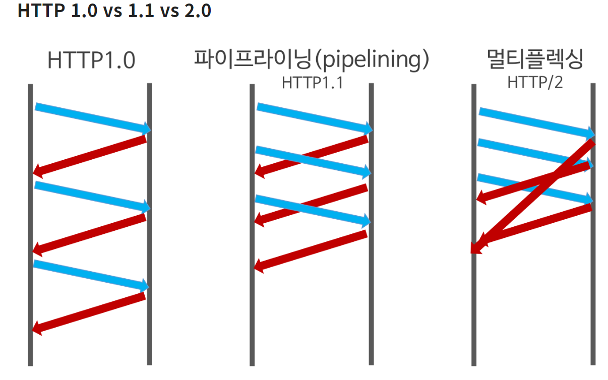
  
- caching 과 cookie

#### DNS

- DNS(Domain Name System)은 IP주소와 도메인 이름을 변환해 주는 역할을 한다.

- 분산된 데이터 베이스를 이용한다.

  - 단일 장애점(Single Point of Failure)으로 인한 오류를 방지하기 위해서이다.
  - 트래픽 양을 조절하기 위해서이다.
  - 유지보수의 편리함

  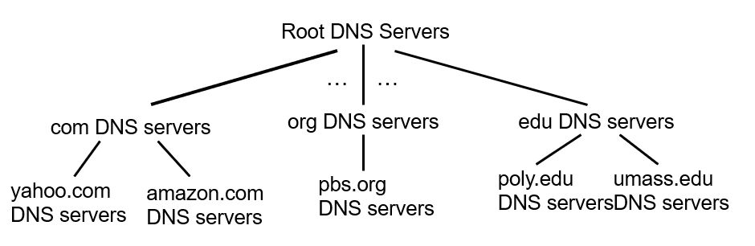

- Root DNS Servers

  - ICANN 이 직접 관리하는 서버

- TLD(top - level domain) Server 

  - 도메인의 가장 마지막 부분

- authoritative DNS servers

  - 실제 개인 도메인과 IP 주소의 관계가 기록 저장 되는 서버

- Recursive DNS Server

  - 인터넷 사용자가 가장 먼저 접근하는 DNS 서버
  - 데이터를 일정 기간 캐시로 저장하여 효율성을 올린다.

- Attacking DNS

  - DDoS attacks : root 서버를 트래픽으로 폭발 시킨다. 등등

#### CDN

- CDN(Content Distrbution Networks)은 비디오와 같은 많은 트래픽이 요구되는 오브젝트를 관리하기 위하여 사용
- 많은 CDN 노드에 내용을 저장하여 사용자들로 하여금 노드에 request하게끔한다.

#### Client/Server socket interaction : UDP

- 클라이언트와 서버 간의 연결이 없다
- handshaking을 하지 않는다.
- 순서에 맞지 않고, 데이터가 유실될 수 있다.

#### Client/Server socket interaction : TCP

- 클라이언트와 서버 간의 연결이 필요하다.
- UDP와 달리 순서와 데이터의 안정성을 보장한다.

### 6계층 - 표현계층(Presentation Layer)

- 전송하는 데이터의 표현 방식을 결정

- 파일 인코딩, 명령어를 포장, 압축, 암호화

- JPEF,MPEG, GIF, ASCII

  CBR(constant bit rate) : 고정된 픽셀

  VBR(variable bir rate) : 변화하는 픽셀 

### 5계층 - 세션 계층(Session Layer)

- 데이터가 통신하기 위한 논리적인 연결을 의미한다.
- Duplex, Half-Duplex, Full Duplex 방식의 통신과 함께 응용 프로세스가 통신을 관리하기 위한 방법을 제공
- TCP/IP세션을 만들고 없애는 책임을 갖는다.

### 4계층 - 전송 계층(Transport Layer)

- 다른 호스트에서 일어나는 프로세스 간의 소통을 지원한다.
- transport protocol은 말단에서 실행된다.(UDP, TCP)
- 네트워크 계층과의 차이점은,
  - 네트워크 계층은 호스트 간의 통신을, 전송 계층은 프로세스 간의 통신을 담당하는 것

#### Multiplexing/Demultiplexing

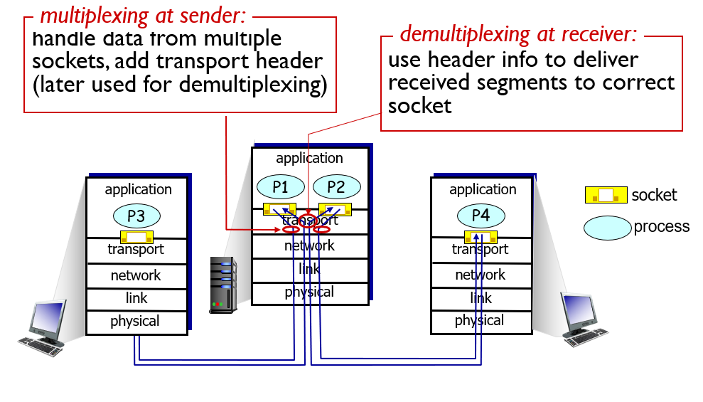

- Multiplexing이란 전송 계층에서 여러 소켓의 데이터들을 처리하는 과정

  - transport header를 추가하여 나중에 Demultiplexing에 사용한다.

- Demultiplexing이란 전송 계층에서 응용계층으로 세그먼트를 올바른 소켓으로 전달하는 것

  - 추가된 헤더를 바탕으로 올바른 소켓에 전달한다.
  - 호스트는 IP 데이타그램을 받으면, 아래와 같은 하나의 segment를 운반하는데

  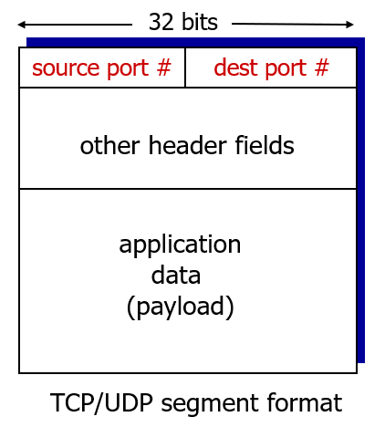

  ​	위와 같이 source port와 destination port를 갖는다. 이를 이용하여 알맞은 소켓에 이동시킨다.

  - Connectionless Demux의 경우 아래와 같이 한 포트로 이동된다.

    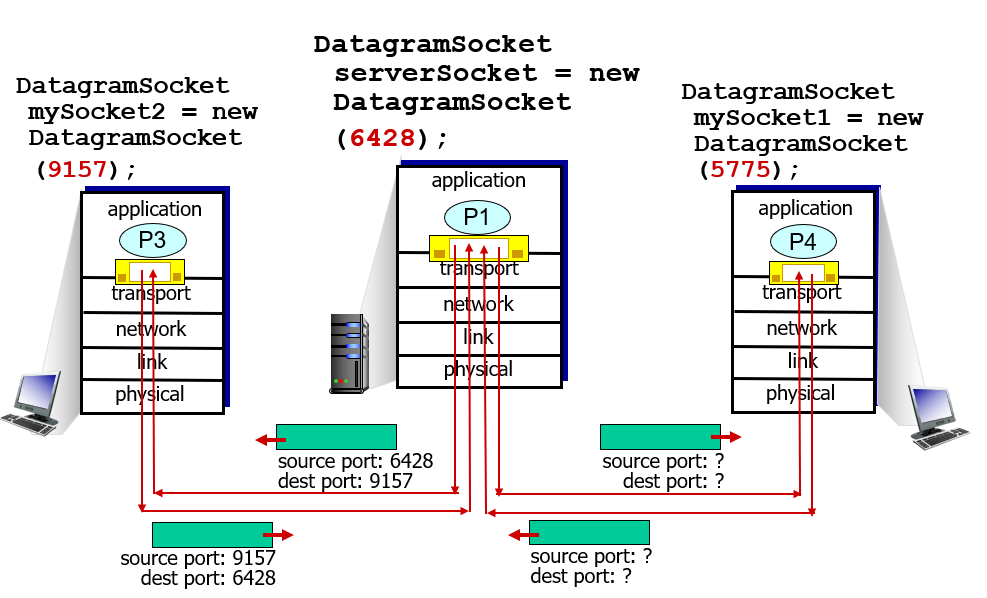

  - Connection oriented Demux의 경우 4개의 정보로 식별한다. (1)(source, dest) (2)(IP, Port)

    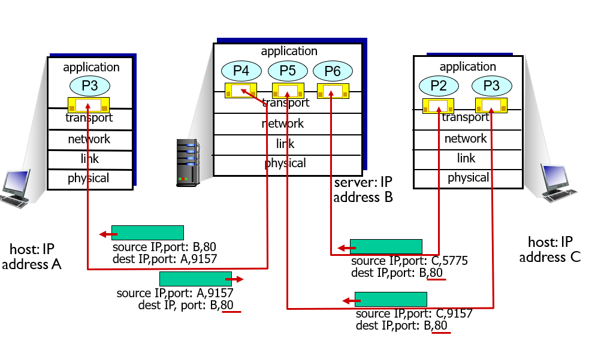

#### UDP(User Datagram Protocol)

- 신뢰성이 낮은 프로토콜로써 완전성을 보증하지 않는다.
- 가상 회선을 굳이 확립하지 않아도 되며, 유연하고 효율적인 데이터 전송에 사용된다.

- 장점

  - 빠른 요청과 응답이 필요한 실시간 응용에 적합
    - 통화, 스트리밍 서비스
  - 여러 다수 지점에 전송 가능(일대 다)
  - 헤더가 단순하여 코스트가 적다.(8 byte)
  - DNS, SNMP에 사용

- 극복 방법

  - 응용 계층에서 신뢰성을 어느 정도 회복하도록 설계한다.

  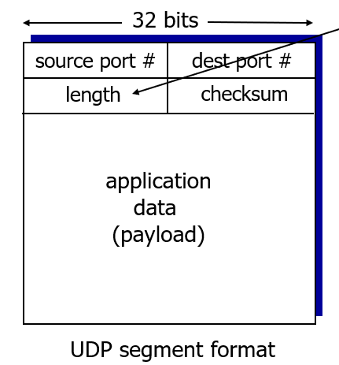

#### RDT(reliable data transfer)

- 1.0 : 어쩌구 등등
- 2.0 : ACKs, NAKs
- 2.1 : ACKs, NAKs 보완
- 2.2 : ACKs 만 사용(중복되면 NAK와 같다)
- 3.0 : time out 적용 - time out 적용에 따른 오류가 발생할 수 있다

#### TCP(Transmission Control Protocol)

- 신뢰성(reliable)한 통신을 보장한다.

  - 패킷 손실, 중복 순서 바뀜 등이 없음

- 연결 지향적으로 양단의 프로세스는 TCP가 제공하는 회선을 통해 통신한다.

  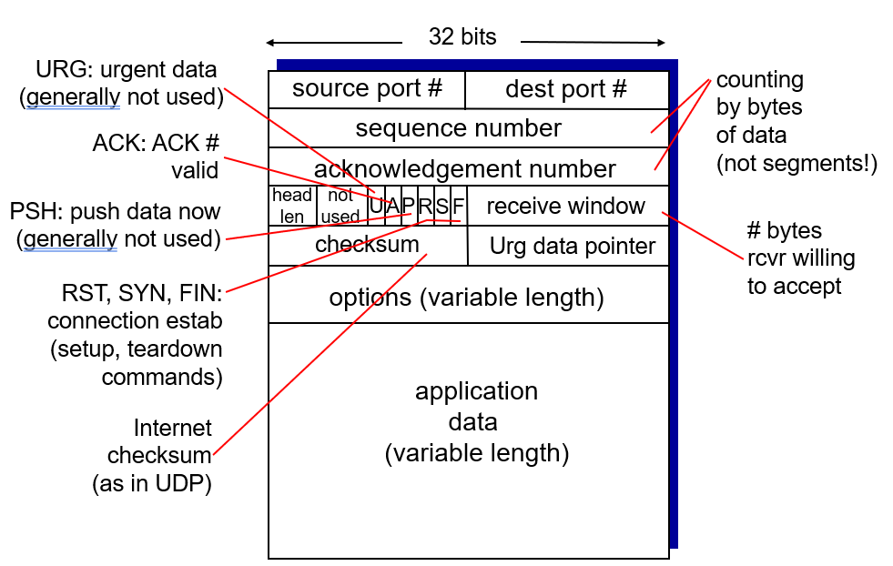

- 수신측에서 송신측으로 하여금 속도를 조절하게하여 flow control을 한다.

- 연결 관리 방법으로는 아래와 같이 hand shake 방식이 있다.

##### 3-way handshake

- 2way의 경우 다음과 같이 오류가 발생할 여지가 많다.

  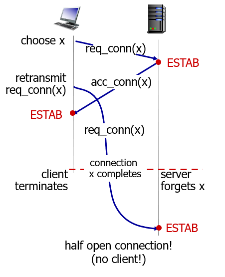

- 기본적인 플로우는 다음과 같다.

  Opening

  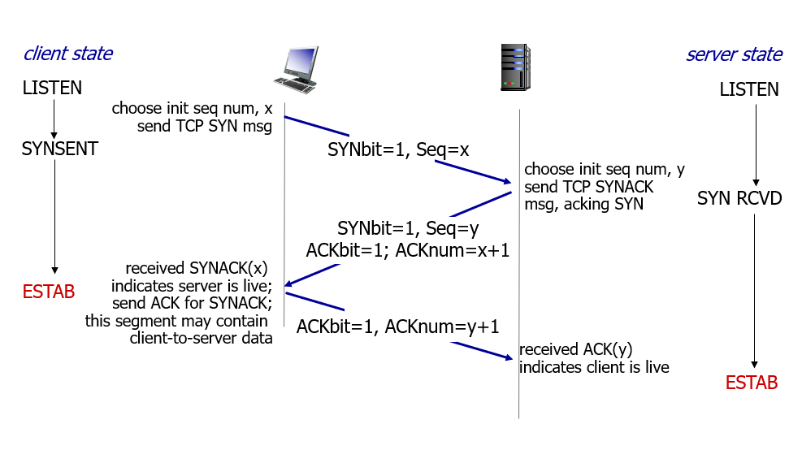

  Closing

  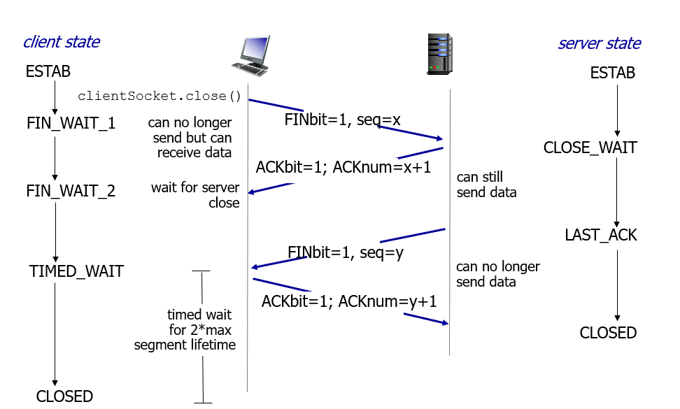

#### Control Congestion

- TCP Slow Start

  처음에는 느리게, 점점 빠르게 통신하다가, loss가 발생한 경우...

- ECN(Explicit Congestion Notification)

  IP 헤더의 두 개의 bit들을 router의 혼잡도를 표기한다.

### 3계층-네트워크 계층(Network Layer)

- 데이터를 목적지까지 빠르고 안전하게 전달하는 라우팅 기능을 수행
  - 라우터
- 어떤 기능을 하는가?
  - 경로를 선택, 경로에 따라 패킷을 전달(routing)
  - Segmentation/Desegmentation
  - 오류제어
  - Internetworking
  - IP 주소부여
- 

### 2계층 - 데이터 링크 계층(Link Layer)

- 물리 계층을 통해 송수신되는 정보의 오류와 흐름을 관리
  - 브릿지, 스위치, 이더넷

- 프레임에 물리적 주소(MAC address)를 부여하고 에러 검출, 재전송 흐름 제어 수행
  - 단위 : Frame

- 어디서 실행 되는가?
  - 모든 Host의 NIC(Network Interface Card), Chip에서 실행 된다.
- 어떻게 실행 되는가?
  - 하드웨어, 소프트웨어, 펌웨어의 조합으로 이루어진다.
- 대표적인 프로토콜
  - Point to Point 프로토콜 : HDLC, ADCCP
  - 근거리 네트워크용 프로토콜 : LLC, ALOHA

### 1계층 -물리 계층 (Physical Layer)

- 전기적, 기계적, 기능적인 특성을 이용하여 통신 케이블로 데이터를 전송하는 물리적인 장비
  - 통신 케이블, 리피터, 허브

- 데이터를 전기적인 신호로 변환하여 전송
  - 단위 : Bit `10101010`
