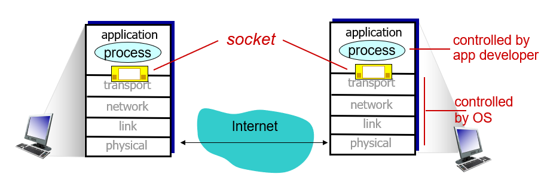

# OSI 7계층

## 개요

OSI 7계층이란, 네트워크 통신이 일어나는 과정을 7단계로 나눈 국제 표준화 기구(ISO)에서 정의한 네트워크 표준 모델이다.

(1)복잡한 시스템에 대처하고 (2)모듈화를 통한 유지보수의 편리를 위하여 명확한 구조를 제시하였다.

|      |    Layer     |                           Content                            |
| :--: | :----------: | :----------------------------------------------------------: |
|  7   | application  |             응용 서비스 ex) FTP, SMTP, HTTP             |
|  6   | presentation | 응용 서비스가 데이터의 해석하게끔 지원 ex) encryption, compression, machine-specific conventions |
|  5   |   session    |                 동기화, 데이터 회복 ex)                 |
|  4   |  transport   |           프로세스간 데이터 이동 ex) TCP, UDP           |
|  3   |   network    |   목적지까지의 데이터 이동 ex) IP, routing protocols    |
|  2   |     link     | 이웃한 네트워크 간 데이터 이동 ex)Ethernet, 802.III, PPP |
|  1   |   physical   |                      bits "on the wire"                      |

## 본문

### 7계층 - 응용 계층(Application Layer)

- 응용 프로세스와 직접 관계하여 일반적인 응용 서비스를 수행
  - explore, chrome
- HTTP, FTP, SMTP, POP3, IMAP, Telnet, DNS 등과 같은 프로토콜이 있다.

#### Application Architectures

1. Client-Server

   |                     Server                      |                            Client                            |
   | :---------------------------------------------: | :----------------------------------------------------------: |
   |       always on host 상시 통신 가능        | Communicate with server(intermittently) 서버와 통신(간헐적으로) |
   |   Permanent IP address 영구적인 IP 주소    |            Dynamic IP address 동적 주소 가능            |
   | Data center for scaling 데이터 베이스 필요 | Do not Communicate directly each other 클라이언트 간 직접 통신 불가 |

   

2. Peer-to-Peer

   - 서버가 항상 켜져 있을 필요 없음
   - 말단 끼리 직접 통신
   - 동적으로 IP 주소 할당 가능

#### Process Communicating

- 프로세스(process) : 호스트 내부에서 동작하는 프로그램
- 같은 호스트 내부에서 두 개의 다른 프로세스끼리 통신하기 위해서는 inter-process comminicatoin(defined by OS)를 통해 이루어진다.
- 다른 호스트간의 프로세스의 경우 message를 교환하여 이루어진다.

###### Sockets

- 프로세스 간 메세지를 주고받는 방법

###### Addressing processes

- 메시지를 받기 위한 인식자(identifier (1) IP, (2) 포트)가 필요

- host device의 경우 32-bit의 unique IP address를 갖고 있다.

###### App layer Protocol defines...

- 메시지의 타입(request, response)
- 메시지의 필드, 의미
- Open : HTTP, SMTP
- Proprietary : Skype

###### 응용 프로그램이 요구하는 전송 조건

1. 데이터 무결성(data intefrity) : 데이터에 따라 손실을 감안할 수 있거나, 없는 경우
2. 시간(timing) : 통화와 같이 지연속도가 요구 되는 경우
3. 처리량(throughput) : 효율적으로 동작할 수 있도록 최소한의 처리량을 요구
4. 보안(security) : 보안

###### Internet Transport Protocols Service

|                            | TCP service | UDP service |
| -------------------------- | :---------: | :---------: |
| **Reliable Transport**     |      o      |      x      |
| **Flow Control**           |      o      |      x      |
| **Congestion Control**     |      o      |      x      |
| **Connection Oriented**(?) |      o      |      x      |
| **Encryition**             |      x      |      x      |

*connection-oriented:* setup required between client and server processes

###### Securing TCP

- 기본적으로 암호화가 되지 않는 TCP, UDP로 인해 **SSL**을 사용한다.
- SSL
  - 암호화된 TCP 통신
  - 응용 프로그램이 SSL 라이브러리를 사용한다.

#### HTTP

- HTTP(Hypertext Transfer Protocol)는 웹의 응용계층의 프로토콜로 client/server형태의 앱의 모델이다.

#### DNS

#### CDN

#### Client/Server socket interaction : UDP

#### Client/Server socket interaction : TCP

### 6계층 - 표현계층(Presentation Layer)

- 전송하는 데이터의 표현 방식을 결정
- 파일 인코딩, 명령어를 포장, 압축, 암호화
- JPEF,MPEG, GIF, ASCII

### 5계층 - 세션 계층(Session Layer)

### 4계층 - 전송 계층(Transport Layer)

### 3계층-네트워크 계층(Network Layer)

### 2계층 - 데이터 링크 계층(Link Layer)

- 물리 계층을 통해 송수신되는 정보의 오류와 흐름을 관리
  - 브릿지, 스위치, 이더넷

- 프레임에 물리적 주소(MAC address)를 부여하고 에러 검출, 재전송 흐름 제어 수행
  - 단위 : Frame

- 어디서 실행 되는가?
  - 모든 Host의 NIC(Network Interface Card), Chip에서 실행 된다.
- 어떻게 실행 되는가?
  - 하드웨어, 소프트웨어, 펌웨어의 조합으로 이루어진다.

### 1계층 -물리 계층 (Physical Layer)

- 전기적, 기계적, 기능적인 특성을 이용하여 통신 케이블로 데이터를 전송하는 물리적인 장비
  - 통신 케이블, 리피터, 허브

- 데이터를 전기적인 신호로 변환하여 전송
  - 단위 : Bit `10101010`
