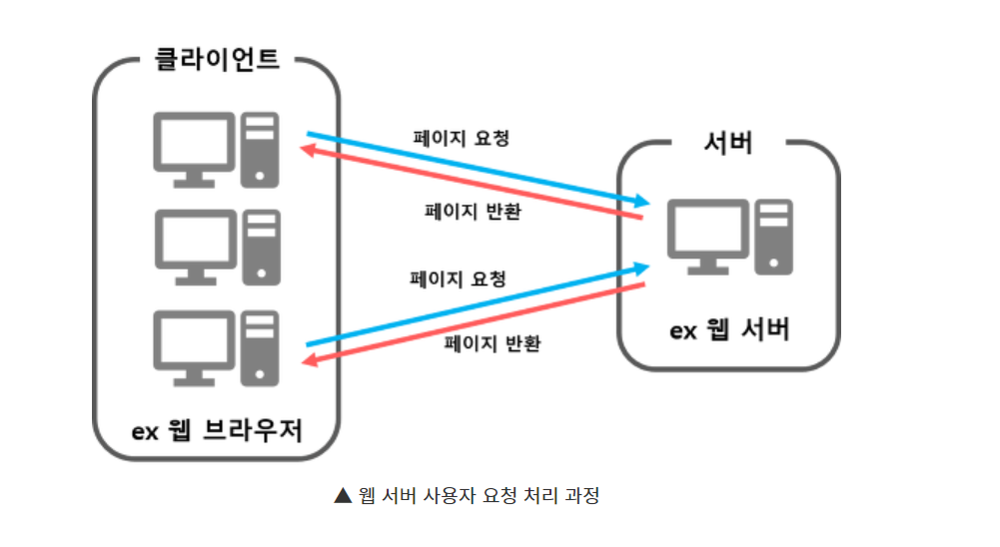
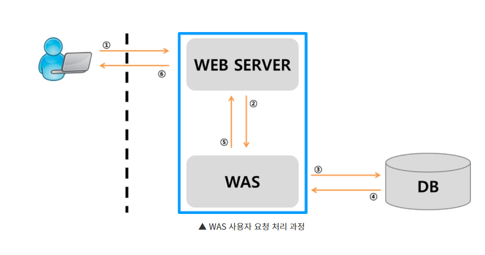

# 웹 서버 vs  WAS

## 웹 서버

웹 브라우저 클라이언트로부터 HTTP 요청을 받아들이고 HTML 문서와 같은 웹 페이지를 반환하는 컴퓨터 프로그램

- 웹 서버: 클라이언트가 요청을 하면, 정적 컨텐츠를 제공(HTML, CSS, JS 등등)

## WAS

Web Application Sever로 인터넷 상에서 HTTP 프로토콜을 통해 사용자 컴퓨터나 장치에 앱을 수행해주는 미들웨어로 동적 컨텐츠를 수행하는 것이 웹서버와 구별된다.

주로 데이터 베이스의 조회나 다양한 로직 처리가 필요한 동적 컨텐츠를 제공한다.

