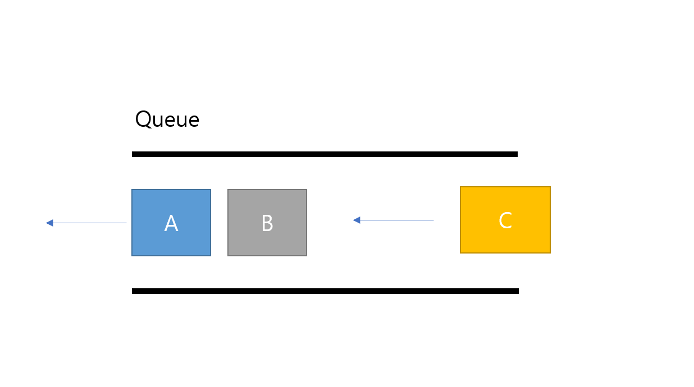

# Queue

### 큐 란?

- Queue : 대기열
- 먼저 들어온 데디어가 먼저 나가는 자료구조
  - FIFO : First in First Out

### Queue의 구조와 추상 데이터 타입

- 객체 : n개의 element의 선형 리스트
- 연산
  - `create()` : 큐를 생성
  - `init(q)` : 큐를 초기화 
  - `is_empty(q)` : 큐가 비어있는지 검사
  - `is_full(q)` : 큐가 가득 찼는가 검사
  - `enqueue(q, e)` : 큐의 맨 뒤에 요소 e를 추가
  - `dequeue(s)` : 큐의 맨 앞의 요소를 반환 후 삭제
  - `peek(q)` : 큐 맨 뒤의 요소를 반환

### 큐의 용도

- 직접적인 응용
  1. 시뮬레이션의 대기열(버스 , 비행기, 은행)
  2. 통신에서의 데이터 패킷 모델링
  3. 프린터와 컴퓨터 사이의 버퍼링
- 간접적인 응용
  	1. 스택과 마찬가지로 프로그래머의 도구
  	1. 알고리즘에서 사용

### 큐의 구현

- 배열을 활용한 경우 스택과 달리 삽입을 위해서 요소들을 이동시켜야함
- 이를 극복하기 위하여 원형큐를 구현