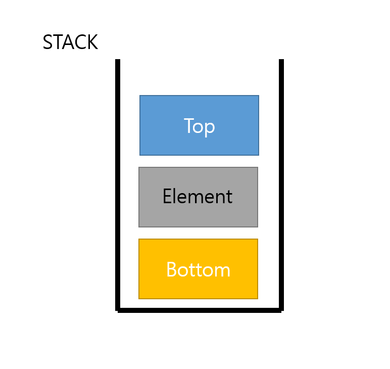

# Stack

### 스택이란?

- stack : 쌓아놓은 더미

- 후입선출

  - LIFO : Last in First Out

  - 가장 최근에 들어온 데이터가 가장 먼저 나감

### 스택의 구조 및 추상 데이터 타입

- 객체 : n개의 element의 선형 리스트
- 연산
  - `create()` : 스택을 생성
  - `is_empty(s)` : 스택이 비어있는지 검사
  - `is_full(s)` : 스택이 가득 찼는가 검사
  - `push(s, e)` : 스택s의 맨 위에 요소 e를 추가
  - `pop(s)` : 스택의 맨 위에 잇는 요소를 삭제, 반환
  - `peek(s)` : 스택 맨 위의 요소를 반환

### 스택의 용도

- 입력과 역순의 출력이 필요한 경우
  1. 되돌리기(undo)기능
  2. 계산기, 미로탐색
  3. 함수 호출에서 복귀주소 기억

### 스택의 구현

- 배열을 이용하여 간단하게 구현이 가능
- 연결리스트와 활용하여 동적인 메모리 할당이 가능하다.