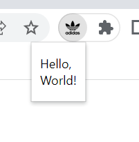

# Chrome Extension

### 기본 참고 자료

1. chrome extension document

   [Chrome Extensions getting started guides - Chrome Developers](https://developer.chrome.com/docs/extensions/mv3/getstarted/)

2. chrome extension API

   [API reference - Chrome Developers](https://developer.chrome.com/docs/extensions/reference/)

   - 이 중 **[documentScan](https://developer.chrome.com/docs/extensions/reference/documentScan), [desktopCapture](https://developer.chrome.com/docs/extensions/reference/desktopCapture)** 필요 => 방향 전환

3. MHTML로 저장하는 방법

   [chrome.pageCapture - Chrome Developers](https://developer.chrome.com/docs/extensions/reference/pageCapture/)


### 직접 시도

1. 유저 정보 불러오기

   - permission 추가

   ```
     // manifest.json
     "permissions":["identity", "identity.email"],
   ```

   - 다음과 같이 클릭 하였을 때, console로 확인 가능

   ```js
   chrome.action.onClicked.addListener((tab) => {
     console.log("clicked");
     console.log(tab);
     // chrome.desktopCapture.chooseDesktopMedia(["tab"], tab, (streamId) => {
     //   console.log("captured", streamId);
     // });
     console.log(chrome.identity);
     chrome.identity.getProfileUserInfo(async (accountInfo) => {
       console.log(accountInfo);
     });
   });
   ```

2. 클릭 시 popup 띄우기

   - 3버전 부터는 `browserAction`이 아니라 `action` 참고

   ```
     chrome.action.setPopup({ popup: "./hello.html",  }, () => {
       console.log("pop");
     });
   ```

   

3. popup에서 인풋 넣고 버튼 활용하기

   - popup의 경우 단순한 인터페이스로, 버튼과 같이 함수가 동작하지는 않는 듯

   ```
   <!DOCTYPE html>
   <html>
   <head>
   </head>
   <body>
     <label for="name">Name (2 to 8 characters):</label>
   
     <input type="text" id="name" name="name" required minlength="2" maxlength="8" size="10">
     <input type="button" value="save btn" onclick="saveRecipe()">
     <script>
       function saveRecipe(){
         console.log("save btn")
         let btn = document.querySelector('input:nth-child(2)')
         btn.value = "클릭되었음"
         
       }
     </script>
   </body>
   </html>
   ```

   위의 popup에서 버튼을 클릭하여도 변화 없음

   - script를 그대로 사용하면 안되는 듯 하다.

   변화가 없는 것이 아니라, popup 창의 경우 console로 확인이 불가능 하다.