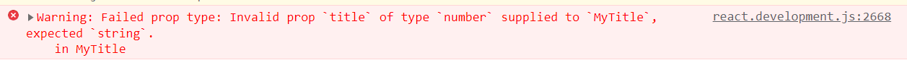

# REACT 자습

obj: 다음 프로젝트 react 사용 가능성이 높아서 공부 해도록 한다.

#### react를 사용하는 이유

- https://ahnheejong.name/articles/why-i-prefer-react-over-vuejs/

1.  타입 스크립트 지원
   - TS는 MS에서 개발한 언어로, JS를 개선한 듯 함

2. 컴포넌트 정의의 용이함
   - Vue에 비해 작은 컴포넌트를 정의하는 문법이 직관적이고 간결
   - 문법이 상대적으로 일관적
   - 템플릿을 문자열로 표현하지 않아, 정보를 잃지 않는다.
3. 빠르고 담대한 개선을 이룰 것이다
   -  이것은 필자의 개인적인 의견인듯
   - 하지만 레퍼런스도 많고, 변경도 빠르다.

=>  Vue가 사용하기 편한 라이브러리이고, 사용해 본 경험도 있기 때문에 익숙하지만, 개인의 발전 및 협업의 용이함으로 사용해보도록 합시다.

=> 동작 원리 및 심화 내용은 일단 건너띄고, 사용 가능해지는 것을 목표로 공부를 시작합니다.


#### 자습 / 실습

1.  데모 프로젝트를 따라 구현해 보도록 한다.

- https://github.com/ruanyf/react-demos


##### demo1

```react
<!DOCTYPE html>
<html>
  <head>
    <meta charset="UTF-8" />
    <script src="../build/react.development.js"></script>
    <script src="../build/react-dom.development.js"></script>
    <script src="../build/babel.min.js"></script>
  </head>
  <body>
    <div id="example"></div> 
    <script type="text/babel">
      ReactDOM.render(
        <h1>Hello, world!</h1>,
        document.getElementById('example')
      );
    </script>
  </body>
</html>

```

Hello, World를 출력, `<script>`내부의 DOM으로 위의 `div#example`를 render 하는 듯,

```react
<!DOCTYPE html>
<html>
  <head>
    <meta charset="UTF-8" />
    <script src="../build/react.development.js"></script>
    <script src="../build/react-dom.development.js"></script>
    <script src="../build/babel.min.js"></script>
  </head>
  <body>
    <div id="example">
      <p>hi</p>
    </div>
    <script type="text/babel">
      ReactDOM.render(
        <h1>Hello, world!</h1>,
        document.getElementById('example')
      );
    </script>
  </body>
</html>

```

위와 같이 `div#example` 내부에 p태그를 넣었지만, 아래 `<script>`에서 render한 대로 Hello, World만 출력됨


##### demo2

```react
<!DOCTYPE html>
<html>
  <head>
    <meta charset="UTF-8" />
    <script src="../build/react.development.js"></script>
    <script src="../build/react-dom.development.js"></script>
    <script src="../build/babel.min.js"></script>
  </head>
  <body>
    <div id="example"></div>
    <script type="text/babel">
      var names = ['Alice', 'Emily', 'Kate'];

      ReactDOM.render(
        <div>
        {
          names.map(function (name, index) {
            return <div key={index}>Hello, {name}!</div>
          })
        }
        </div>,
        document.getElementById('example')
      );
    </script>
  </body>
</html>

```

JavaScript의 문법이 적용되는 듯 하다.

render 함수 내부에 함수가 적용된다. Vue에서는 v-for을 사용하여 텍스트로만 가져왔을듯,


##### demo3

```react
<!DOCTYPE html>
<html>
  <head>
    <meta charset="UTF-8" />
    <script src="../build/react.development.js"></script>
    <script src="../build/react-dom.development.js"></script>
    <script src="../build/babel.min.js"></script>
  </head>
  <body>
    <div id="example"></div>
    <script type="text/babel">
      var arr = [
        <h1 key="1">Hello world!</h1>,
        <h2 key="2">React is awesome</h2>,
      ];
      ReactDOM.render(
        <div>{arr}</div>,
        document.getElementById('example')
      );
    </script>
  </body>
</html>

```

뭐지, 통째로 가져와지네

뭐가 어떻게 되든, render함수 내에 html형식의 Text를 만들어 넣으면 되는듯


##### demo4

```react
<!DOCTYPE html>
<html>
  <head>
    <meta charset="UTF-8" />
    <script src="../build/react.development.js"></script>
    <script src="../build/react-dom.development.js"></script>
    <script src="../build/babel.min.js"></script>
  </head>
  <body>
    <div id="example"></div>
    <script type="text/babel">
      class HelloMessage extends React.Component {
        render() {
          return <h1>Hello {this.props.pipi}</h1>;
        }
      }

      ReactDOM.render(
        <HelloMessage name="John" age="18" pipi="run" />,
        document.getElementById('example')
      );
    </script>
  </body>
</html>

```

클래스를 생성한 후, props의 속성에 접근할 수 있는 듯합니다. render 내부에 태그를 선언할 때, 객체가 하나 생기는 듯 합니다.

++ Class의 첫 글자는 대문자, 아니면 React에서 오류 발생


##### demo5

```react
<!DOCTYPE html>
<html>
  <head>
    <meta charset="UTF-8" />
    <script src="../build/react.development.js"></script>
    <script src="../build/react-dom.development.js"></script>
    <script src="../build/babel.min.js"></script>
  </head>
  <body>
    <div id="example"></div>
    <script type="text/babel">
      class NotesList extends React.Component {
        render() {
          return (
            <ol>
              {
                React.Children.map(this.props.children, function (child) {
                  return <li>{child}</li>;
                })
              }
            </ol>
          );
        }
      }

      ReactDOM.render(
        <NotesList>
          <span>hello</span>
          <span>world</span>
        </NotesList>,
        document.getElementById('example')
      );
    </script>
  </body>
</html>
```

`this.props.children`으로 자식 요소 접근 가능,

위의 코드에서는 `<span>` 태그 두 개가 자식 요소가 된다.

```react
<!DOCTYPE html>
<html>
  <head>
    <meta charset="UTF-8" />
    <script src="../build/react.development.js"></script>
    <script src="../build/react-dom.development.js"></script>
    <script src="../build/babel.min.js"></script>
  </head>
  <body>
    <div id="example"></div>
    <script type="text/babel">
      class NotesList extends React.Component {
        render() {
          return (
            <div>
              <ol>
                {
                  React.Children.map(this.props.children, function (child) {
                    return <li>{child}</li>;
                  })
                }
              </ol>
              <p>{this.props.children.length}</p>
            </div>
          );
        }
      }
      // class NotesListNum extends React.Component {
      //   render() {
      //     return (
      //       <h1>Hello {this.props.pipi}</h1>
      //     );
      //   }
      // }

      ReactDOM.render(
        <NotesList>
          <span>hello</span>
          <span>world</span>
        </NotesList>,
        // <NotesListNum>
        //   <span>hello</span>
        //   <span>world</span>
        // </NotesListNum>,
        document.getElementById('example')
      );
    </script>
  </body>
</html>


```

위와 같이 자식요소의 개수를 더 출력해 보았다.

++코드를 짜보니, Class의 return값 내부에는 Vue의 template와 같이 하나의 부모 태그만이 존재할 수 있었다.


##### demo6

```react
<!DOCTYPE html>
<html>
  <head>
    <meta charset="UTF-8" />
    <script src="../build/react.development.js"></script>
    <script src="../build/react-dom.development.js"></script>
    <script src="../build/babel.min.js"></script>
    <script src="../build/prop-types.js"></script>
  </head>
  <body>
    <div id="example"></div>
    <script type="text/babel">

      var data = 123;

      class MyTitle extends React.Component {
        static propTypes = {
          title: PropTypes.string.isRequired,
        }
        render() {
          return <h1> {this.props.title} </h1>;
        }
      }

      ReactDOM.render(
        <MyTitle title={data} />,
        document.getElementById('example')
      );

    </script>
  </body>
</html>


```

`static propTypes = {
          title: PropTypes.string.isRequired,
        }`

이 부분이 prop의 type을 지정하는 듯하다. 현재 String으로 type이 지정 되어있지만, title로 들어가 data는 number임을 볼 수 있다. 화면은 출력되긴 하지만 console창에 다음과 같은 경고가 나타난다.




demo7

```react
<!DOCTYPE html>
<html>
  <head>
    <meta charset="UTF-8" />
    <script src="../build/react.development.js"></script>
    <script src="../build/react-dom.development.js"></script>
    <script src="../build/babel.min.js"></script>
  </head>
  <body>
    <div id="example"></div>
    <!-- https://reactjs.org/docs/refs-and-the-dom.html#callback-refs -->
    <script type="text/babel">
      class MyComponent extends React.Component {
        constructor(props) {
          super(props);
          this.myTextInput = React.createRef();
          this.handleClick = this.handleClick.bind(this)
        }
        handleClick() {
          this.myTextInput.current.focus(); // 여기서 어디서든 접근 가능한 ref 사용,
        }
        render() {
          return (
            <div>
              <input type="text" ref={this.myTextInput} />
              <input type="button" value="Focus the text input" onClick={this.handleClick} />
            </div>
          );
        }
      }

      ReactDOM.render(
        <MyComponent />,
        document.getElementById('example')
      );
    </script>
  </body>
</html>
```

ref의 선언을 알 수 있었다. 어디서든 접근 가능한 데이터, 사용에 주의합시다.


