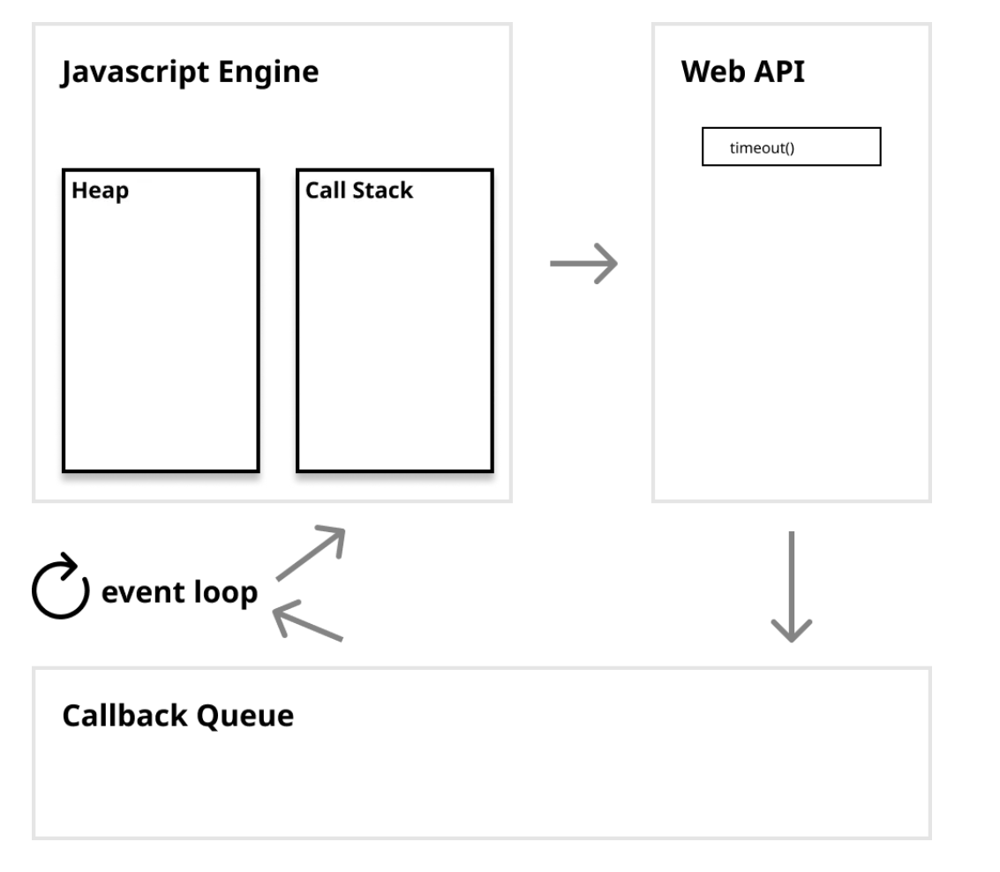
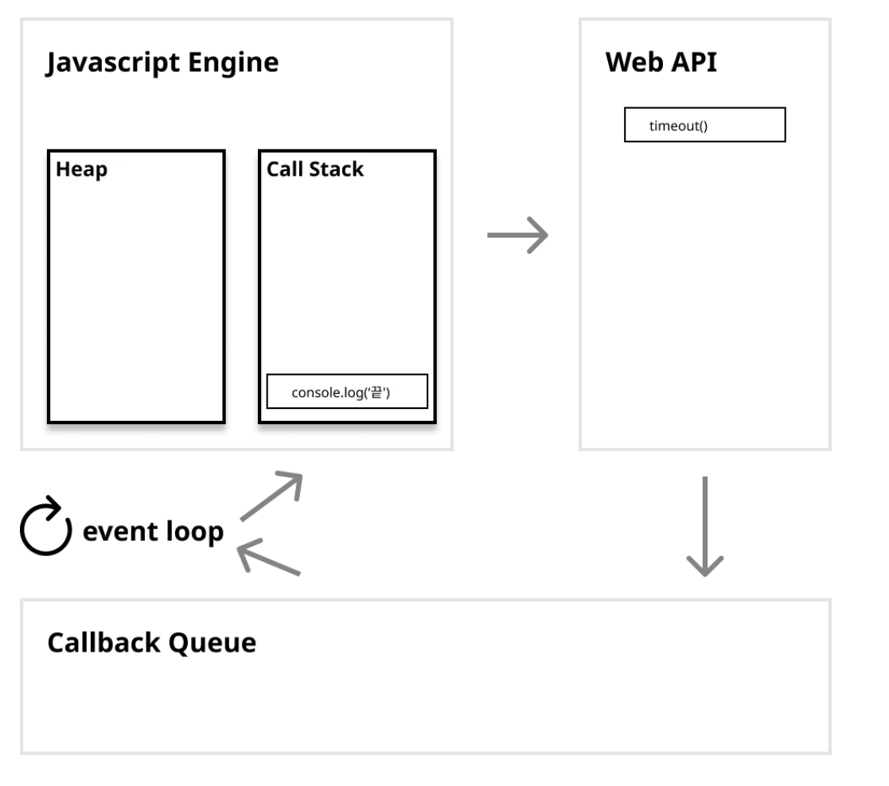
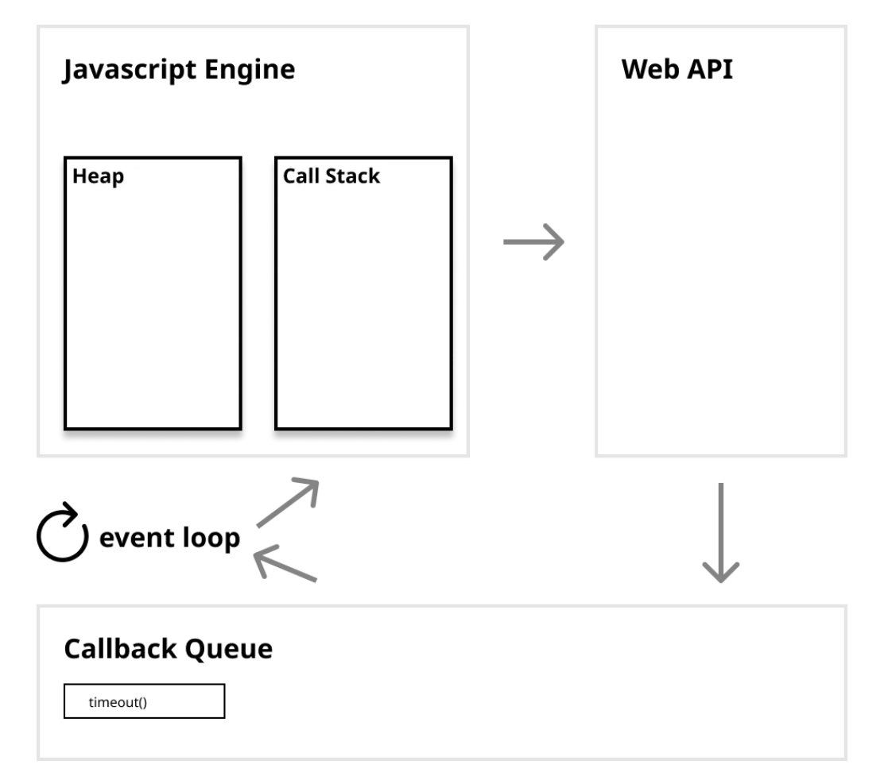
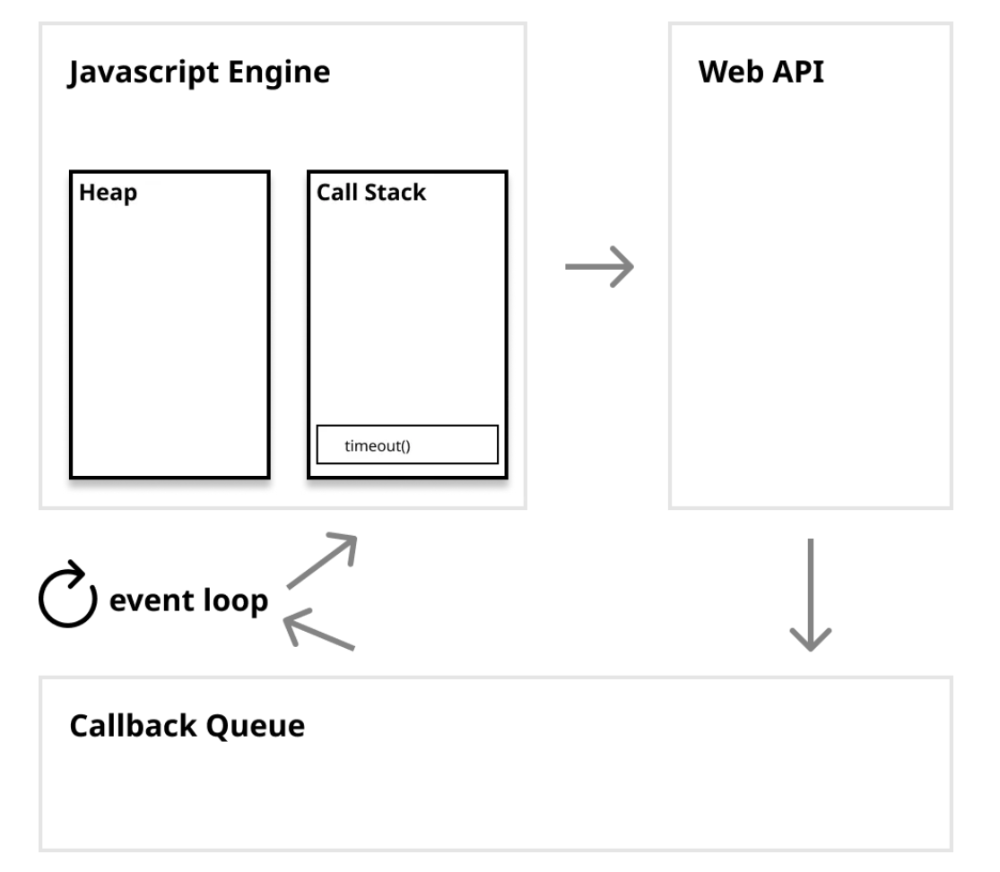
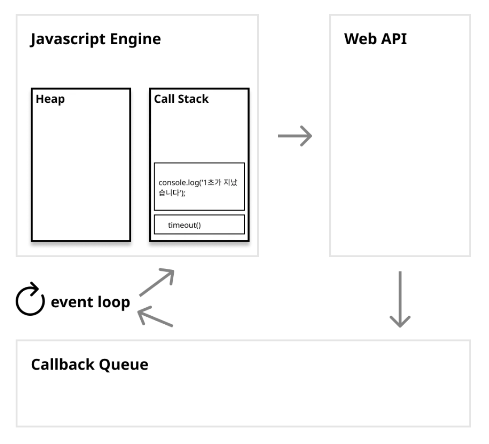
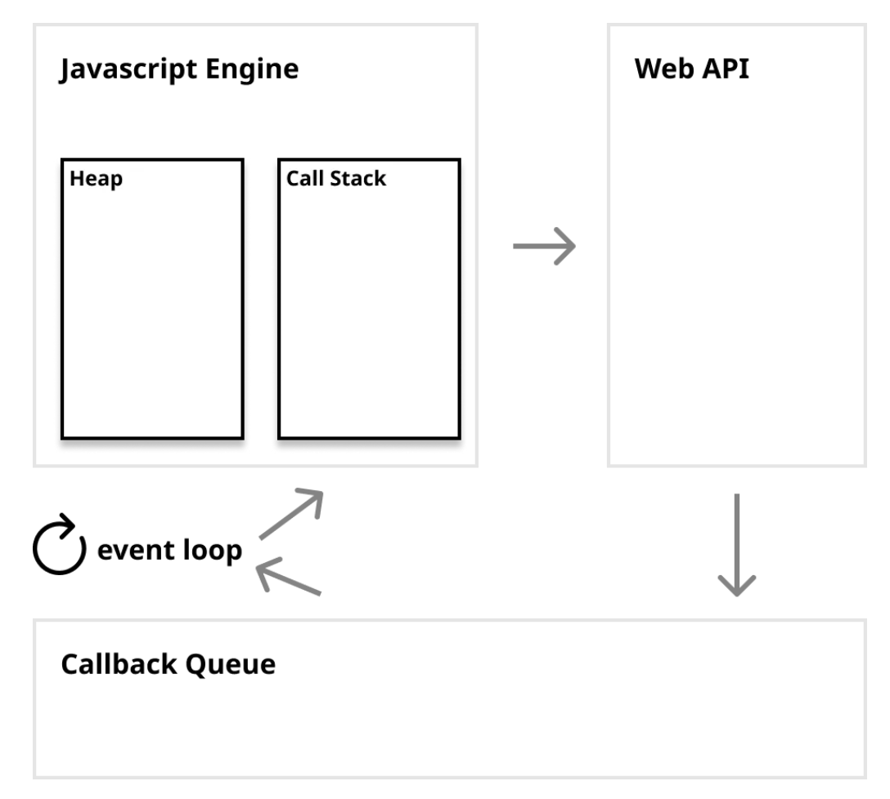

# 면접 준비

## 기술 면접

#### Javascript 동작 원리

1. 싱글 쓰레드 언어

2. JS Engine

   - V8이 대표적

   - Memory Heap

     데이터를 임시 저장, 함수나 변수를 저장

   - Call Stack

     코드가 실행되면 코드 내부의 실행 순서를 기록하여 하나씩 순차적으로 진행

     이 때 효과적으로 event를 관리하기 위하여 web API와 Callback Queue, Envent Loop가 필요

   **browser web APIs** : 오래 걸리는 작업을 대신 해주는 역할(C++ 구현된 쓰레드), DOM event, Ajax, setTimeout 과 같은 비동기 이벤트를 JS의 싱글 쓰레드의 영향르 받지 않고, 독립적으로 처리

   **Callback Queue** : browser web API의 event가 실행 된 후 callback 저장

   **Event Loop**: JS 가 효과적으로 작업하기 위한 메커니즘

   ex)

   ```js
   console.log('시작!');
   setTimeout(function timeout(){
   	console.log('1초가 지났습니다');
   });
   console.log('끝!');
   ```

   |  |  |
   | ------------------------------------------------------------ | ------------------------------------------------------------ |
   |  |  |
   |  |  |
   |  |  |
   |                                                              |                                                              |

   결과적으로 `**event loop**`**는** `**Call Stack**` **비어있는지를 주기적으로 확인하여** `**Callback Queue**`**에서** `**Callback function**`**을 가져와** `**Call Stack**`**에서** `**Javascript**` **코드가 실행될 수 있도록 돕는 역할**을 합니다. `event loop`가 반복적으로 `Call Stack`이 비어있는지 확인 하는 것을 `tick`이라고 합니다.

   

   

#### python 특징

1. 스크립트 언어
   - 컴파일 과정없이 인터프리터가 한줄씩 실행, 손쉽게 코드를 수정 및 작성 가능
2. 동적 타이핑
3. 플랫폼 독립적
   - 모든 운영체제에서 동작합니다.
4. GIL
   - 파이썬 인터 프리터는 한 쓰레드로만 동작하게 한다.

#### Flask 에 대하여

- Python web Frame work로 소규모 개발에 적합

#### FastAPI 에 대하여

- python web frame work

1. VS Flask
   - API 문서 자동 생성 : swagger 스타일
   - 비동기 동작으로 빠른 성능 보장
   - 공식문서가 잘 되어있다.

#### Teachable Machine

- 구글에서 제공하는 머신 러닝 모델을 간단하게 만들기 위한 도구
- 데이터만 있으면 손쉽게 모델 생성이 가능하다.

#### Vue.js

#### React.js

#### Java&Spring Framework

#### DB Query

#### AWS

#### React Native


## 지원 동기

#### 자기 소개


## 포트 폴리오