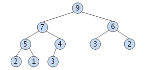
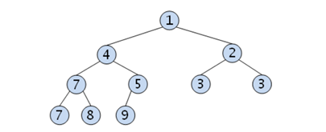

# Heap

### 힙 이란?

- 완전 이진 트리 구조를 갖는다.
- 최대 힙
  - 부모 노드의 키 값이 자식 노드의 키 값보다 크거나 같은 완전 이진 트리
- 최소 힙
  - 부모 노드의 키 값이 자식 노드의 키 값보다 작거나 같은 완전 이진 트리

### 힙의 구조와 추상 데이터 타입

- 최대 힙

- 최소 힙

- 객체 : n개의 element의 모임
- 연산
  - 삽입 : 말단에 값을 삽입, 부모 노드와 값을 비교해 가며 힙의 성질을 복원한다.
  - 삭제 : 루트 삭제, 말단 노드의 값을 루트로 올린 후 자식 노드와 값을 비교해 가며 힙의 성질 복원

### 힙의 용도

- 힙 정렬 : n개의 요소중 가장 큰 값을 뽑아야 되는 경우 O(logn)
- 우선 순위에 따라 이벤트를 처리해야 하는 경우

### 힙의 구현

- 배열을 이용하여 구현, 노드에 번호를 붙여서 배열의 인덱스에 대응시킨다.