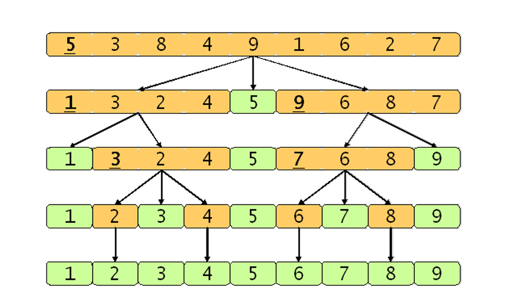
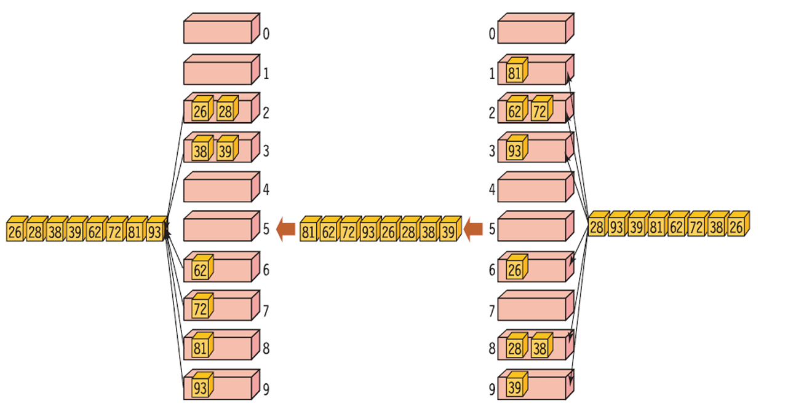
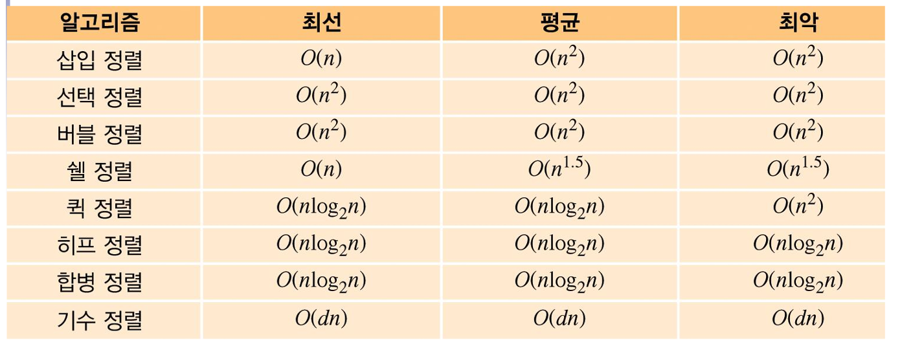

# 정렬

## 선택 정렬

정렬이 되지 않은 숫자 중 가장 큰(작은) 숫자를 선택하여 배열의 첫번째 요소와 교환

선택 O(n), n번의 선택이 필요하므로 O(n^2)의 시간 복잡도를 갖는다.

간단한 알고리즘을 갖지만, 효율이 좋지 않다.

## 삽입 정렬

정렬되어 있는 부분에 새로운 레코드를 적절한 위치에 삽입하는 과정을 반복하여 정렬

이미 정렬되어 있는 경우 O(n), 하지만 역순이었던 경우에는 O(n^2)의 복잡도를 갖는다.

이미 정렬되어 있던 배열에는 효과적으로 사용할 수 있다.

## 버블 정렬

인접한 레코드가 순서대로 되어 있지 않으면 교환하여, 전체가 정렬될 때 까지 반복

항상 O(n^2)의 복잡도를 갖는다.

단순한 알고리즘을 갖고있지만, 불필요한 이동이 많아 자주 쓰이지 않는다.

## 쉘 정렬

삽입정렬이 어느정도 정렬된 배열에 대하여 효율적인 것에 착안한 방법으로,

전체 리스트를 일정 간격의 부분 리스트로 나누고 부분 리스트틀 정렬, 간격을 점점 줄여 1이 될 때까지 반복

O(n^1.5) 에서 O(n^2)의 복잡도를 갖는다.

부분 리스트가 점진적으로 정렬된 상태가 되어 속도가 증가한다.

## 합병 정렬

리스트를 두 개의 균등한 크기로 나누어 부분 리스트를 정렬한 후 다시 합하여 전체 리스트를 정렬

O(n*logn)의 시간 복잡도를 갖는다.

# 퀵 정렬

보편적으로 가장 빠른 정렬으로, 피벗을 하나 정하여 기준으로 앞뒤로 정렬해 나간다.

O(n*logn)~O(n^2)의 시간 복잡도를 갖는다.

피벗을 어떻게 정하느냐에 따라 복잡도가 달라질 수 있다.

## 기수 정렬

낮은 자리수로 먼저 분류한 후, 높은 자리수로 분류해 나간다.

정렬할 수 있는 타입이 한정되어 있다.

동일한 길이를 가져야한다.

